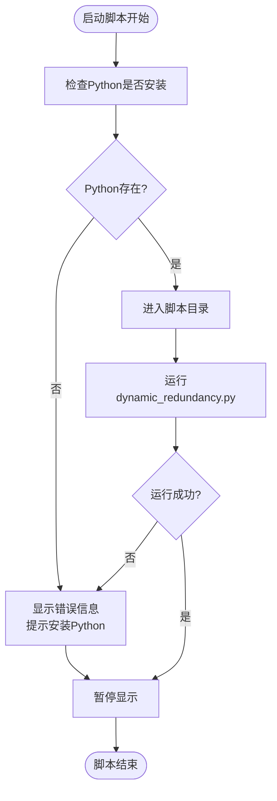
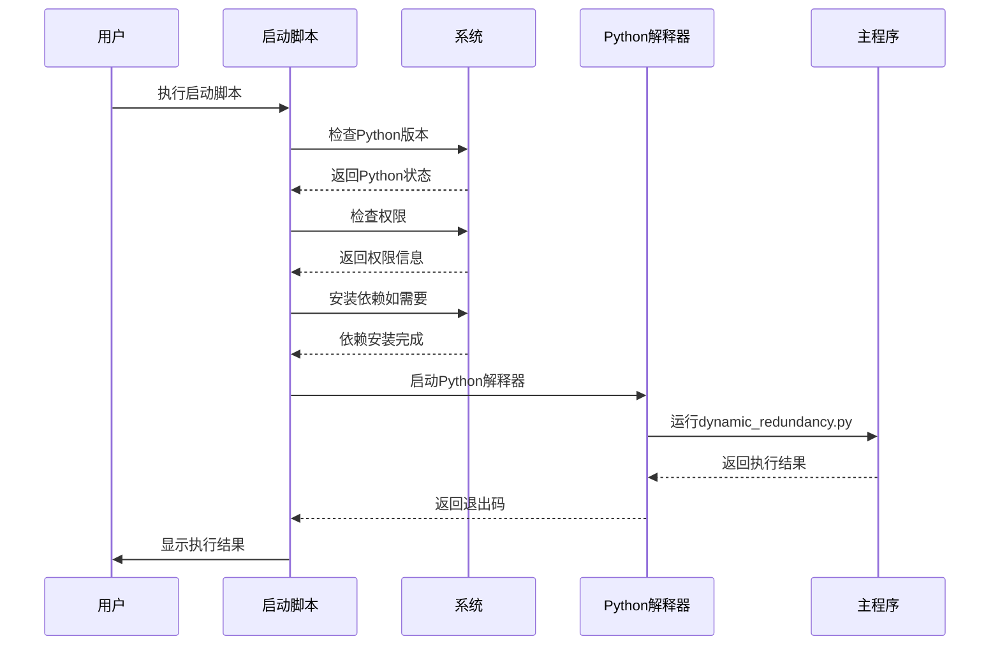
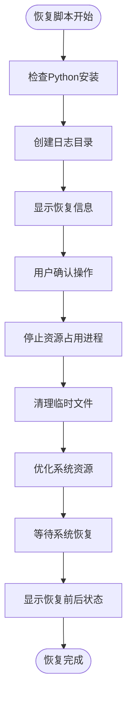
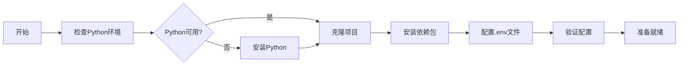

# 使用方法

<cite>
**本文档引用的文件**
- [README.md](file://README.md)
- [start_dynamic_redundancy.bat](file://start_dynamic_redundancy.bat)
- [start_dynamic_redundancy.sh](file://start_dynamic_redundancy.sh)
- [Recover/recover_system.bat](file://Recover/recover_system.bat)
- [Recover/recover_system.sh](file://Recover/recover_system.sh)
- [Recover/recover_system.py](file://Recover/recover_system.py)
- [scripts/dynamic_redundancy.py](file://scripts/dynamic_redundancy.py)
- [requirements.txt](file://requirements.txt)
</cite>

## 目录
1. [项目概述](#项目概述)
2. [系统要求](#系统要求)
3. [安装与配置](#安装与配置)
4. [主程序启动](#主程序启动)
5. [系统恢复操作](#系统恢复操作)
6. [用户交互指南](#用户交互指南)
7. [运行环境要求](#运行环境要求)
8. [故障排除](#故障排除)
9. [完整工作流程](#完整工作流程)
10. [最佳实践建议](#最佳实践建议)

## 项目概述

CloudResourceOptimizer是一个用于云主机资源利用率管理和优化的脚本工具。该工具能够根据云主机的内存规格（特别是8GB以下和16GB以上）自动调整系统资源（CPU、内存、磁盘）的利用率，使其达到监管云要求的目标值。通过智能调控系统资源占用，实现云主机资源的高效利用和优化管理。

**章节来源**
- [README.md](file://README.md#L1-L20)

## 系统要求

### 操作系统支持
- **Windows系统**：支持Windows 7及以上版本
- **Linux系统**：支持CentOS、Ubuntu、麒麟系统、OpenEuler等主流Linux发行版

### 软件依赖
- **Python 3.6+**：必须安装Python 3.6或更高版本
- **管理员/root权限**：运行脚本需要相应的系统权限
- **网络连接**：首次运行时需要下载依赖包

### 硬件要求
- **内存**：至少512MB可用内存
- **磁盘空间**：至少1GB可用存储空间
- **CPU**：支持多核处理器（推荐2核以上）

## 安装与配置

### 安装Python依赖

在开始使用之前，需要安装项目所需的Python依赖包：

```bash
pip install -r requirements.txt
```

这个命令会自动安装项目运行所需的所有Python库，包括：
- psutil：系统资源监控
- python-dotenv：环境变量管理
- glances（可选）：系统性能监控

### 配置环境变量

项目使用.env文件进行配置管理，主要配置项包括：

```ini
# 内存规格定义
SMALL_MEMORY_MAX=8          # 小规格内存上限(GB)
LARGE_MEMORY_MIN=16         # 大规格内存下限(GB)

# 目标利用率设置（百分比）
TARGET_UTILIZATION_SMALL=25 # 小规格平均利用率目标
TARGET_UTILIZATION_LARGE=40 # 大规格平均利用率目标

# 监控周期设置
MONITOR_PERIOD_DAYS=30      # 监控周期(天)
CHECK_INTERVAL_SECONDS=60   # 检查间隔(秒)

# glances监控配置
GLANCES_ENABLED=true        # 启用glances监控
GLANCES_REFRESH_INTERVAL=2  # 刷新间隔(秒)
```

**章节来源**
- [README.md](file://README.md#L40-L120)

## 主程序启动

### Windows系统启动

#### 方法一：双击启动脚本
1. 找到项目根目录下的`start_dynamic_redundancy.bat`文件
2. 双击该批处理文件即可启动主程序
3. 系统会自动检查Python环境并运行主脚本

#### 方法二：命令行启动
```cmd
cd D:\safePro\Dynamic_Redundancy
start_dynamic_redundancy.bat
```

#### 启动脚本内部流程


**图表来源**
- [start_dynamic_redundancy.bat](file://start_dynamic_redundancy.bat#L1-L24)

### Linux系统启动

#### 方法一：直接运行脚本
```bash
cd /path/to/Dynamic_Redundancy
chmod +x start_dynamic_redundancy.sh
./start_dynamic_redundancy.sh
```

#### 方法二：带参数运行
```bash
# 不安装依赖（如果已经安装）
./start_dynamic_redundancy.sh --no-deps

# 默认安装依赖
./start_dynamic_redundancy.sh
```

#### 启动脚本高级功能
Linux启动脚本具有以下增强功能：

1. **自动检测Linux发行版**
   - CentOS/RHEL系统
   - Ubuntu/Debian系统  
   - 麒麟系统
   - OpenEuler系统

2. **自动安装依赖**
   ```bash
   # 检查并安装pip
   if ! command -v pip3 &> /dev/null; then
       # 根据不同发行版安装pip
       if [ -f /etc/centos-release ]; then
           yum install -y python3-pip
       elif [ -f /etc/lsb-release ]; then
           apt-get update && apt-get install -y python3-pip
       fi
   fi
   
   # 安装项目依赖
   pip3 install -r requirements.txt
   ```

3. **系统信息展示**
   - 操作系统版本
   - Python版本
   - 总内存容量
   - CPU核心数
   - 磁盘挂载点



**图表来源**
- [start_dynamic_redundancy.sh](file://start_dynamic_redundancy.sh#L1-L104)

**章节来源**
- [start_dynamic_redundancy.bat](file://start_dynamic_redundancy.bat#L1-L24)
- [start_dynamic_redundancy.sh](file://start_dynamic_redundancy.sh#L1-L104)

## 系统恢复操作

### 恢复脚本概述

当需要停止所有资源占用进程并清理临时文件时，可以使用系统恢复脚本。恢复脚本会：
- 停止所有资源占用进程（CPU、内存、磁盘占用脚本）
- 清理临时文件
- 优化系统资源
- 显示系统状态变化

### Windows系统恢复

#### 执行步骤
1. **定位恢复脚本**
   ```
   D:\safePro\Dynamic_Redundancy\Recover\recover_system.bat
   ```

2. **双击运行**
   - 双击`recover_system.bat`文件
   - 系统会弹出命令提示窗口

3. **确认操作**
   ```
   是否继续? (y/n): y
   ```

4. **等待恢复完成**
   - 系统会显示详细的恢复进度
   - 包括停止进程、清理文件、优化资源等步骤

#### 恢复脚本功能流程


**图表来源**
- [Recover/recover_system.bat](file://Recover/recover_system.bat#L1-L45)

### Linux系统恢复

#### 执行步骤
1. **打开终端**
   ```bash
   cd /path/to/Dynamic_Redundancy/Recover
   ```

2. **赋予执行权限**
   ```bash
   chmod +x recover_system.sh
   ```

3. **运行恢复脚本**
   ```bash
   ./recover_system.sh
   ```

4. **输入密码（如需要）**
   - Linux系统通常需要sudo权限才能完全停止进程
   - 输入系统密码后继续执行

#### 恢复过程详解

Linux恢复脚本的核心功能由Python脚本实现，主要包括以下几个阶段：

1. **进程停止阶段**
   ```python
   def stop_stresser_processes(self):
       """停止所有资源占用进程"""
       stresser_scripts = [
           'cpu_stresser.py', 
           'memory_stresser.py', 
           'disk_stresser.py',
           'dynamic_redundancy.py'
       ]
       
       # 遍历所有进程并终止匹配的资源占用脚本
   ```

2. **文件清理阶段**
   ```python
   def cleanup_temp_files(self):
       """清理临时文件"""
       temp_file_patterns = ['temp_*.dat']
       
       # 根据平台搜索临时文件
       if self.system == 'windows':
           drives = [f"{d}:\\" for d in 'DEFGHIJKLMNOPQRSTUVWXYZ']
       else:
           search_dirs = ['/data', '/var/data', '/home', '/opt']
   ```

3. **系统优化阶段**
   ```python
   def optimize_system(self):
       """优化系统资源"""
       if self.system == 'windows':
           # Windows内存清理
           subprocess.run(['powershell.exe', 'Clear-SystemMemoryCache -Immediately'])
       else:
           # Linux页面缓存清理
           with open('/proc/sys/vm/drop_caches', 'w') as f:
               f.write('3')
   ```

**章节来源**
- [Recover/recover_system.bat](file://Recover/recover_system.bat#L1-L45)
- [Recover/recover_system.sh](file://Recover/recover_system.sh#L1-L43)
- [Recover/recover_system.py](file://Recover/recover_system.py#L1-L229)

## 用户交互指南

### 恢复操作安全机制

#### Windows系统
- **确认提示**：恢复脚本会显示详细的操作说明，并要求用户确认
- **日志记录**：所有操作都会记录到日志文件中，便于追踪
- **进程保护**：不会终止自身进程，确保脚本完整性

#### Linux系统
- **权限检查**：脚本会检查当前用户权限，提醒使用root权限
- **优雅终止**：优先使用`terminate()`优雅终止进程，超时后才强制终止
- **权限提升**：需要sudo权限来完全停止所有进程

### 用户界面提示信息

#### 恢复脚本界面
```
=======================================================
             系统资源恢复工具
=======================================================
此工具将：
1. 停止所有资源占用进程（CPU、内存、磁盘占用脚本）
2. 清理临时文件
3. 优化系统资源
4. 显示系统状态变化
=======================================================
日志文件将保存在：D:\safePro\Dynamic_Redundancy\logs
=======================================================
```

#### 操作确认
```
是否继续? (y/n): 
```

#### 恢复进度显示
```
==== 系统资源恢复开始 ====
恢复前系统状态:
CPU使用率: 15%
内存使用: 35% (8.50GB/24.00GB)
...
共停止 3 个资源占用进程
共清理 15 个临时文件
...
==== 系统资源恢复完成 ====
```

### 预期输出结果

#### 正常运行状态
```
系统资源恢复脚本启动...
此脚本将停止所有资源占用进程并清理临时文件
是否继续? (y/n): y
[2024-01-01 10:00:00] [INFO] ==== 系统资源恢复开始 ====
[2024-01-01 10:00:00] [INFO] 恢复前系统状态:
...
[2024-01-01 10:00:05] [INFO] 成功终止进程: PID=1234
[2024-01-01 10:00:10] [INFO] 删除临时文件: C:\temp\temp_1234.dat
...
[2024-01-01 10:00:20] [INFO] ==== 系统资源恢复完成 ====

恢复完成! 详细日志请查看logs目录下的recover_*.log文件
按Enter键退出...
```

#### 异常情况处理
- **Python未安装**：显示错误信息并指导安装
- **权限不足**：提示使用管理员/root权限
- **进程终止失败**：记录错误但继续执行后续步骤
- **文件删除失败**：记录错误但不影响整体恢复流程

## 运行环境要求

### 权限要求

#### Windows系统
- **普通用户权限**：可以运行基本功能
- **管理员权限**（推荐）：完全停止所有进程，包括系统关键进程
- **日志写入权限**：需要在项目目录写入日志文件

#### Linux系统
- **普通用户权限**：可以运行部分功能
- **root权限**（推荐）：完全停止所有进程，包括系统关键进程
- **sudo权限**：用于执行需要特权的操作
- **磁盘写入权限**：需要在多个目录写入临时文件

### 后台运行建议

#### Windows系统
- **任务计划程序**：可以配置为开机自启动
- **服务化运行**：可以将脚本注册为Windows服务
- **PowerShell脚本**：使用PowerShell脚本实现后台运行

#### Linux系统
- **systemd服务**：创建systemd服务文件
- **cron定时任务**：配置定时执行
- **screen/tmux**：使用终端复用器保持后台运行
- **nohup命令**：使用nohup命令后台运行

### 与其他系统任务的协调

#### 进程冲突处理
- **自动检测**：启动脚本会检测现有资源占用进程
- **优雅终止**：优先优雅终止进程，避免数据丢失
- **强制终止**：超时后才使用强制终止方式

#### 资源竞争避免
- **检查间隔**：默认60秒检查间隔，避免频繁操作
- **资源限制**：根据系统规格动态调整资源占用量
- **监控周期**：30天平均利用率统计，避免短期波动影响

## 故障排除

### 常见问题及解决方案

#### Python相关问题

1. **Python未安装**
   ```
   错误：未找到Python。请先安装Python 3.6或更高版本。
   ```
   **解决方案**：
   - 下载并安装Python 3.6+
   - 将Python添加到系统PATH环境变量
   - 验证安装：`python --version`

2. **依赖包安装失败**
   ```
   ModuleNotFoundError: No module named 'psutil'
   ```
   **解决方案**：
   - 手动安装依赖：`pip install -r requirements.txt`
   - 检查网络连接
   - 使用国内镜像源：`pip install -r requirements.txt -i https://pypi.tuna.tsinghua.edu.cn/simple`

#### 权限相关问题

1. **Windows权限不足**
   ```
   PermissionError: Access is denied
   ```
   **解决方案**：
   - 以管理员身份运行CMD
   - 右键点击bat文件选择"以管理员身份运行"

2. **Linux权限不足**
   ```
   sudo: unable to resolve host
   ```
   **解决方案**：
   - 编辑/etc/hosts文件，添加主机名映射
   - 使用sudo执行脚本：`sudo ./start_dynamic_redundancy.sh`

#### 系统兼容性问题

1. **Linux发行版不支持**
   ```
   无法识别的Linux发行版
   ```
   **解决方案**：
   - 手动修改脚本中的发行版检测逻辑
   - 使用通用安装方法：`python3 -m ensurepip --upgrade`

2. **glances监控失败**
   ```
   错误：无法启动glances监控
   ```
   **解决方案**：
   - 手动安装glances：`pip install glances`
   - 检查端口占用：`netstat -tulpn | grep 61209`

### 日志分析

#### 日志位置
- **Windows**：`D:\safePro\Dynamic_Redundancy\logs\`
- **Linux**：`/path/to/Dynamic_Redundancy/logs/`

#### 日志文件命名
- `cloud_resource_optimizer_YYYYMMDD.log`：主程序日志
- `recover_YYYYMMDD_HHMMSS.log`：恢复脚本日志

#### 关键日志信息
- **INFO级别**：正常操作记录
- **WARNING级别**：潜在问题警告
- **ERROR级别**：错误事件记录

## 完整工作流程

### 典型使用流程

#### 第一步：环境准备


#### 第二步：主程序运行
1. **配置参数**
   - 修改`config/.env`文件
   - 设置内存规格和目标利用率
   - 配置监控周期和检查间隔

2. **启动主程序**
   - Windows：双击启动脚本或命令行执行
   - Linux：赋予执行权限后运行

3. **监控运行状态**
   - 查看日志文件了解运行情况
   - 使用glances Web界面监控性能
   - 定期检查系统资源使用情况

#### 第三步：按需恢复系统
1. **识别恢复需求**
   - 系统响应变慢
   - 资源占用过高
   - 需要释放系统资源

2. **执行恢复操作**
   - Windows：双击恢复脚本
   - Linux：使用sudo执行恢复脚本

3. **验证恢复效果**
   - 检查系统状态变化
   - 确认资源占用降低
   - 验证应用程序正常运行

### 最佳实践工作流

#### 生产环境部署
```
1. 环境准备
   - 安装Python 3.8+
   - 配置防火墙规则
   - 设置日志轮转

2. 项目部署
   - 克隆代码仓库
   - 安装依赖包
   - 配置环境变量

3. 服务化运行
   - 创建systemd服务
   - 配置自动启动
   - 设置健康检查

4. 监控告警
   - 配置日志监控
   - 设置性能告警
   - 定期备份配置
```

#### 开发测试环境
```
1. 快速搭建
   - 使用虚拟环境
   - 安装开发依赖
   - 配置本地测试

2. 功能验证
   - 单元测试
   - 集成测试
   - 性能测试

3. 代码优化
   - 代码审查
   - 性能调优
   - 文档完善
```

## 最佳实践建议

### 系统稳定性保障

#### 资源使用控制
- **合理设置目标利用率**：小规格25%-30%，大规格35%-45%
- **避免过度占用**：防止影响系统正常运行
- **定期监控**：持续关注系统资源使用情况

#### 安全性考虑
- **权限最小化原则**：只授予必要的系统权限
- **日志审计**：记录所有重要操作，便于追溯
- **备份配置**：定期备份.env配置文件

#### 性能优化建议
- **检查间隔调优**：根据实际需求调整监控频率
- **磁盘路径选择**：选择合适的磁盘进行资源占用
- **并发控制**：避免同时运行过多资源占用进程

### 维护和升级

#### 版本管理
- **Git分支策略**：使用git flow进行版本管理
- **发布标签**：为每个版本打上标签
- **变更日志**：维护详细的版本更新记录

#### 自动化运维
- **CI/CD流水线**：自动化测试和部署
- **监控告警**：实时监控系统状态
- **自动恢复**：配置自动故障恢复机制

通过遵循这些最佳实践，可以确保CloudResourceOptimizer项目的稳定运行和长期维护。完整的使用方法文档为用户提供了从环境准备到日常使用的全方位指导，帮助用户充分利用该工具的功能，实现云主机资源的高效管理和优化。