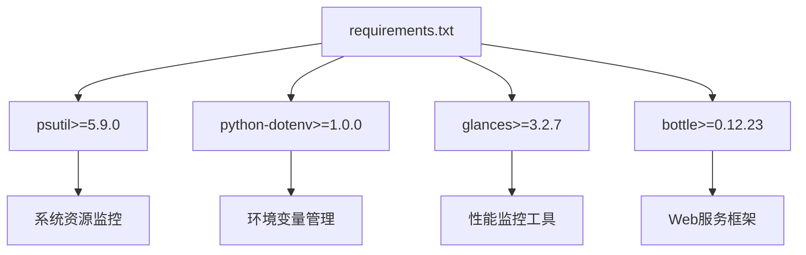
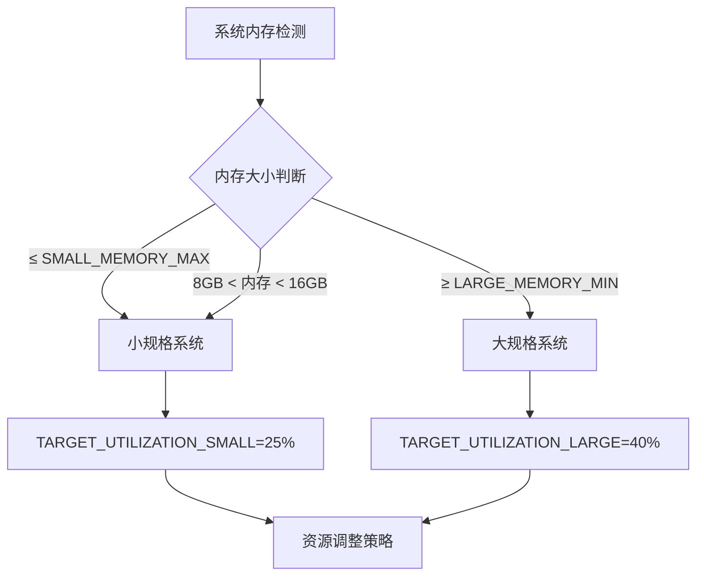
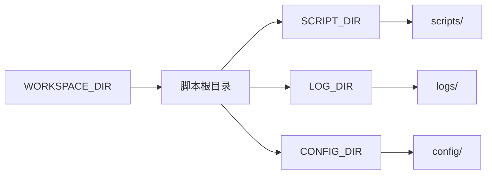
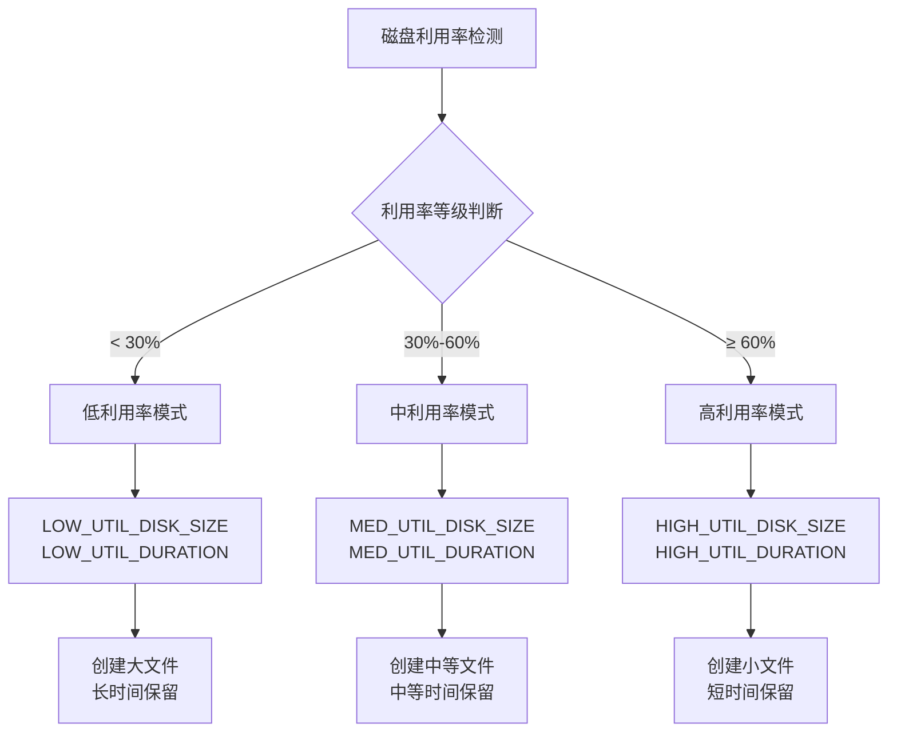
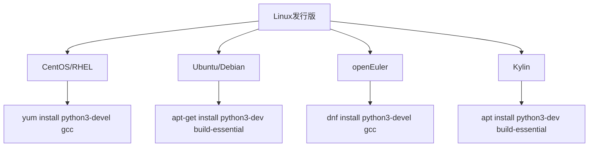
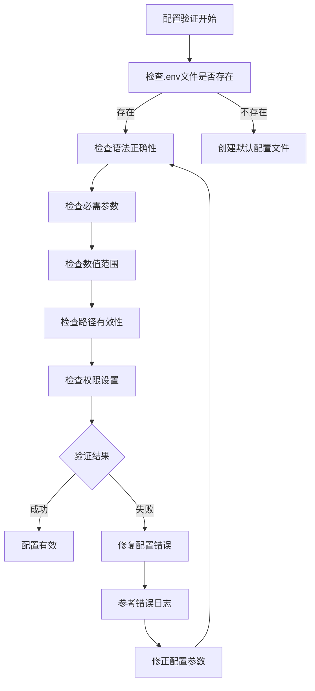
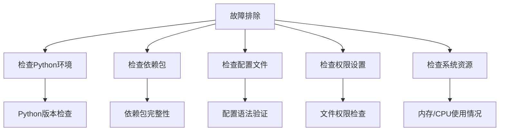

# 安装与配置指南

<cite>
**本文档引用的文件**
- [requirements.txt](file://requirements.txt)
- [README.md](file://README.md)
- [dynamic_redundancy.py](file://scripts/dynamic_redundancy.py)
- [cpu_stresser.py](file://scripts/cpu_stresser.py)
- [memory_stresser.py](file://scripts/memory_stresser.py)
- [disk_stresser.py](file://scripts/disk_stresser.py)
- [recover_system.py](file://Recover/recover_system.py)
</cite>

## 目录
1. [项目概述](#项目概述)
2. [环境要求](#环境要求)
3. [依赖包安装](#依赖包安装)
4. [配置文件详解](#配置文件详解)
5. [操作系统特定配置](#操作系统特定配置)
6. [典型配置案例](#典型配置案例)
7. [配置验证与故障排除](#配置验证与故障排除)
8. [总结](#总结)

## 项目概述

CloudResourceOptimizer是一个专门用于云主机资源利用率管理和优化的脚本工具。该工具能够根据云主机的规格（特别是内存大小）自动调整系统资源（CPU、内存、磁盘）的利用率，使其达到监管云要求的目标值。通过智能调控系统资源占用，实现云主机资源的高效利用和优化管理。

**章节来源**
- [README.md](file://README.md#L1-L20)

## 环境要求

### Python版本要求
- **最低版本**: Python 3.6+
- **推荐版本**: Python 3.8+（获得更好的兼容性和性能）

### 操作系统支持
- **Windows**: Windows 10/11, Windows Server 2016+
- **Linux**: CentOS 7+, Ubuntu 18.04+, 其他主流Linux发行版

### 权限要求
- **管理员权限**: 在Windows系统上运行
- **Root权限**: 在Linux系统上运行，特别是在调整系统资源和创建大文件时

**章节来源**
- [README.md](file://README.md#L21-L25)

## 依赖包安装

### 安装步骤

1. **克隆项目仓库**
```bash
git clone https://github.com/your-repository-url.git
cd Dynamic_Redundancy
```

2. **创建虚拟环境（推荐）**
```bash
# Windows
python -m venv cloud_optimizer_env
cloud_optimizer_env\Scripts\activate

# Linux/MacOS
python3 -m venv cloud_optimizer_env
source cloud_optimizer_env/bin/activate
```

3. **安装依赖包**
```bash
pip install -r requirements.txt
```

### 依赖包说明

项目需要以下核心依赖包：



**图表来源**
- [requirements.txt](file://requirements.txt#L1-L5)

#### 1. psutil包
- **版本要求**: ≥5.9.0
- **用途**: 系统资源监控，获取CPU、内存、磁盘使用情况
- **安装命令**: `pip install psutil>=5.9.0`

#### 2. python-dotenv包
- **版本要求**: ≥1.0.0
- **用途**: 加载.env配置文件，管理环境变量
- **安装命令**: `pip install python-dotenv>=1.0.0`

#### 3. glances包
- **版本要求**: ≥3.2.7
- **用途**: 集成性能监控工具，提供Web界面监控
- **安装命令**: `pip install glances>=3.2.7`

#### 4. bottle包
- **版本要求**: ≥0.12.23
- **用途**: Web服务框架，支持glances的Web界面
- **安装命令**: `pip install bottle>=0.12.23`

### 操作系统特定安装问题

#### Windows系统
- **常见问题**: 权限不足导致安装失败
- **解决方案**: 
  ```bash
  pip install --upgrade pip
  pip install -r requirements.txt --user
  ```

#### Linux系统
- **CentOS/RHEL**:
  ```bash
  sudo yum install python3-devel gcc
  pip install -r requirements.txt
  ```
  
- **Ubuntu/Debian**:
  ```bash
  sudo apt-get update
  sudo apt-get install python3-dev build-essential
  pip install -r requirements.txt
  ```
  
- **glances安装问题**:
  ```bash
  # CentOS/RHEL
  sudo yum install epel-release
  sudo yum install glances
  
  # Ubuntu/Debian
  sudo apt-get install glances
  
  # 或者通过pip安装
  pip install glances
  ```

**章节来源**
- [requirements.txt](file://requirements.txt#L1-L5)
- [README.md](file://README.md#L26-L35)

## 配置文件详解

### 配置文件位置

配置文件位于`config/.env`路径，项目结构如下：
```
CloudResourceOptimizer/
├── config/
│   └── .env                    # 环境配置文件
├── scripts/
│   └── dynamic_redundancy.py   # 主控制脚本
└── logs/                       # 日志目录
```

### 核心配置参数详解

#### 1. 内存规格定义



**图表来源**
- [dynamic_redundancy.py](file://scripts/dynamic_redundancy.py#L40-L50)

- **SMALL_MEMORY_MAX**: 小规格内存上限（GB）
  - **默认值**: 8
  - **作用**: 定义小规格云主机的内存上限
  - **建议值**: 根据实际业务需求调整

- **LARGE_MEMORY_MIN**: 大规格内存下限（GB）
  - **默认值**: 16
  - **作用**: 定义大规格云主机的内存下限
  - **建议值**: 根据实际业务需求调整

#### 2. 目标利用率设置

- **TARGET_UTILIZATION_SMALL**: 小规格平均利用率目标（百分比）
  - **默认值**: 25
  - **作用**: 小规格云主机的目标资源利用率
  - **建议范围**: 20-30%

- **TARGET_UTILIZATION_LARGE**: 大规格平均利用率目标（百分比）
  - **默认值**: 40
  - **作用**: 大规格云主机的目标资源利用率
  - **建议范围**: 35-45%

#### 3. 监控周期设置

- **MONITOR_PERIOD_DAYS**: 监控周期（天）
  - **默认值**: 30
  - **作用**: 统计和监控的时间周期长度
  - **建议值**: 根据审计需求调整，最小1天，最大90天

- **CHECK_INTERVAL_SECONDS**: 检查间隔（秒）
  - **默认值**: 60
  - **作用**: 系统资源检查的频率
  - **建议范围**: 30-120秒

#### 4. 工作区配置



**图表来源**
- [dynamic_redundancy.py](file://scripts/dynamic_redundancy.py#L55-L65)

- **WORKSPACE_DIR**: 工作区目录
  - **默认值**: 脚本所在目录的父目录
  - **作用**: 定义项目的根工作目录
  - **配置方法**: 使用相对路径或绝对路径

- **SCRIPT_DIR**: 脚本目录
  - **默认值**: `${WORKSPACE_DIR}/scripts`
  - **作用**: 存放各类资源占用脚本的目录
  - **配置方法**: 相对路径配置

- **LOG_DIR**: 日志目录
  - **默认值**: `${WORKSPACE_DIR}/logs`
  - **作用**: 存放系统运行日志的目录
  - **配置方法**: 相对路径配置

- **CONFIG_DIR**: 配置目录
  - **默认值**: `${WORKSPACE_DIR}/config`
  - **作用**: 存放配置文件的目录
  - **配置方法**: 相对路径配置

#### 5. 磁盘监控配置

- **DATA_DISK_ONLY**: 数据盘监控模式
  - **默认值**: true
  - **作用**: 是否只监控数据盘，忽略系统盘
  - **使用场景**: 在多盘系统中，只监控业务数据盘

#### 6. 平台配置

- **PLATFORM**: 平台自动检测机制
  - **默认值**: auto
  - **支持选项**: auto, centos, ubuntu, kylin, openEuler
  - **作用**: 自动检测或指定系统类型
  - **使用场景**: 不同Linux发行版可能有不同的系统优化方式

#### 7. Glances监控配置

- **GLANCES_ENABLED**: 监控集成开关
  - **默认值**: true
  - **作用**: 启用或禁用glances性能监控
  - **使用场景**: 在资源受限环境中可关闭以节省资源

- **GLANCES_REFRESH_INTERVAL**: 刷新间隔（秒）
  - **默认值**: 2
  - **作用**: glances监控界面的刷新频率
  - **建议范围**: 1-5秒

#### 8. 磁盘占用控制配置



**图表来源**
- [dynamic_redundancy.py](file://scripts/dynamic_redundancy.py#L70-L85)

- **DISK_STRESS_PATH**: 磁盘占用默认路径
  - **默认值**: 空（使用最大的目录路径）
  - **作用**: 指定磁盘占用脚本的工作目录
  - **配置方法**: 可指定具体路径

- **低利用率配置**:
  - `LOW_UTIL_DISK_SIZE`: 200MB
  - `LOW_UTIL_DURATION`: 3600秒（1小时）

- **中利用率配置**:
  - `MED_UTIL_DISK_SIZE`: 100MB
  - `MED_UTIL_DURATION`: 1800秒（30分钟）

- **高利用率配置**:
  - `HIGH_UTIL_DISK_SIZE`: 50MB
  - `HIGH_UTIL_DURATION`: 600秒（10分钟）

**章节来源**
- [README.md](file://README.md#L36-L85)
- [dynamic_redundancy.py](file://scripts/dynamic_redundancy.py#L30-L90)

## 操作系统特定配置

### Windows系统配置

#### 权限配置
- **管理员权限**: 必须以管理员身份运行PowerShell或CMD
- **执行策略**: 可能需要调整执行策略
  ```powershell
  Set-ExecutionPolicy -ExecutionPolicy RemoteSigned -Scope CurrentUser
  ```

#### 启动脚本配置
- **Windows启动脚本**: `start_dynamic_redundancy.bat`
- **恢复脚本**: `Recover\recover_system.bat`
- **注意事项**: 
  - 确保Python已添加到PATH环境变量
  - 检查防火墙设置，允许Python进程通信

### Linux系统配置

#### 权限配置
- **Root权限**: 大多数操作需要root权限
- **用户权限**: 可以使用普通用户权限运行，但功能受限

#### 发行版特定配置



**图表来源**
- [README.md](file://README.md#L170-L180)

- **CentOS/RHEL**:
  ```bash
  sudo yum install python3-devel gcc
  sudo yum install epel-release
  sudo yum install glances
  ```

- **Ubuntu/Debian**:
  ```bash
  sudo apt-get update
  sudo apt-get install python3-dev build-essential
  sudo apt-get install glances
  ```

- **openEuler**:
  ```bash
  sudo dnf install python3-devel gcc
  sudo dnf install glances
  ```

- **Kylin**:
  ```bash
  sudo apt install python3-dev build-essential
  sudo apt install glances
  ```

#### 文件权限配置
- **脚本权限**: 确保所有Python脚本具有可执行权限
  ```bash
  chmod +x scripts/*.py
  chmod +x Recover/*.sh
  ```

- **目录权限**: 确保工作目录有适当的读写权限
  ```bash
  mkdir -p logs config
  chmod 755 logs config
  ```

**章节来源**
- [README.md](file://README.md#L170-L180)

## 典型配置案例

### 案例1：小规格云主机配置

适用于内存≤8GB的小规格云主机，需要较高的资源利用率以满足监管要求。

```ini
# 小规格云主机配置
SMALL_MEMORY_MAX=8
LARGE_MEMORY_MIN=16

TARGET_UTILIZATION_SMALL=30
TARGET_UTILIZATION_LARGE=40

MONITOR_PERIOD_DAYS=30
CHECK_INTERVAL_SECONDS=60

WORKSPACE_DIR=
SCRIPT_DIR=${WORKSPACE_DIR}/scripts
LOG_DIR=${WORKSPACE_DIR}/logs
CONFIG_DIR=${WORKSPACE_DIR}/config

DATA_DISK_ONLY=true
PLATFORM=auto

GLANCES_ENABLED=true
GLANCES_REFRESH_INTERVAL=2

# 磁盘占用配置（适合小规格主机）
LOW_UTIL_DISK_SIZE=100MB
LOW_UTIL_DURATION=7200
MED_UTIL_DISK_SIZE=50MB
MED_UTIL_DURATION=3600
HIGH_UTIL_DISK_SIZE=25MB
HIGH_UTIL_DURATION=1800
```

### 案例2：大规格云主机配置

适用于内存≥16GB的大规格云主机，需要平衡资源利用率和系统性能。

```ini
# 大规格云主机配置
SMALL_MEMORY_MAX=8
LARGE_MEMORY_MIN=16

TARGET_UTILIZATION_SMALL=25
TARGET_UTILIZATION_LARGE=35

MONITOR_PERIOD_DAYS=30
CHECK_INTERVAL_SECONDS=60

WORKSPACE_DIR=
SCRIPT_DIR=${WORKSPACE_DIR}/scripts
LOG_DIR=${WORKSPACE_DIR}/logs
CONFIG_DIR=${WORKSPACE_DIR}/config

DATA_DISK_ONLY=true
PLATFORM=auto

GLANCES_ENABLED=true
GLANCES_REFRESH_INTERVAL=3

# 磁盘占用配置（适合大规格主机）
LOW_UTIL_DISK_SIZE=300MB
LOW_UTIL_DURATION=5400
MED_UTIL_DISK_SIZE=150MB
MED_UTIL_DURATION=2700
HIGH_UTIL_DISK_SIZE=75MB
HIGH_UTIL_DURATION=900
```

### 案例3：审计导向配置

适用于需要长期审计和合规检查的环境，延长日志保留周期。

```ini
# 审计导向配置
SMALL_MEMORY_MAX=8
LARGE_MEMORY_MIN=16

TARGET_UTILIZATION_SMALL=25
TARGET_UTILIZATION_LARGE=40

MONITOR_PERIOD_DAYS=90
CHECK_INTERVAL_SECONDS=30

WORKSPACE_DIR=
SCRIPT_DIR=${WORKSPACE_DIR}/scripts
LOG_DIR=${WORKSPACE_DIR}/logs
CONFIG_DIR=${WORKSPACE_DIR}/config

DATA_DISK_ONLY=false
PLATFORM=auto

GLANCES_ENABLED=true
GLANCES_REFRESH_INTERVAL=1

# 长期审计配置
LOW_UTIL_DISK_SIZE=200MB
LOW_UTIL_DURATION=86400
MED_UTIL_DISK_SIZE=100MB
MED_UTIL_DURATION=43200
HIGH_UTIL_DISK_SIZE=50MB
HIGH_UTIL_DURATION=21600
```

### 案例4：资源受限环境配置

适用于资源受限的环境，减少系统资源消耗。

```ini
# 资源受限环境配置
SMALL_MEMORY_MAX=8
LARGE_MEMORY_MIN=16

TARGET_UTILIZATION_SMALL=20
TARGET_UTILIZATION_LARGE=30

MONITOR_PERIOD_DAYS=15
CHECK_INTERVAL_SECONDS=120

WORKSPACE_DIR=
SCRIPT_DIR=${WORKSPACE_DIR}/scripts
LOG_DIR=${WORKSPACE_DIR}/logs
CONFIG_DIR=${WORKSPACE_DIR}/config

DATA_DISK_ONLY=true
PLATFORM=auto

GLANCES_ENABLED=false
GLANCES_REFRESH_INTERVAL=2

# 减少资源消耗的配置
LOW_UTIL_DISK_SIZE=50MB
LOW_UTIL_DURATION=1800
MED_UTIL_DISK_SIZE=25MB
MED_UTIL_DURATION=900
HIGH_UTIL_DISK_SIZE=10MB
HIGH_UTIL_DURATION=300
```

**章节来源**
- [README.md](file://README.md#L36-L85)

## 配置验证与故障排除

### 配置验证方法

#### 1. 基本配置检查



**图表来源**
- [dynamic_redundancy.py](file://scripts/dynamic_redundancy.py#L30-L90)

#### 2. 常见配置错误及修复

##### 错误1：单位错误
- **错误现象**: 数值参数超出合理范围
- **示例**: `SMALL_MEMORY_MAX=8000`（应为8GB）
- **修复方法**: 确保数值参数符合预期单位和范围

##### 错误2：路径不存在
- **错误现象**: 指定的工作目录或脚本目录不存在
- **修复方法**:
  ```bash
  # 创建必要的目录结构
  mkdir -p logs scripts config
  
  # 设置正确的权限
  chmod 755 logs scripts config
  ```

##### 错误3：权限不足
- **错误现象**: 无法创建临时文件或访问系统资源
- **修复方法**:
  ```bash
  # Windows: 以管理员身份运行
  # Linux: 使用sudo或切换到root用户
  sudo python scripts/dynamic_redundancy.py
  ```

##### 错误4：端口冲突
- **错误现象**: glances监控无法启动
- **修复方法**:
  ```bash
  # 检查端口占用
  netstat -tulpn | grep :61209
  
  # 修改glances端口配置
  echo "GLANCES_REFRESH_INTERVAL=3" >> config/.env
  ```

#### 3. 配置测试步骤

1. **启动测试**:
   ```bash
   # Windows
   python scripts/dynamic_redundancy.py
   
   # Linux
   python3 scripts/dynamic_redundancy.py
   ```

2. **检查日志**:
   ```bash
   tail -f logs/cloud_resource_optimizer_*.log
   ```

3. **验证功能**:
   - 检查系统资源利用率是否达到目标
   - 验证临时文件是否按预期创建和删除
   - 确认监控功能正常工作

#### 4. 故障排除清单



**图表来源**
- [dynamic_redundancy.py](file://scripts/dynamic_redundancy.py#L90-L120)

##### Python环境检查
```bash
# 检查Python版本
python --version
python3 --version

# 检查pip版本
pip --version
pip3 --version

# 验证Python环境
python -c "import sys; print(sys.version)"
```

##### 依赖包检查
```bash
# 列出已安装的依赖包
pip list | grep -E "(psutil|python-dotenv|glances|bottle)"

# 验证特定包的版本
python -c "import psutil; print(psutil.__version__)"
python -c "import glances; print(glances.__version__)"
```

##### 权限检查
```bash
# Windows
whoami

# Linux
whoami
groups
id -u
```

##### 系统资源检查
```bash
# 检查磁盘空间
df -h

# 检查内存使用
free -h

# 检查CPU使用
top -bn1 | head -20
```

**章节来源**
- [README.md](file://README.md#L170-L182)
- [dynamic_redundancy.py](file://scripts/dynamic_redundancy.py#L90-L120)

## 总结

CloudResourceOptimizer的安装与配置过程虽然涉及多个方面，但通过遵循本指南的步骤，您可以顺利完成项目的部署和配置。关键要点包括：

1. **环境准备**: 确保Python 3.6+环境正确安装，并根据操作系统特性进行相应的依赖包安装
2. **配置管理**: 深入理解各项配置参数的含义和影响，根据实际需求进行合理配置
3. **权限设置**: 根据操作系统要求正确设置权限，确保脚本能够正常运行
4. **验证测试**: 通过日志检查和功能验证确保配置正确无误
5. **故障排除**: 掌握常见问题的诊断和解决方法

通过合理的配置和定期维护，CloudResourceOptimizer能够有效地帮助您管理云主机资源，提高资源利用率，满足监管要求。在实际应用中，建议根据具体的业务需求和系统环境，选择合适的配置方案，并建立定期的监控和维护机制。