# CloudResourceOptimizer 架构设计文档

<cite>
**本文档引用的文件**
- [README.md](file://README.md)
- [scripts/dynamic_redundancy.py](file://scripts/dynamic_redundancy.py)
- [scripts/memory_stresser.py](file://scripts/memory_stresser.py)
- [scripts/cpu_stresser.py](file://scripts/cpu_stresser.py)
- [scripts/disk_stresser.py](file://scripts/disk_stresser.py)
- [Recover/recover_system.py](file://Recover/recover_system.py)
- [start_dynamic_redundancy.bat](file://start_dynamic_redundancy.bat)
- [start_dynamic_redundancy.sh](file://start_dynamic_redundancy.sh)
- [requirements.txt](file://requirements.txt)
</cite>

## 目录
1. [引言](#引言)
2. [项目概述](#项目概述)
3. [整体架构设计](#整体架构设计)
4. [核心组件分析](#核心组件分析)
5. [数据流与控制流程](#数据流与控制流程)
6. [跨平台支持设计](#跨平台支持设计)
7. [依赖关系分析](#依赖关系分析)
8. [可扩展性评估](#可扩展性评估)
9. [总结](#总结)

## 引言

CloudResourceOptimizer 是一个面向云主机资源利用率管理的智能优化系统。该系统采用模块化架构设计，通过五个核心层次实现对CPU、内存、磁盘资源的动态调控，确保云主机资源利用率符合监管要求。本文档将深入分析系统的整体架构设计思想、核心组件实现原理以及未来的扩展潜力。

## 项目概述

CloudResourceOptimizer 项目旨在解决云主机资源利用率优化问题，通过智能调控系统资源占用，实现资源的高效利用和优化管理。系统具备以下核心特性：

- **自适应资源调控**：根据云主机内存规格自动区分小规格（≤8GB）和大规格（≥16GB），并相应调整资源利用率目标
- **多维度资源监控**：实时监控CPU、内存、磁盘的利用率，并维护30天平均利用率统计数据
- **跨平台兼容性**：支持Windows和Linux系统，具备自动平台检测和差异化处理能力
- **完整恢复机制**：提供独立的系统资源恢复脚本，确保系统资源可完全恢复到正常状态

## 整体架构设计

### 面向对象模块化设计思想

系统采用面向对象的模块化设计思想，将整体架构划分为五个核心层次，每个层次承担特定的功能职责：

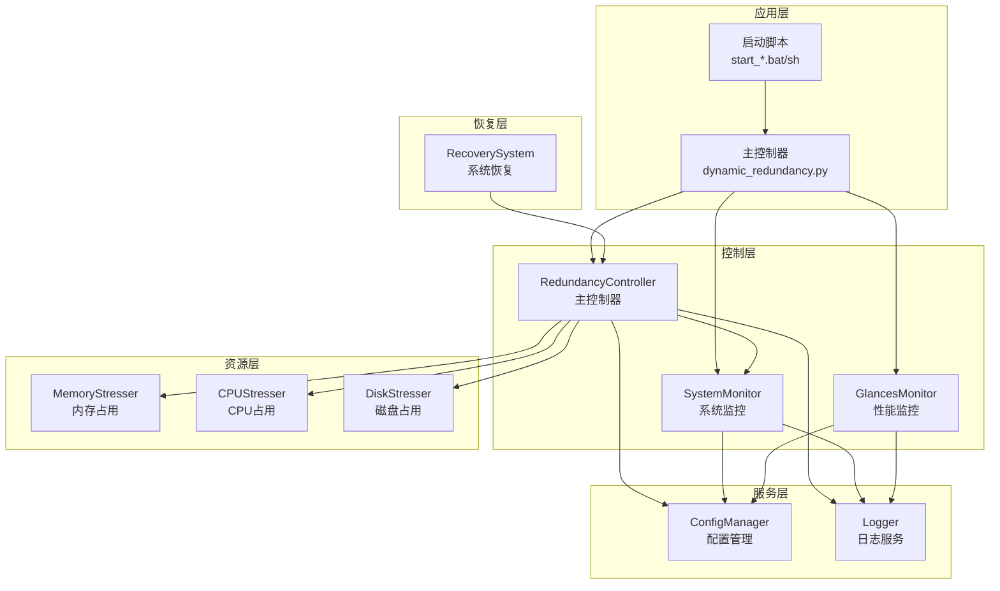

**图表来源**
- [scripts/dynamic_redundancy.py](file://scripts/dynamic_redundancy.py#L1-L730)
- [start_dynamic_redundancy.bat](file://start_dynamic_redundancy.bat#L1-L24)
- [start_dynamic_redundancy.sh](file://start_dynamic_redundancy.sh#L1-L104)

### 五大层次架构详解

#### 1. 配置管理层（ConfigManager）

ConfigManager 采用单例模式设计，负责统一管理所有配置项，提供全局配置访问接口：

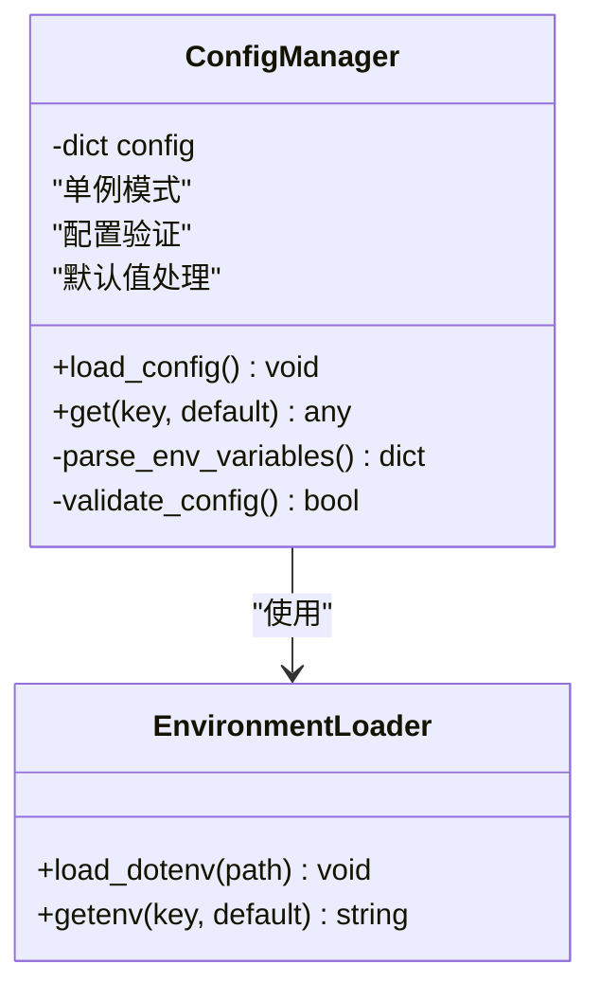

**图表来源**
- [scripts/dynamic_redundancy.py](file://scripts/dynamic_redundancy.py#L25-L100)

#### 2. 日志服务层（Logger）

Logger 服务模式实现多目的地日志输出，支持文件和控制台双重输出：

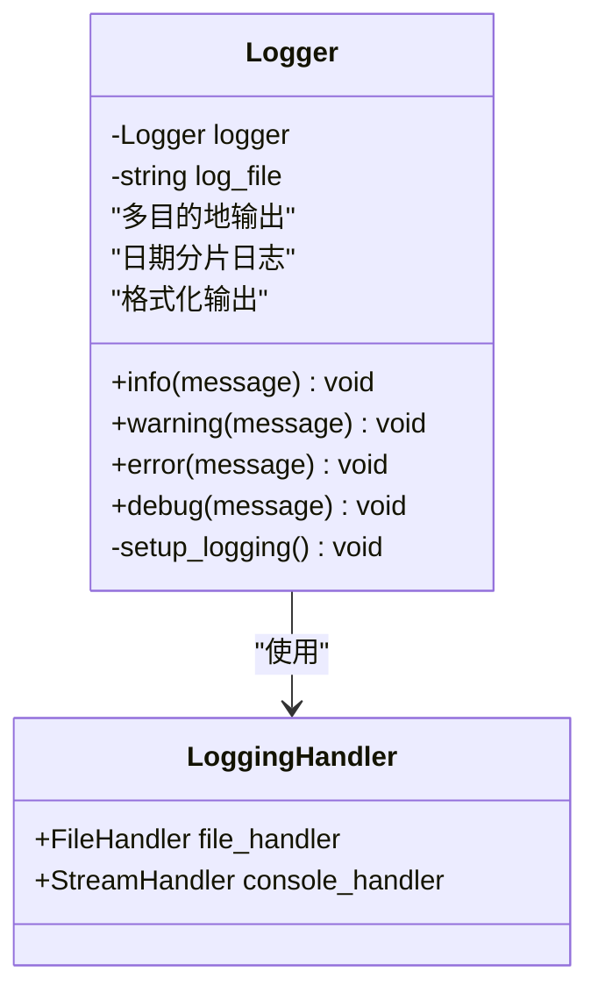

**图表来源**
- [scripts/dynamic_redundancy.py](file://scripts/dynamic_redundancy.py#L102-L130)

#### 3. 系统监控层（SystemMonitor）

SystemMonitor 采用观察者模式设计，实时采集系统资源数据：

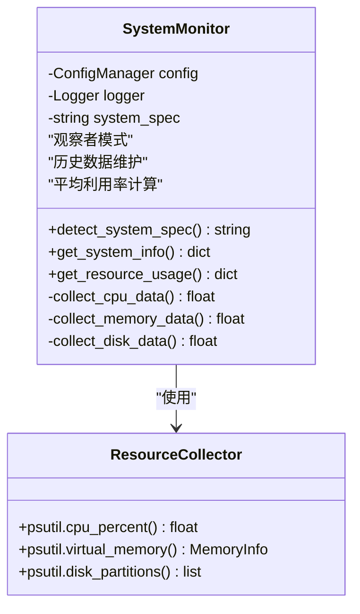

**图表来源**
- [scripts/dynamic_redundancy.py](file://scripts/dynamic_redundancy.py#L132-L250)

#### 4. 冗余控制层（RedundancyController）

RedundancyController 作为系统中枢，协调各组件工作，形成完整的控制闭环：

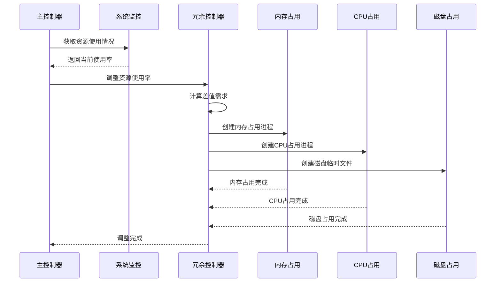

**图表来源**
- [scripts/dynamic_redundancy.py](file://scripts/dynamic_redundancy.py#L252-L500)

#### 5. 外部监控集成层（GlancesMonitor）

GlancesMonitor 集成第三方监控工具，提供Web界面的实时性能监控：

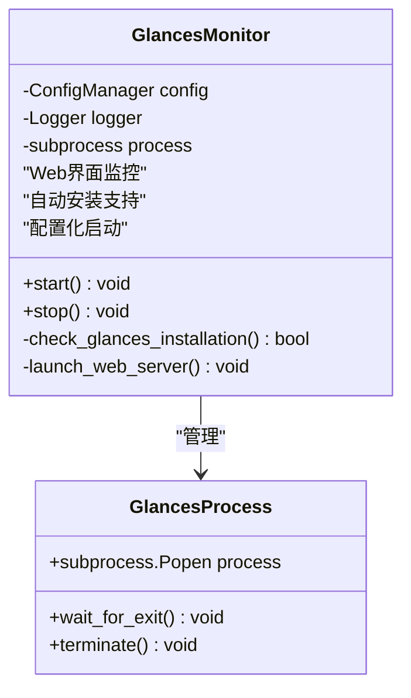

**图表来源**
- [scripts/dynamic_redundancy.py](file://scripts/dynamic_redundancy.py#L502-L530)

**章节来源**
- [scripts/dynamic_redundancy.py](file://scripts/dynamic_redundancy.py#L25-L730)
- [README.md](file://README.md#L1-L217)

## 核心组件分析

### ConfigManager 单例模式配置管理

ConfigManager 采用单例模式设计，确保整个系统只有一个配置实例，提供统一的配置访问接口：

```python
# 配置加载示例
self.config['SMALL_MEMORY_MAX'] = int(os.getenv('SMALL_MEMORY_MAX', 8))
self.config['LARGE_MEMORY_MIN'] = int(os.getenv('LARGE_MEMORY_MIN', 16))
self.config['TARGET_UTILIZATION_SMALL'] = int(os.getenv('TARGET_UTILIZATION_SMALL', 25))
self.config['TARGET_UTILIZATION_LARGE'] = int(os.getenv('TARGET_UTILIZATION_LARGE', 40))
```

**关键特性**：
- **环境变量优先**：优先从.env文件读取配置，支持运行时动态调整
- **默认值保护**：提供合理的默认值，确保配置缺失时系统仍能正常运行
- **类型转换**：自动进行配置值的类型转换和验证
- **集中管理**：所有配置项集中存储，便于维护和审计

### Logger 服务模式多目的地输出

Logger 采用服务模式设计，支持同时向文件和控制台输出日志：

```python
logging.basicConfig(
    level=logging.INFO,
    format='%(asctime)s - %(levelname)s - %(message)s',
    handlers=[
        logging.FileHandler(log_file),
        logging.StreamHandler()
    ]
)
```

**设计优势**：
- **双输出机制**：实时日志既保存到文件便于后续分析，又显示在控制台便于即时监控
- **日期分片**：按日期生成日志文件，避免单个文件过大
- **格式标准化**：统一的日志格式便于日志分析和问题定位
- **级别分类**：支持不同级别的日志输出，便于调试和生产环境使用

### SystemMonitor 观察者模式实时监控

SystemMonitor 采用观察者模式设计，持续监控系统资源使用情况：

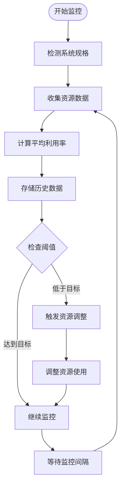

**图表来源**
- [scripts/dynamic_redundancy.py](file://scripts/dynamic_redundancy.py#L132-L250)

**监控特性**：
- **实时采集**：使用psutil库实时获取系统资源使用情况
- **历史维护**：维护30天监控周期的历史数据，支持趋势分析
- **平均计算**：计算各资源的平均利用率，避免瞬时波动影响决策
- **异常处理**：完善的异常处理机制，确保监控服务的稳定性

### RedundancyController 主控制器协调机制

RedundancyController 作为系统的核心协调器，负责整个资源调控流程：

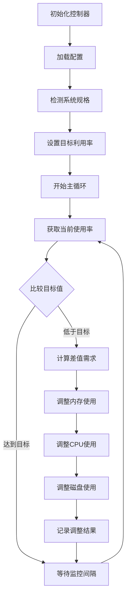

**图表来源**
- [scripts/dynamic_redundancy.py](file://scripts/dynamic_redundancy.py#L252-L730)

**控制逻辑**：
- **自适应调整**：根据系统规格和当前使用情况动态调整资源
- **多资源协调**：同时调整CPU、内存、磁盘三种资源，确保整体平衡
- **渐进式调节**：采用渐进式的调整策略，避免系统资源剧烈波动
- **资源隔离**：每种资源的调整相互独立，降低系统风险

**章节来源**
- [scripts/dynamic_redundancy.py](file://scripts/dynamic_redundancy.py#L25-L730)

## 数据流与控制流程

### 配置加载→系统检测→目标设定→资源监控→差值计算→调节执行 数据流闭环

系统采用完整的数据流闭环设计，确保资源调控的准确性和有效性：

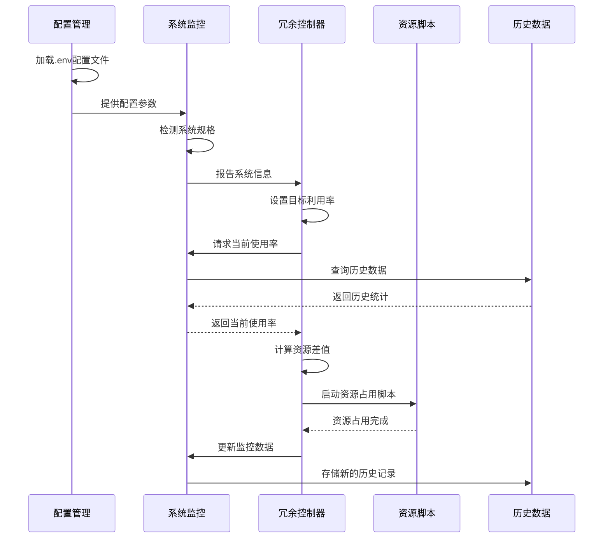

**图表来源**
- [scripts/dynamic_redundancy.py](file://scripts/dynamic_redundancy.py#L650-L730)

### dynamic_redundancy.py 对各 stresser 脚本的依赖注入机制

系统采用依赖注入机制，通过动态调用的方式管理各个资源占用脚本：

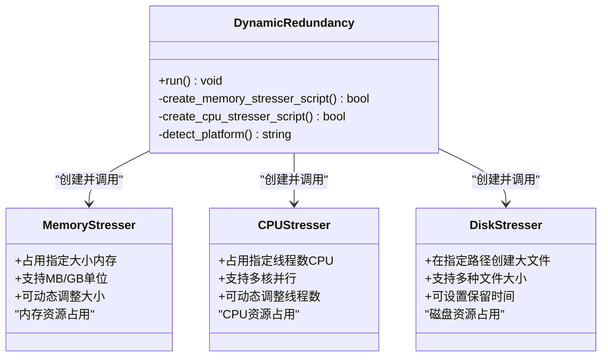

**图表来源**
- [scripts/dynamic_redundancy.py](file://scripts/dynamic_redundancy.py#L532-L650)

**依赖注入特点**：
- **动态创建**：在运行时动态创建资源占用脚本，确保脚本可用性
- **平台适配**：根据不同平台选择合适的脚本执行方式
- **资源隔离**：每个资源类型独立运行，避免相互干扰
- **生命周期管理**：通过子进程管理资源占用的生命周期

**章节来源**
- [scripts/dynamic_redundancy.py](file://scripts/dynamic_redundancy.py#L532-L730)

## 跨平台支持设计

### Windows/Linux 启动脚本差异处理

系统提供专门的启动脚本，针对不同平台的特点进行优化：

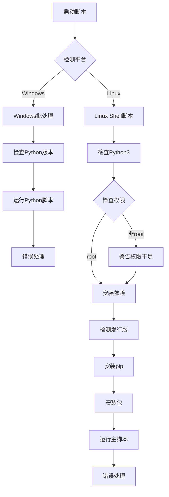

**图表来源**
- [start_dynamic_redundancy.bat](file://start_dynamic_redundancy.bat#L1-L24)
- [start_dynamic_redundancy.sh](file://start_dynamic_redundancy.sh#L1-L104)

### 平台自动检测逻辑

系统具备完善的平台自动检测能力：

```python
def detect_platform(self):
    """检测操作系统平台"""
    platform_config = self.config.get('PLATFORM', 'auto').lower()
    
    if platform_config != 'auto':
        return platform_config
    
    # 自动检测平台
    system = platform.system().lower()
    if system == 'windows':
        return 'windows'
    elif system == 'linux':
        # 尝试检测Linux发行版
        try:
            with open('/etc/os-release', 'r') as f:
                content = f.read().lower()
                if 'centos' in content:
                    return 'centos'
                elif 'ubuntu' in content:
                    return 'ubuntu'
                elif 'kylin' in content:
                    return 'kylin'
                elif 'openEuler' in content or 'openeuler' in content:
                    return 'openEuler'
        except:
            return 'linux_generic'
    else:
        return 'unknown'
```

**平台支持特性**：
- **自动识别**：自动识别Windows、Linux主流发行版
- **发行版适配**：针对不同Linux发行版提供差异化支持
- **通用兼容**：对于未知平台提供通用配置支持
- **权限检测**：Linux平台检测root权限，提供权限不足警告

**章节来源**
- [scripts/dynamic_redundancy.py](file://scripts/dynamic_redundancy.py#L350-L400)
- [start_dynamic_redundancy.bat](file://start_dynamic_redundancy.bat#L1-L24)
- [start_dynamic_redundancy.sh](file://start_dynamic_redundancy.sh#L1-L104)

## 依赖关系分析

### 组件间依赖关系图

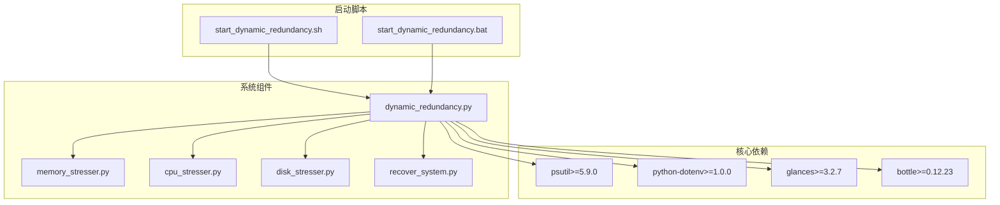

**图表来源**
- [requirements.txt](file://requirements.txt#L1-L5)
- [scripts/dynamic_redundancy.py](file://scripts/dynamic_redundancy.py#L1-L20)

### 依赖层次分析

**第一层：基础依赖**
- **psutil**：系统资源监控的基础库，提供跨平台的系统信息获取能力
- **python-dotenv**：环境变量管理，支持配置文件的加载和解析

**第二层：功能依赖**
- **glances**：第三方监控工具，提供Web界面的实时性能监控
- **bottle**：Web框架，支持Glances的Web服务器功能

**第三层：业务依赖**
- **stresser脚本**：资源占用的核心实现，由主控制器动态调用
- **恢复脚本**：系统资源恢复的核心实现，提供完整的资源清理能力

**章节来源**
- [requirements.txt](file://requirements.txt#L1-L5)
- [scripts/dynamic_redundancy.py](file://scripts/dynamic_redundancy.py#L1-L20)

## 可扩展性评估

### 当前架构的可扩展性分析

CloudResourceOptimizer 的架构设计具有良好的可扩展性，主要体现在以下几个方面：

#### 1. 模块化设计支持新功能添加

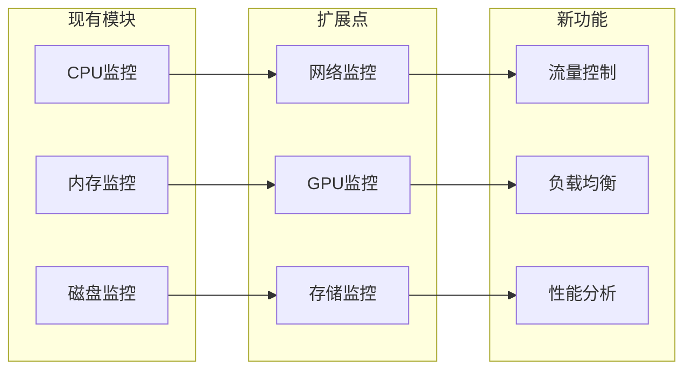

#### 2. 新功能潜在接入点

**网络流量控制接入点**：
- **监控层扩展**：在SystemMonitor中添加网络流量监控
- **控制层扩展**：在RedundancyController中添加网络流量调节逻辑
- **脚本层扩展**：创建network_stresser.py脚本实现网络流量占用

**负载均衡接入点**：
- **配置层扩展**：在ConfigManager中添加负载均衡相关配置
- **监控层扩展**：扩展SystemMonitor的监控范围
- **控制层扩展**：在RedundancyController中添加负载均衡算法

**性能分析接入点**：
- **历史数据分析**：扩展resource_history的数据结构，支持更复杂的数据分析
- **机器学习集成**：集成机器学习算法进行预测性资源调整
- **可视化增强**：扩展GlancesMonitor的可视化能力

#### 3. 扩展设计原则

**插件化架构**：新功能可以通过插件化的方式集成，无需修改核心代码
**配置驱动**：通过配置文件控制新功能的启用和参数设置
**接口标准化**：新功能需要遵循现有的接口规范，确保系统一致性
**向后兼容**：新功能的添加不会影响现有功能的正常运行

**章节来源**
- [scripts/dynamic_redundancy.py](file://scripts/dynamic_redundancy.py#L25-L730)

## 总结

CloudResourceOptimizer 采用了先进的面向对象模块化设计理念，构建了一个完整、稳定、可扩展的云主机资源优化系统。通过五个核心层次的清晰分工和紧密协作，系统实现了：

### 架构优势

1. **清晰的层次划分**：配置管理、日志服务、系统监控、冗余控制、外部监控集成五大层次，职责明确，耦合度低
2. **单例模式配置管理**：ConfigManager采用单例模式，确保配置的一致性和可靠性
3. **观察者模式监控**：SystemMonitor采用观察者模式，实现实时、高效的系统资源监控
4. **主控制器协调机制**：RedundancyController作为系统中枢，协调各组件工作，形成完整的控制闭环
5. **跨平台支持**：完善的Windows/Linux平台支持，具备自动检测和差异化处理能力

### 设计亮点

1. **数据流闭环设计**：从配置加载到资源监控再到调节执行的完整数据流闭环，确保系统运行的准确性和有效性
2. **依赖注入机制**：通过动态调用的方式管理资源占用脚本，提高系统的灵活性和可维护性
3. **多目的地日志输出**：Logger服务模式支持文件和控制台双重输出，便于系统监控和问题排查
4. **自适应资源调控**：根据系统规格自动调整资源利用率目标，实现智能化的资源管理

### 可扩展性展望

系统架构设计充分考虑了未来的扩展需求，为添加网络流量控制、负载均衡、性能分析等功能提供了清晰的接入点和扩展路径。模块化的设计思想和插件化的扩展机制，使得系统能够在保持稳定性的前提下，逐步演进和完善。

CloudResourceOptimizer 不仅是一个功能完善的资源优化工具，更是一个具有前瞻性的系统架构设计典范，为类似系统的开发提供了宝贵的参考价值。