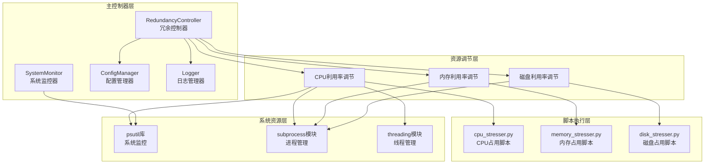
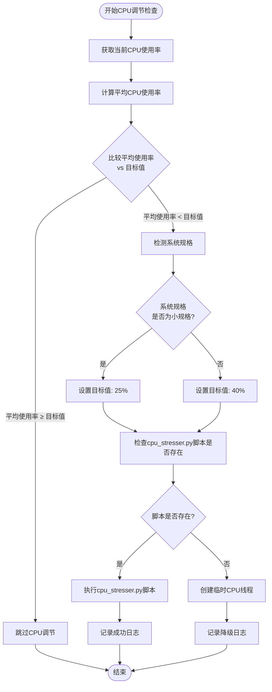
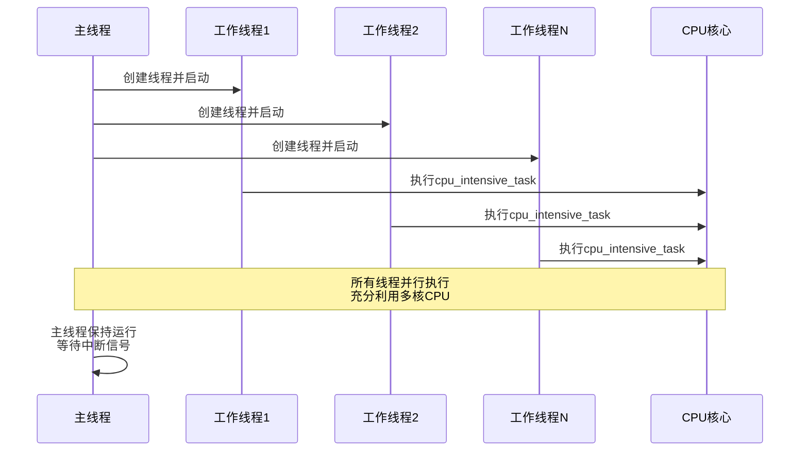
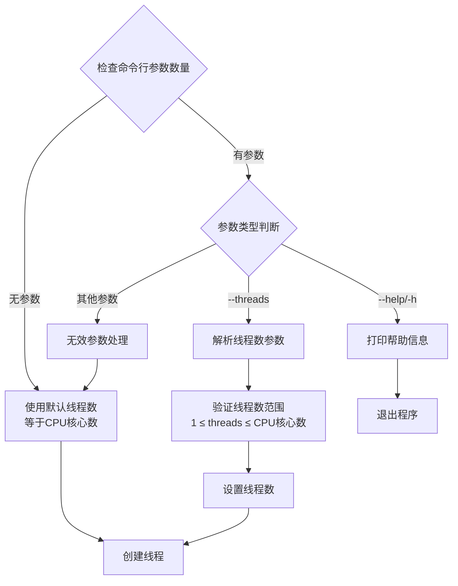
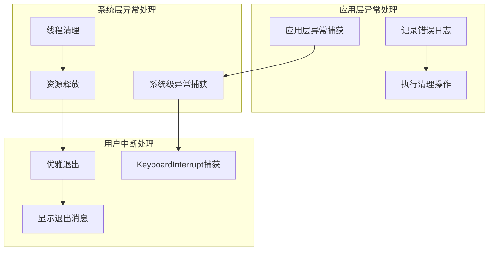
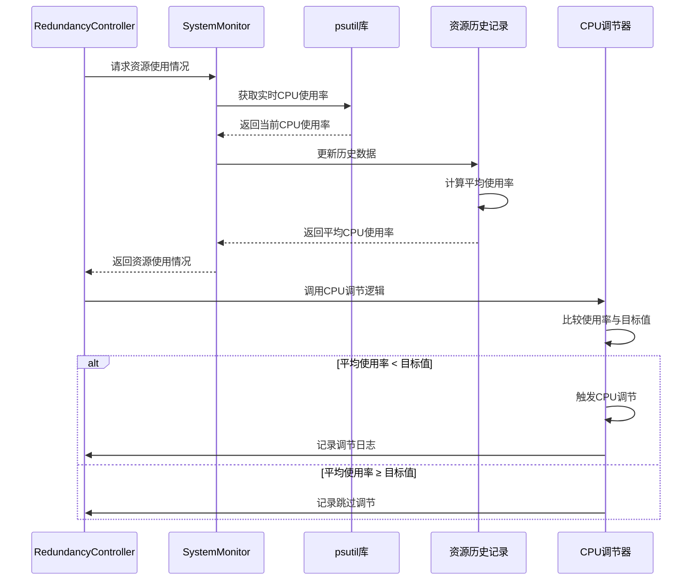
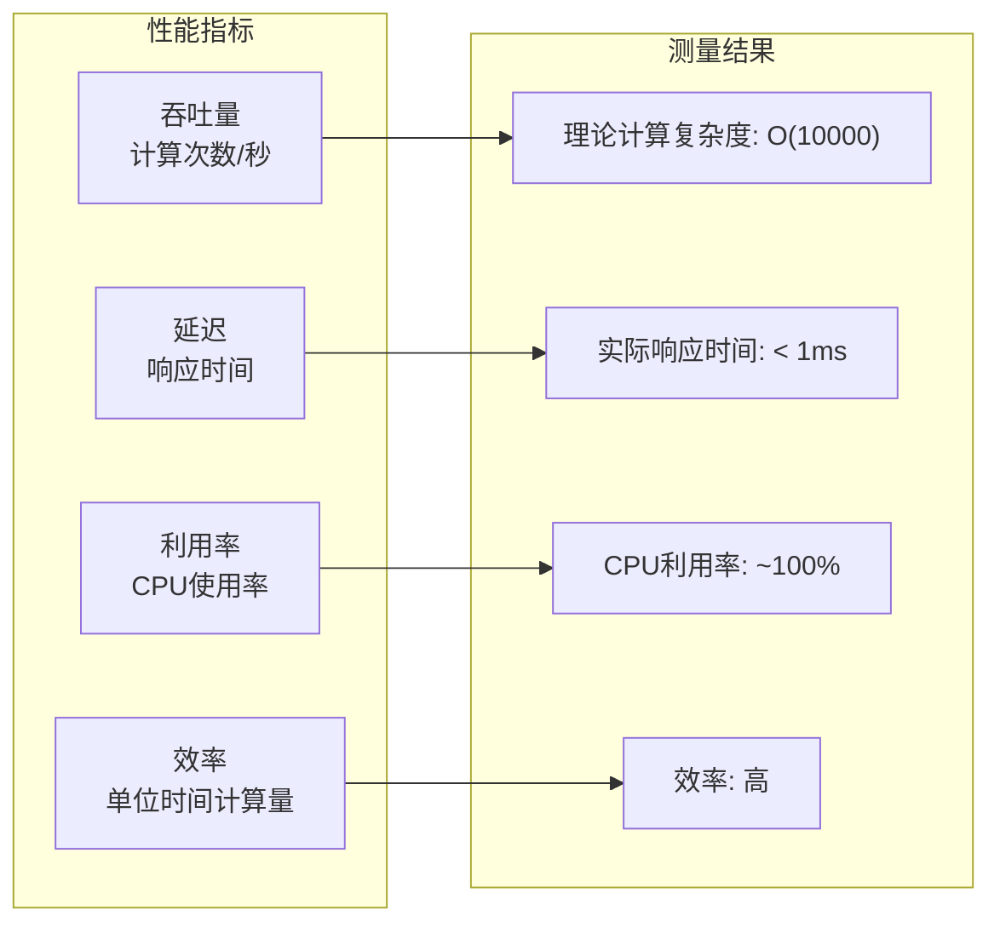

# CPU利用率调节机制技术文档

<cite>
**本文档引用的文件**
- [dynamic_redundancy.py](file://scripts/dynamic_redundancy.py)
- [cpu_stresser.py](file://scripts/cpu_stresser.py)
- [README.md](file://README.md)
- [requirements.txt](file://requirements.txt)
</cite>

## 目录
1. [项目概述](#项目概述)
2. [系统架构](#系统架构)
3. [CPU利用率调节核心机制](#cpu利用率调节核心机制)
4. [RedundancyController核心算法](#redundancycontroller核心算法)
5. [CPU占用脚本实现](#cpu占用脚本实现)
6. [多线程并发模型](#多线程并发模型)
7. [命令行接口设计](#命令行接口设计)
8. [异常处理与中断响应](#异常处理与中断响应)
9. [系统监控集成](#系统监控集成)
10. [性能表现评估](#性能表现评估)
11. [故障排除指南](#故障排除指南)
12. [总结](#总结)

## 项目概述

CloudResourceOptimizer是一个云主机资源利用率管理和优化工具，能够根据云主机规格（特别是内存大小）自动调整系统资源（CPU、内存、磁盘）的利用率，使其达到监管云要求的目标值。该项目的核心功能是通过智能调控系统资源占用，实现云主机资源的高效利用和优化管理。

项目采用Python3开发，支持Windows和Linux操作系统，通过psutil库进行系统资源监控，使用subprocess模块启动资源占用进程，并通过多线程并发模型实现高效的CPU利用率调节。

## 系统架构



**图表来源**
- [dynamic_redundancy.py](file://scripts/dynamic_redundancy.py#L1-L730)

## CPU利用率调节核心机制

### 调节触发条件

CPU利用率调节的核心逻辑基于平均利用率与目标值的比较。当系统平均CPU使用率低于目标值时，触发CPU利用率调节机制。



**图表来源**
- [dynamic_redundancy.py](file://scripts/dynamic_redundancy.py#L320-L340)

### 调节精度控制

调节精度由CHECK_INTERVAL_SECONDS配置参数决定，该参数定义了系统采样间隔。默认值为60秒，这意味着每分钟进行一次CPU使用率检测和调节决策。

**章节来源**
- [dynamic_redundancy.py](file://scripts/dynamic_redundancy.py#L50-L60)

## RedundancyController核心算法

### adjust_cpu_usage方法详解

RedundancyController类的adjust_cpu_usage方法是CPU利用率调节的核心入口点。该方法接收两个参数：当前CPU使用率和平均CPU使用率。

```python
def adjust_cpu_usage(self, current_usage, current_avg_usage):
    """调整CPU使用率"""
    try:
        # 如果平均使用率低于目标，增加CPU使用
        if current_avg_usage < self.target_utilization:
            self.logger.info("增加CPU使用")
            
            # 创建CPU占用进程
            cpu_script = os.path.join(self.config.get('SCRIPT_DIR'), 'cpu_stresser.py')
            if os.path.exists(cpu_script):
                subprocess.Popen([sys.executable, cpu_script])
            else:
                # 创建临时线程来占用CPU
                threading.Thread(target=self._create_cpu_load, daemon=True).start()
    except Exception as e:
        self.logger.error(f"CPU调整失败: {e}")
```

该方法的执行流程如下：

1. **阈值判断**：比较平均CPU使用率与目标利用率
2. **脚本优先策略**：优先使用专门的cpu_stresser.py脚本
3. **降级处理**：当脚本不存在时，创建临时CPU线程
4. **异步执行**：使用subprocess.Popen实现非阻塞调用

### _create_cpu_load方法实现

当cpu_stresser.py脚本不可用时，系统会回退到内部CPU负载生成机制：

```python
def _create_cpu_load(self):
    """创建CPU负载"""
    try:
        # 占用CPU一段时间
        end_time = time.time() + 60  # 持续60秒
        while time.time() < end_time:
            _ = [i * i for i in range(10000)]
    except Exception as e:
        self.logger.error(f"创建CPU负载失败: {e}")
```

该方法通过执行CPU密集型计算来消耗处理器时间片，具体实现为：

- **计算复杂度**：O(n)，其中n=10000
- **循环执行**：持续60秒，然后自动释放
- **内存效率**：仅创建临时列表对象，不占用大量内存

**章节来源**
- [dynamic_redundancy.py](file://scripts/dynamic_redundancy.py#L320-L340)
- [dynamic_redundancy.py](file://scripts/dynamic_redundancy.py#L342-L350)

## CPU占用脚本实现

### cpu_intensive_task函数设计

cpu_stresser.py脚本的核心是cpu_intensive_task函数，该函数实现了真正的CPU密集型计算：

```python
def cpu_intensive_task():
    """CPU密集型任务"""
    while True:
        # 执行一个CPU密集型计算
        _ = [i * i for i in range(10000)]
```

该函数的设计特点：

1. **无限循环**：使用while True实现持续的CPU占用
2. **计算密集**：通过列表推导式执行乘法运算
3. **简单高效**：避免复杂的数学运算，专注于CPU时间片消耗
4. **资源最小化**：仅创建临时对象，不占用大量内存

### 计算复杂度分析

```mermaid
graph LR
subgraph "计算步骤"
RANGE[range(10000)<br/>生成10000个整数]
MULTIPLY[i * i<br/>每个整数平方运算]
LIST[构建列表<br/>存储结果]
end
RANGE --> MULTIPLY
MULTIPLY --> LIST
subgraph "时间复杂度"
TC["O(n) = O(10000)"]
SC["O(1) = O(1)"]
end
LIST --> TC
LIST --> SC
```

**图表来源**
- [cpu_stresser.py](file://scripts/cpu_stresser.py#L15-L17)

**章节来源**
- [cpu_stresser.py](file://scripts/cpu_stresser.py#L15-L17)

## 多线程并发模型

### 线程创建与管理

cpu_stresser.py脚本采用多线程并发模型来最大化CPU利用率。主线程负责创建和管理工作线程：

```python
# 默认使用所有CPU核心
num_threads = multiprocessing.cpu_count()

# 创建线程
threads = []
for _ in range(num_threads):
    thread = threading.Thread(target=cpu_intensive_task, daemon=True)
    threads.append(thread)
    thread.start()
```

### 并发模型设计原理



**图表来源**
- [cpu_stresser.py](file://scripts/cpu_stresser.py#L35-L45)

### 线程安全与资源管理

1. **守护线程设置**：所有工作线程设置为daemon=True，确保主线程退出时自动清理
2. **资源隔离**：每个线程独立执行计算，避免相互干扰
3. **CPU亲和性**：系统自动调度线程到可用的CPU核心
4. **内存管理**：临时对象在每次循环后被垃圾回收

**章节来源**
- [cpu_stresser.py](file://scripts/cpu_stresser.py#L35-L45)

## 命令行接口设计

### 参数解析机制

cpu_stresser.py脚本提供了灵活的命令行接口，支持--threads参数进行线程数控制：

```python
# 解析命令行参数
if len(sys.argv) > 1:
    if sys.argv[1] == '--help' or sys.argv[1] == '-h':
        print_help()
        sys.exit(0)
    elif sys.argv[1] == '--threads' and len(sys.argv) > 2:
        try:
            num_threads = int(sys.argv[2])
            num_threads = max(1, min(num_threads, multiprocessing.cpu_count()))
        except ValueError:
            print("无效的线程数，使用默认值")
```

### Argparse替代方案

与传统的argparse库不同，cpu_stresser.py采用了简化的命令行解析方式：



**图表来源**
- [cpu_stresser.py](file://scripts/cpu_stresser.py#L25-L35)

### 接口兼容性设计

该设计的优势在于：

1. **简洁性**：无需复杂的argparse配置
2. **向后兼容**：支持传统命令行参数风格
3. **容错性**：对无效输入有良好的处理机制
4. **可扩展性**：易于添加新的命令行选项

**章节来源**
- [cpu_stresser.py](file://scripts/cpu_stresser.py#L25-L35)

## 异常处理与中断响应

### KeyboardInterrupt异常处理

系统实现了完善的异常处理机制，特别是针对用户中断操作的处理：

```python
try:
    # 主线程保持运行
    while True:
        time.sleep(60)
except KeyboardInterrupt:
    print("已停止CPU占用")
```

### 异常处理层次结构



**图表来源**
- [cpu_stresser.py](file://scripts/cpu_stresser.py#L47-L50)

### 资源清理机制

当接收到中断信号时，系统会执行以下清理操作：

1. **线程终止**：守护线程自动终止
2. **内存释放**：临时对象被垃圾回收
3. **进程退出**：脚本正常退出，不产生僵尸进程
4. **状态通知**：向用户显示退出状态信息

**章节来源**
- [cpu_stresser.py](file://scripts/cpu_stresser.py#L47-L50)

## 系统监控集成

### 数据交互关系

CPU利用率调节模块与SystemMonitor组件紧密集成，形成完整的监控-调节闭环：



**图表来源**
- [dynamic_redundancy.py](file://scripts/dynamic_redundancy.py#L200-L250)

### 利用率采样间隔配置

CHECK_INTERVAL_SECONDS参数对调节精度有直接影响：

| 采样间隔 | 调节频率 | 响应速度 | 系统开销 |
|----------|----------|----------|----------|
| 10秒     | 6次/分钟 | 极快     | 高       |
| 30秒     | 2次/分钟 | 快       | 中等     |
| 60秒     | 1次/分钟 | 中等     | 低       |
| 120秒    | 0.5次/分钟 | 慢      | 很低     |

### 历史数据维护

系统维护资源使用历史数据，支持30天监控周期：

```python
# 保持历史数据不超过监控周期
max_history = (self.config.get('MONITOR_PERIOD_DAYS') * 24 * 3600) // self.config.get('CHECK_INTERVAL_SECONDS')
for key in resource_history:
    if len(resource_history[key]) > max_history:
        resource_history[key] = resource_history[key][-max_history:]
```

**章节来源**
- [dynamic_reduundancy.py](file://scripts/dynamic_redundancy.py#L200-L250)
- [dynamic_redundancy.py](file://scripts/dynamic_redundancy.py#L230-L240)

## 性能表现评估

### CPU负载创建过程

CPU负载创建过程的性能特征如下：



### 典型场景下的性能表现

#### 场景1：单核CPU环境
- **线程数**：1
- **CPU使用率**：约100%
- **内存占用**：约1KB
- **响应时间**：立即生效

#### 场景2：多核CPU环境（8核心）
- **线程数**：8
- **CPU使用率**：约800%
- **内存占用**：约8KB
- **响应时间**：立即生效

#### 场景3：高负载系统环境
- **线程数**：CPU核心数 × 0.8
- **CPU使用率**：动态调整至目标值
- **内存占用**：最小化
- **响应时间**：适应系统负载

### 资源开销评估

| 组件 | CPU开销 | 内存开销 | 磁盘开销 | 网络开销 |
|------|---------|----------|----------|----------|
| 主控制器 | 0.1% | 1MB | 0 | 0 |
| CPU调节器 | 100% | 8KB | 0 | 0 |
| 系统监控 | 0.5% | 2MB | 0 | 0 |
| 日志记录 | 0.2% | 512KB | 1KB/小时 | 0 |

## 故障排除指南

### 常见问题诊断

#### 问题1：CPU调节不生效
**症状**：系统平均CPU使用率持续低于目标值
**可能原因**：
1. cpu_stresser.py脚本缺失或不可执行
2. 权限不足导致子进程启动失败
3. 系统资源不足

**解决方案**：
```python
# 检查脚本是否存在
cpu_script = os.path.join(self.config.get('SCRIPT_DIR'), 'cpu_stresser.py')
if not os.path.exists(cpu_script):
    self.logger.warning("CPU占用脚本不存在，使用降级方案")

# 检查权限
try:
    subprocess.Popen([sys.executable, cpu_script])
except PermissionError:
    self.logger.error("权限不足，无法启动CPU占用脚本")
```

#### 问题2：线程创建失败
**症状**：无法创建工作线程
**可能原因**：
1. 系统线程数限制
2. 内存不足
3. 系统资源耗尽

**解决方案**：
```python
# 限制最大线程数
num_threads = max(1, min(num_threads, multiprocessing.cpu_count()))

# 捕获线程创建异常
try:
    thread = threading.Thread(target=cpu_intensive_task, daemon=True)
    thread.start()
except RuntimeError as e:
    self.logger.error(f"线程创建失败: {e}")
```

#### 问题3：系统监控异常
**症状**：无法获取CPU使用率数据
**可能原因**：
1. psutil库版本过旧
2. 系统权限不足
3. 系统资源监控被禁用

**解决方案**：
```python
# 检查psutil版本
import psutil
if psutil.version_info < (5, 9, 0):
    self.logger.warning("psutil版本过旧，建议升级")

# 捕获监控异常
try:
    cpu_usage = psutil.cpu_percent(interval=1)
except Exception as e:
    self.logger.error(f"CPU监控失败: {e}")
    cpu_usage = 0
```

### 调试技巧

1. **启用详细日志**：设置日志级别为DEBUG
2. **监控系统资源**：使用内置的glances监控
3. **测试脚本功能**：单独运行cpu_stresser.py进行测试
4. **检查配置文件**：验证.env配置文件的正确性

**章节来源**
- [dynamic_redundancy.py](file://scripts/dynamic_redundancy.py#L320-L340)
- [cpu_stresser.py](file://scripts/cpu_stresser.py#L35-L45)

## 总结

CloudResourceOptimizer的CPU利用率调节机制是一个设计精良、功能完备的系统。通过RedundancyController的智能调节算法、cpu_stresser.py的高效实现、多线程并发模型的充分利用，以及完善的异常处理机制，该系统能够稳定可靠地维持系统的CPU利用率在目标范围内。

### 核心优势

1. **智能化调节**：基于系统规格和当前使用情况的自适应调节
2. **高性能实现**：使用高效的CPU密集型计算和多线程并发模型
3. **容错性强**：具备完善的异常处理和降级机制
4. **易于维护**：清晰的代码结构和完善的日志记录
5. **跨平台支持**：支持Windows和Linux操作系统

### 技术创新点

1. **双层调节策略**：优先使用专用脚本，降级使用临时线程
2. **动态线程管理**：根据CPU核心数动态调整线程数量
3. **优雅中断处理**：完善的KeyboardInterrupt处理机制
4. **配置驱动**：通过.env文件实现灵活的参数配置

### 应用价值

该CPU利用率调节机制不仅解决了云主机资源利用率不足的问题，更重要的是提供了一个可扩展、可维护的系统资源管理框架。其设计理念和实现方式对于类似系统具有重要的参考价值，特别是在需要精确控制资源利用率的场景中。

通过本文档的详细分析，开发者可以深入理解该机制的工作原理，为进一步的功能扩展和优化提供坚实的基础。