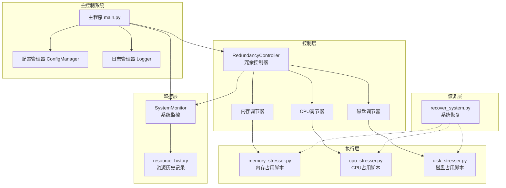
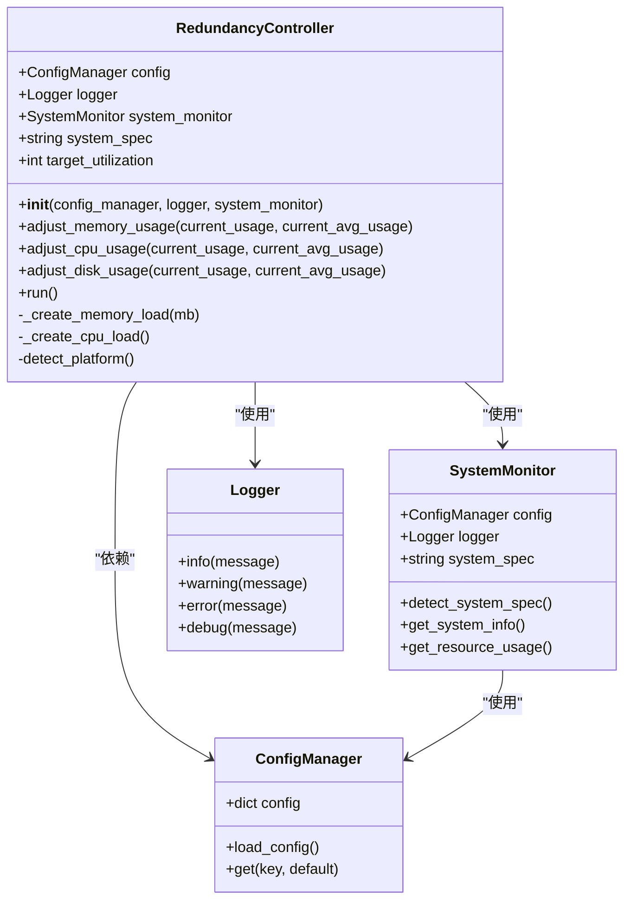
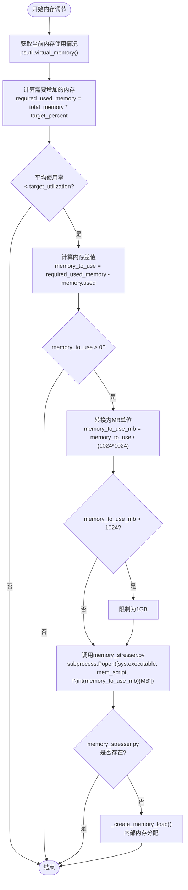
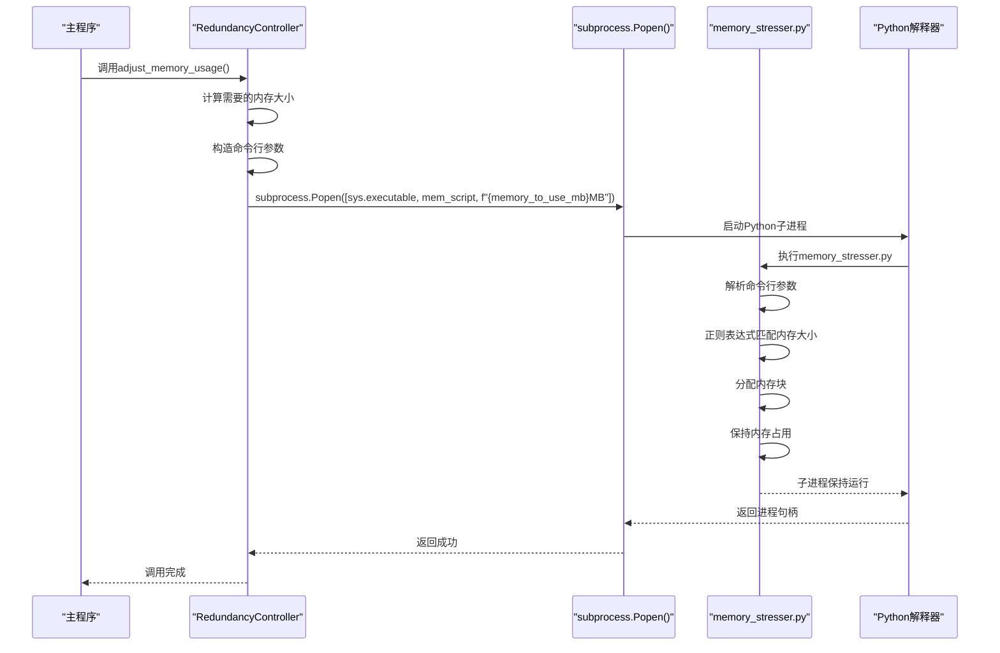
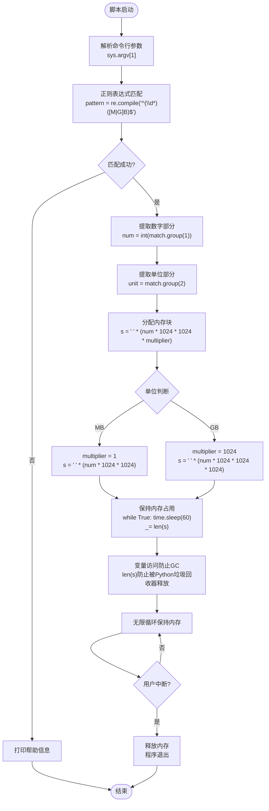
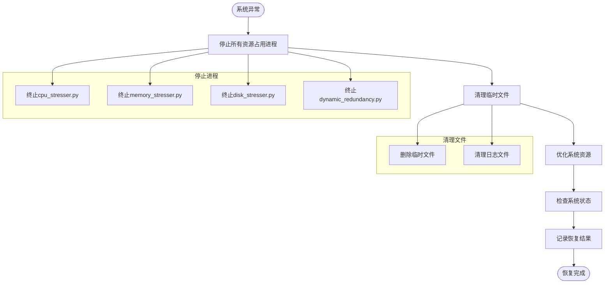

# 内存利用率调节功能技术文档

<cite>
**本文档引用的文件**
- [dynamic_redundancy.py](file://scripts/dynamic_redundancy.py)
- [memory_stresser.py](file://scripts/memory_stresser.py)
- [README.md](file://README.md)
- [recover_system.py](file://Recover/recover_system.py)
</cite>

## 目录
1. [简介](#简介)
2. [系统架构概览](#系统架构概览)
3. [RedundancyController核心组件](#redundancycontroller核心组件)
4. [内存利用率调节工作流程](#内存利用率调节工作流程)
5. [IPC通信机制详解](#ipc通信机制详解)
6. [内存分配技术细节](#内存分配技术细节)
7. [资源历史监控系统](#资源历史监控系统)
8. [故障排除指南](#故障排除指南)
9. [总结](#总结)

## 简介

CloudResourceOptimizer是一个智能的云主机资源利用率管理系统，专门设计用于根据云主机的内存规格自动调整系统资源（CPU、内存、磁盘）的利用率。该系统的核心功能之一是内存利用率调节，它通过动态创建内存占用进程来维持目标利用率水平。

内存利用率调节功能的主要特点：
- **自适应调节**：根据系统规格（小规格≤8GB vs 大规格≥16GB）自动设置不同的目标利用率
- **智能监控**：实时监控内存使用率和平均使用率，确保资源利用符合监管要求
- **安全限制**：单次内存分配不超过1GB，防止系统资源耗尽
- **恢复机制**：提供完整的系统资源恢复功能，确保系统稳定性

## 系统架构概览



**图表来源**
- [dynamic_redundancy.py](file://scripts/dynamic_redundancy.py#L1-L730)
- [memory_stresser.py](file://scripts/memory_stresser.py#L1-L46)

## RedundancyController核心组件

RedundancyController是内存利用率调节功能的核心控制器，负责协调整个资源调节过程。



**图表来源**
- [dynamic_redundancy.py](file://scripts/dynamic_redundancy.py#L245-L488)

**章节来源**
- [dynamic_redundancy.py](file://scripts/dynamic_redundancy.py#L245-L488)

## 内存利用率调节工作流程

内存利用率调节的核心工作流程如下：



**图表来源**
- [dynamic_redundancy.py](file://scripts/dynamic_redundancy.py#L245-L298)

### 关键算法步骤

1. **内存规格检测**：根据系统总内存自动判断是小规格（≤8GB）还是大规格（≥16GB）
2. **目标利用率计算**：小规格目标25%，大规格目标40%，最高不超过90%
3. **内存差值计算**：`required_used_memory = total_memory * required_usage_percent / 100`
4. **安全限制**：单次分配不超过1GB，防止系统资源耗尽
5. **IPC调用**：通过subprocess调用外部脚本进行内存分配

**章节来源**
- [dynamic_redundancy.py](file://scripts/dynamic_redundancy.py#L245-L298)

## IPC通信机制详解

内存利用率调节采用外部脚本模式，通过subprocess模块实现进程间通信（IPC）。



**图表来源**
- [dynamic_redundancy.py](file://scripts/dynamic_redundancy.py#L272-L298)
- [memory_stresser.py](file://scripts/memory_stresser.py#L1-L46)

### IPC通信特点

1. **进程隔离**：内存占用在独立进程中运行，不影响主程序稳定性
2. **参数传递**：通过命令行参数传递内存大小（如"100MB"或"1GB"）
3. **资源独立**：每个内存占用进程拥有独立的内存空间
4. **易于监控**：可以通过psutil监控子进程状态

**章节来源**
- [dynamic_redundancy.py](file://scripts/dynamic_redundancy.py#L272-L298)

## 内存分配技术细节

memory_stresser.py脚本实现了高效的内存分配机制，其核心技术包括正则表达式解析和内存块分配。



**图表来源**
- [memory_stresser.py](file://scripts/memory_stresser.py#L1-L46)

### 技术实现要点

1. **正则表达式解析**：
   ```python
   pattern = re.compile('^(\\d*)([M|G]B)$')
   match = pattern.match(sys.argv[1].upper())
   ```
   - 支持"100MB"、"1GB"等多种格式
   - 自动转换为大写进行匹配
   - 提取数字和单位两个分组

2. **内存分配策略**：
   ```python
   if unit == 'MB':
       s = ' ' * (num * 1024 * 1024)
   else:
       s = ' ' * (num * 1024 * 1024 * 1024)
   ```
   - MB单位：1MB = 1024 * 1024 字节
   - GB单位：1GB = 1024 * 1024 * 1024 字节

3. **垃圾回收防护**：
   ```python
   while True:
       time.sleep(60)
       # 访问一下变量，防止被垃圾回收
       _ = len(s)
   ```
   - 定期访问变量长度，防止Python垃圾回收器释放内存
   - 保持内存占用的稳定性

**章节来源**
- [memory_stresser.py](file://scripts/memory_stresser.py#L1-L46)

## 资源历史监控系统

系统维护了一个全局的resource_history字典来记录30天的资源使用历史，支持平均利用率的统计计算。

```mermaid
erDiagram
RESOURCE_HISTORY {
list cpu
list memory
list disk
}
MONITOR_CONFIG {
int MONITOR_PERIOD_DAYS
int CHECK_INTERVAL_SECONDS
}
SYSTEM_MONITOR {
dict resource_history
append_usage()
calculate_average()
}
REDUNDANCY_CONTROLLER {
float target_utilization
adjust_memory_usage()
}
RESOURCE_HISTORY ||--o{ SYSTEM_MONITOR : "记录"
MONITOR_CONFIG ||--|| SYSTEM_MONITOR : "配置"
SYSTEM_MONITOR ||--|| REDUNDANCY_CONTROLLER : "提供数据"
```

**图表来源**
- [dynamic_redundancy.py](file://scripts/dynamic_redundancy.py#L21-L232)

### 监控窗口计算

监控窗口的计算公式：
```python
max_history = (MONITOR_PERIOD_DAYS * 24 * 3600) // CHECK_INTERVAL_SECONDS
```

例如：
- 监控周期：30天
- 检查间隔：60秒
- 最大历史记录数：`(30 * 24 * 3600) // 60 = 43200条记录`

### 平均利用率计算

```python
{
    'cpu_avg': sum(resource_history['cpu']) / len(resource_history['cpu']) if resource_history['cpu'] else 0,
    'memory_avg': sum(resource_history['memory']) / len(resource_history['memory']) if resource_history['memory'] else 0,
    'disk_avg': sum(resource_history['disk']) / len(resource_history['disk']) if resource_history['disk'] else 0
}
```

**章节来源**
- [dynamic_redundancy.py](file://scripts/dynamic_redundancy.py#L21-L232)

## 故障排除指南

### 内存分配失败的常见原因

1. **系统内存不足**
   - 症状：`memory_stresser.py`启动失败
   - 解决方案：检查系统可用内存，确保有足够的空闲内存
   - 检查命令：`free -h` 或 `psutil.virtual_memory().available`

2. **权限问题**
   - 症状：无法创建子进程或访问系统资源
   - 解决方案：以管理员/root权限运行脚本
   - 检查命令：`whoami` 或 `id`

3. **脚本文件缺失**
   - 症状：找不到`memory_stresser.py`
   - 解决方案：检查脚本目录权限和文件存在性
   - 检查命令：`ls -la scripts/`

4. **Python环境问题**
   - 症状：子进程启动但立即退出
   - 解决方案：检查Python版本和依赖包
   - 检查命令：`python --version` 和 `pip list`

### 恢复机制

系统提供了完整的恢复机制来处理异常情况：



**图表来源**
- [recover_system.py](file://Recover/recover_system.py#L1-L229)

### 恢复脚本使用方法

1. **Windows系统**：
   ```cmd
   Recover\recover_system.bat
   ```

2. **Linux系统**：
   ```bash
   cd Recover
   ./recover_system.sh
   ```

3. **手动恢复**：
   ```python
   python Recover/recover_system.py
   ```

**章节来源**
- [recover_system.py](file://Recover/recover_system.py#L1-L229)

## 总结

CloudResourceOptimizer的内存利用率调节功能是一个高度集成和可靠的技术解决方案。它通过以下关键特性确保系统的稳定性和效率：

### 核心优势

1. **智能调节**：根据系统规格自动设置不同的目标利用率，确保资源利用符合监管要求
2. **安全机制**：单次内存分配不超过1GB，防止系统资源耗尽
3. **进程隔离**：采用外部脚本模式，确保内存占用在独立进程中运行
4. **监控完整**：30天历史数据记录，支持精确的平均利用率计算
5. **恢复保障**：完整的系统恢复机制，确保异常情况下的系统稳定性

### 技术亮点

- **高效的IPC通信**：通过subprocess模块实现进程间通信，保证主程序稳定性
- **智能内存分配**：正则表达式解析和内存块分配技术，支持多种内存大小格式
- **垃圾回收防护**：定期访问变量防止Python垃圾回收器释放内存
- **自适应监控**：根据监控周期动态调整历史数据存储量

### 应用场景

该内存利用率调节功能特别适用于：
- 云主机资源优化管理
- 监管合规性要求
- 系统性能监控和调优
- 资源使用率统计分析

通过这种设计，CloudResourceOptimizer能够在保证系统稳定性的同时，实现智能的资源利用率调节，为云主机的高效运行提供有力支撑。