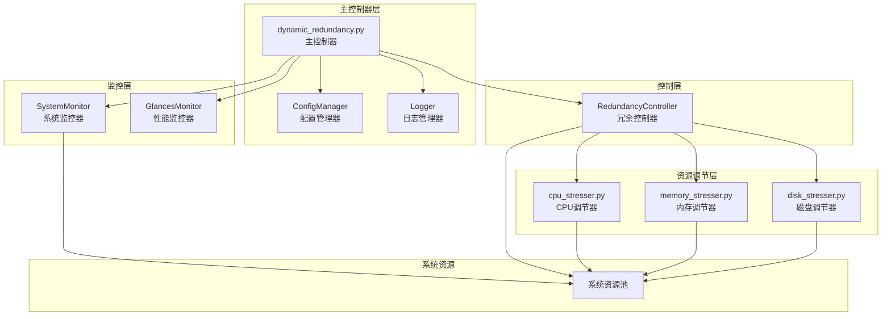
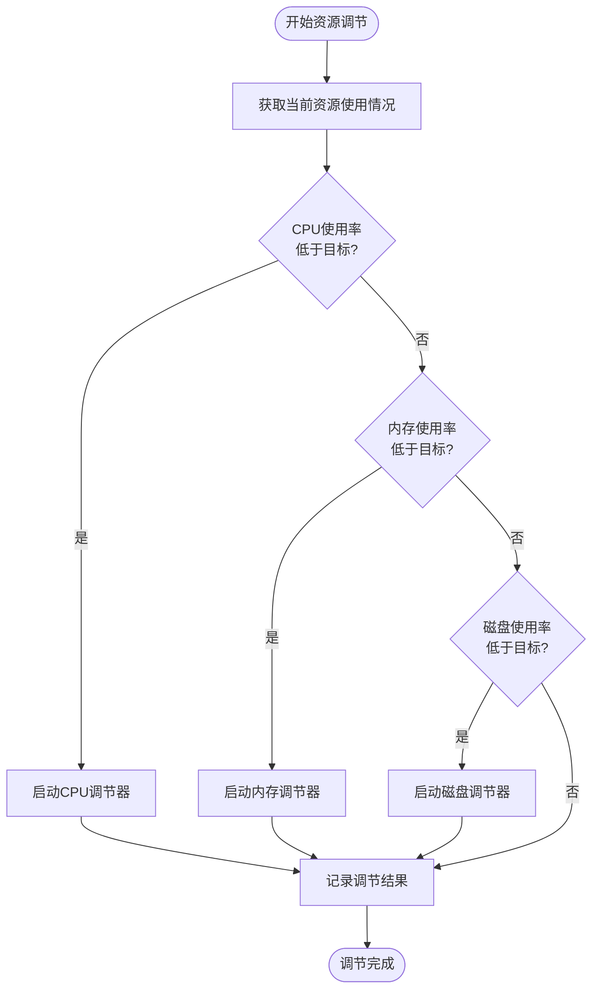
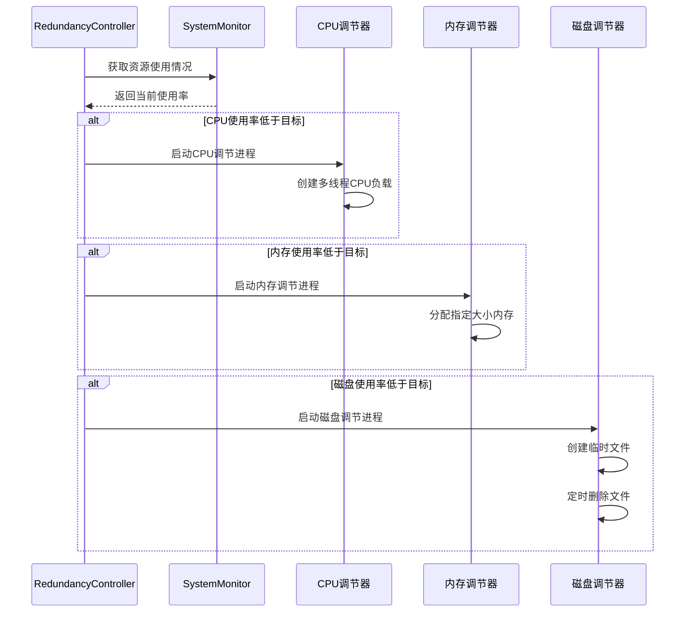

# 动态冗余系统核心功能详解

<cite>
**本文档引用的文件**
- [dynamic_redundancy.py](file://scripts/dynamic_redundancy.py)
- [cpu_stresser.py](file://scripts/cpu_stresser.py)
- [memory_stresser.py](file://scripts/memory_stresser.py)
- [disk_stresser.py](file://scripts/disk_stresser.py)
- [README.md](file://README.md)
- [requirements.txt](file://requirements.txt)
</cite>

## 目录
1. [项目概述](#项目概述)
2. [系统架构](#系统架构)
3. [核心组件分析](#核心组件分析)
4. [RedundancyController详细分析](#redundancycontroller详细分析)
5. [资源调节机制](#资源调节机制)
6. [历史数据管理](#历史数据管理)
7. [并发控制与资源竞争](#并发控制与资源竞争)
8. [故障排除指南](#故障排除指南)
9. [总结](#总结)

## 项目概述

CloudResourceOptimizer是一个智能的云主机资源利用率管理系统，旨在根据云主机的硬件规格（特别是内存大小）动态调整系统资源（CPU、内存、磁盘）的利用率，使其达到监管云要求的目标值。该系统通过智能调控系统资源占用，实现云主机资源的高效利用和优化管理。

### 主要特性

- **自适应资源配置**：根据云主机内存规格自动区分小规格（≤8GB）和大规格（≥16GB），并设置不同的目标利用率
- **动态资源调节**：实时监控系统资源使用情况，自动调整CPU、内存、磁盘利用率
- **智能历史统计**：维护30天平均利用率统计，支持历史数据分析
- **多平台兼容**：支持Windows和Linux系统，具备自动平台检测能力
- **完整监控体系**：集成glances性能监控工具，提供Web界面实时监控

## 系统架构



**图表来源**
- [dynamic_redundancy.py](file://scripts/dynamic_redundancy.py#L1-L730)

## 核心组件分析

### ConfigManager配置管理器

ConfigManager负责读取和解析.env配置文件，提供全局配置访问接口。该组件采用环境变量配置方式，支持灵活的参数调整。

```python
class ConfigManager:
    """配置管理类，负责读取和解析.env配置文件"""
    def __init__(self):
        self.config = {}
        self.load_config()
        
    def load_config(self):
        """加载.env配置文件"""
        # 从环境变量加载配置参数
        self.config['SMALL_MEMORY_MAX'] = int(os.getenv('SMALL_MEMORY_MAX', 8))
        self.config['LARGE_MEMORY_MIN'] = int(os.getenv('LARGE_MEMORY_MIN', 16))
        self.config['TARGET_UTILIZATION_SMALL'] = int(os.getenv('TARGET_UTILIZATION_SMALL', 25))
        self.config['TARGET_UTILIZATION_LARGE'] = int(os.getenv('TARGET_UTILIZATION_LARGE', 40))
```

### SystemMonitor系统监控器

SystemMonitor负责收集系统资源使用情况，包括CPU、内存、磁盘的实时利用率和平均利用率。它还维护资源使用历史数据，支持30天监控周期。

```python
class SystemMonitor:
    """系统监控类，负责收集系统资源使用情况"""
    def __init__(self, config_manager, logger):
        self.config = config_manager
        self.logger = logger
        self.system_spec = self.detect_system_spec()
    
    def get_resource_usage(self):
        """获取当前系统资源使用情况"""
        # CPU使用率
        cpu_usage = psutil.cpu_percent(interval=1)
        
        # 内存使用率
        memory = psutil.virtual_memory()
        memory_usage = memory.percent
        
        # 磁盘使用率
        disk_usage = 0
        disk_count = 0
        
        # 记录历史数据
        global resource_history
        resource_history['cpu'].append(cpu_usage)
        resource_history['memory'].append(memory_usage)
        resource_history['disk'].append(disk_usage)
```

### Logger日志管理器

Logger负责记录系统运行日志，包括信息、警告和错误日志，同时输出到文件和控制台。支持按日期轮转日志文件。

**章节来源**
- [dynamic_redundancy.py](file://scripts/dynamic_redundancy.py#L25-L150)
- [dynamic_redundancy.py](file://scripts/dynamic_redundancy.py#L152-L250)
- [dynamic_redundancy.py](file://scripts/dynamic_redundancy.py#L110-L150)

## RedundancyController详细分析

RedundancyController是整个系统的核心控制器，负责协调各资源调节模块的工作。它基于SystemMonitor提供的当前资源利用率数据与目标值进行差值计算，并决策是否触发相应的调节动作。

### 控制器初始化

```python
class RedundancyController:
    """冗余控制类，负责动态调整系统资源利用率"""
    def __init__(self, config_manager, logger, system_monitor):
        self.config = config_manager
        self.logger = logger
        self.system_monitor = system_monitor
        self.system_spec = system_monitor.system_spec
        
        # 根据系统规格设置目标利用率
        if self.system_spec == 'small':
            self.target_utilization = self.config.get('TARGET_UTILIZATION_SMALL')
        else:
            self.target_utilization = self.config.get('TARGET_UTILIZATION_LARGE')
        
        self.logger.info(f"系统规格: {self.system_spec}, 目标利用率: {self.target_utilization}%")
```

### 资源调节决策流程



**图表来源**
- [dynamic_redundancy.py](file://scripts/dynamic_redundancy.py#L400-L450)

### CPU调节机制

CPU调节通过创建无限循环线程消耗处理器时间片来实现。当检测到CPU使用率低于目标值时，系统会启动CPU调节器。

```python
def adjust_cpu_usage(self, current_usage, current_avg_usage):
    """调整CPU使用率"""
    try:
        # 如果平均使用率低于目标，增加CPU使用
        if current_avg_usage < self.target_utilization:
            self.logger.info("增加CPU使用")
            
            # 创建CPU占用进程
            cpu_script = os.path.join(self.config.get('SCRIPT_DIR'), 'cpu_stresser.py')
            if os.path.exists(cpu_script):
                subprocess.Popen([sys.executable, cpu_script])
            else:
                # 创建临时线程来占用CPU
                threading.Thread(target=self._create_cpu_load, daemon=True).start()
    except Exception as e:
        self.logger.error(f"CPU调整失败: {e}")
```

CPU调节器的具体实现：

```python
def cpu_intensive_task():
    """CPU密集型任务"""
    while True:
        # 执行一个CPU密集型计算
        _ = [i * i for i in range(10000)]

# 创建线程
threads = []
for _ in range(num_threads):
    thread = threading.Thread(target=cpu_intensive_task, daemon=True)
    threads.append(thread)
    thread.start()
```

### 内存调节机制

内存调节通过分配指定大小的内存块并持续占用来实现。当检测到内存使用率低于目标值时，系统会启动内存调节器。

```python
def adjust_memory_usage(self, current_usage, current_avg_usage):
    """调整内存使用率"""
    try:
        # 计算需要增加的内存使用量
        memory = psutil.virtual_memory()
        total_memory = memory.total
        
        # 如果平均使用率低于目标，增加内存使用
        if current_avg_usage < self.target_utilization:
            # 需要达到的内存使用量
            required_usage_percent = min(self.target_utilization + 5, 90)  # 最多使用90%
            required_used_memory = total_memory * required_usage_percent / 100
            memory_to_use = required_used_memory - memory.used
            
            if memory_to_use > 0:
                # 转换为MB
                memory_to_use_mb = memory_to_use / (1024 * 1024)
                
                # 如果需要使用的内存超过1GB，限制为1GB
                memory_to_use_mb = min(memory_to_use_mb, 1024)
                
                self.logger.info(f"增加内存使用: {memory_to_use_mb:.2f} MB")
                
                # 创建内存占用进程
                mem_script = os.path.join(self.config.get('SCRIPT_DIR'), 'memory_stresser.py')
                if os.path.exists(mem_script):
                    subprocess.Popen([sys.executable, mem_script, f"{int(memory_to_use_mb)}MB"])
                else:
                    # 如果没有专门的内存占用脚本，创建一个临时的
                    self._create_memory_load(memory_to_use_mb)
    except Exception as e:
        self.logger.error(f"内存调整失败: {e}")
```

内存调节器的具体实现：

```python
def create_memory_load(self, mb):
    """创建内存负载"""
    try:
        # 在当前进程中分配内存
        load = ' ' * int(mb * 1024 * 1024)  # 1MB = 1,048,576 bytes
        time.sleep(60)  # 保持内存占用60秒
    except Exception as e:
        self.logger.error(f"创建内存负载失败: {e}")
```

### 磁盘调节机制

磁盘调节是最复杂的调节机制，涉及智能路径选择和文件大小策略。当检测到磁盘使用率低于目标值时，系统会启动磁盘调节器。

```python
def adjust_disk_usage(self, current_usage, current_avg_usage):
    """调整磁盘使用率"""
    try:
        # 如果平均使用率低于目标，增加磁盘使用
        if current_avg_usage < self.target_utilization:
            # 检测当前平台
            current_platform = self.detect_platform()
            
            # 获取配置的磁盘路径
            disk_stress_path = self.config.get('DISK_STRESS_PATH', '')
            disk_path = None
            
            # 如果配置了磁盘路径且有效，则使用配置的路径
            if disk_stress_path and os.path.exists(disk_stress_path):
                # 检查配置路径是否有足够空间
                try:
                    usage = psutil.disk_usage(disk_stress_path)
                    if usage.free > 1024 * 1024 * 1024:  # 至少1GB空闲空间
                        disk_path = disk_stress_path
                    else:
                        self.logger.warning(f"配置的磁盘路径 {disk_stress_path} 空间不足")
                except Exception as e:
                    self.logger.error(f"检查配置路径失败: {e}")
            
            # 如果没有配置有效路径或配置路径不可用，则寻找合适的数据盘
            if not disk_path:
                # 寻找合适的数据盘
                data_disks = []
                disk_sizes = []
                
                for partition in psutil.disk_partitions(all=not self.config.get('DATA_DISK_ONLY')):
                    try:
                        # 跳过系统盘
                        if self.config.get('DATA_DISK_ONLY'):
                            if current_platform == 'windows':
                                if partition.mountpoint.lower() == 'c:':
                                    continue
                            else:
                                # 对于Linux系统，跳过根目录和常见的系统挂载点
                                system_mounts = ['/', '/boot', '/boot/efi', '/sys', '/proc', '/dev']
                                if partition.mountpoint in system_mounts:
                                    continue
                    
                        usage = psutil.disk_usage(partition.mountpoint)
                        # 确保有足够空间
                        if usage.free > 1024 * 1024 * 1024:  # 至少1GB空闲空间
                            data_disks.append(partition.mountpoint)
                            disk_sizes.append(usage.total)  # 记录磁盘总大小
                    except (PermissionError, FileNotFoundError):
                        continue
                
                if data_disks:
                    # 选择最大的磁盘
                    largest_disk_index = disk_sizes.index(max(disk_sizes))
                    disk_path = data_disks[largest_disk_index]
            
            if disk_path:
                # 根据当前利用率选择文件大小和保留时间
                if current_avg_usage < 30:
                    # 低利用率
                    file_size = self.config.get('LOW_UTIL_DISK_SIZE', '200MB')
                    duration_seconds = self.config.get('LOW_UTIL_DURATION', 3600)
                elif current_avg_usage < 60:
                    # 中利用率
                    file_size = self.config.get('MED_UTIL_DISK_SIZE', '100MB')
                    duration_seconds = self.config.get('MED_UTIL_DURATION', 1800)
                else:
                    # 高利用率
                    file_size = self.config.get('HIGH_UTIL_DISK_SIZE', '50MB')
                    duration_seconds = self.config.get('HIGH_UTIL_DURATION', 600)
                
                self.logger.info(f"在 {disk_path} 创建 {file_size} 的临时文件，保留 {duration_seconds} 秒")
                
                # 使用disk_stresser.py脚本
                disk_script = os.path.join(self.config.get('SCRIPT_DIR'), 'disk_stresser.py')
                if os.path.exists(disk_script):
                    # 根据平台调整命令格式
                    if current_platform == 'windows':
                        # Windows平台
                        cmd = [
                            sys.executable,
                            disk_script,
                            '--path', disk_path,
                            '--size', file_size,
                            '--duration', str(duration_seconds)
                        ]
                    else:
                        # Linux平台
                        cmd = [
                            'python3',
                            disk_script,
                            '--path', disk_path,
                            '--size', file_size,
                            '--duration', str(duration_seconds)
                        ]
                    
                    try:
                        subprocess.Popen(cmd)
                        self.logger.info(f"已启动磁盘占用脚本，平台: {current_platform}")
                    except Exception as e:
                        self.logger.error(f"启动磁盘占用脚本失败: {e}")
                else:
                    self.logger.error(f"磁盘占用脚本不存在: {disk_script}")
    except Exception as e:
        self.logger.error(f"磁盘调整失败: {e}")
```

磁盘调节器的具体实现：

```python
def create_temp_file(file_path, file_size_bytes, duration_seconds):
    """创建临时大文件"""
    try:
        # 确保目录存在
        dir_path = os.path.dirname(file_path)
        if dir_path and not os.path.exists(dir_path):
            os.makedirs(dir_path, exist_ok=True)
        
        print(f"正在 {file_path} 创建 {file_size_bytes/1024/1024:.2f}MB 的临时文件...")
        
        # 分块写入文件
        block_size = 1024 * 1024  # 1MB块
        blocks = file_size_bytes // block_size
        remainder = file_size_bytes % block_size
        
        with open(file_path, 'wb') as f:
            for i in range(blocks):
                # 显示进度
                if i % 10 == 0:
                    progress = (i / blocks) * 100
                    print(f"进度: {progress:.1f}%")
                # 写入随机数据
                f.write(os.urandom(block_size))
        
            # 写入剩余部分
            if remainder > 0:
                f.write(os.urandom(remainder))
        
        print(f"文件创建完成，大小: {os.path.getsize(file_path)/1024/1024:.2f}MB")
        print(f"将在 {duration_seconds} 秒后删除文件")
        
        # 等待指定时间后删除文件
        try:
            time.sleep(duration_seconds)
        except KeyboardInterrupt:
            print("\n接收到中断信号，立即删除文件")
        
        # 删除临时文件
        if os.path.exists(file_path):
            os.remove(file_path)
            print(f"已删除临时文件: {file_path}")
        
    except Exception as e:
        print(f"创建临时文件失败: {e}")
        # 清理已创建的文件
        if 'file_path' in locals() and os.path.exists(file_path):
            try:
                os.remove(file_path)
                print(f"已清理临时文件: {file_path}")
            except:
                pass
        sys.exit(1)
```

**章节来源**
- [dynamic_redundancy.py](file://scripts/dynamic_redundancy.py#L300-L450)
- [dynamic_redundancy.py](file://scripts/dynamic_redundancy.py#L450-L550)
- [dynamic_redundancy.py](file://scripts/dynamic_redundancy.py#L550-L700)

## 历史数据管理

### 30天平均利用率统计

系统通过resource_history全局字典存储历史数据，并定期清理过期记录。这种设计确保了系统能够维持长期的资源使用趋势分析。

```python
# 全局变量
resource_history = {
    'cpu': [],
    'memory': [],
    'disk': []
}

def get_resource_usage(self):
    """获取当前系统资源使用情况"""
    # ... 获取当前使用情况 ...
    
    # 记录历史数据
    global resource_history
    resource_history['cpu'].append(cpu_usage)
    resource_history['memory'].append(memory_usage)
    resource_history['disk'].append(disk_usage)
    
    # 保持历史数据不超过监控周期
    max_history = (self.config.get('MONITOR_PERIOD_DAYS') * 24 * 3600) // self.config.get('CHECK_INTERVAL_SECONDS')
    for key in resource_history:
        if len(resource_history[key]) > max_history:
            resource_history[key] = resource_history[key][-max_history:]
    
    return {
        'cpu': cpu_usage,
        'memory': memory_usage,
        'disk': disk_usage,
        'cpu_avg': sum(resource_history['cpu']) / len(resource_history['cpu']) if resource_history['cpu'] else 0,
        'memory_avg': sum(resource_history['memory']) / len(resource_history['memory']) if resource_history['memory'] else 0,
        'disk_avg': sum(resource_history['disk']) / len(resource_history['disk']) if resource_history['disk'] else 0
    }
```

### 数据清理机制

系统采用固定窗口大小的数据清理机制，确保内存使用不会无限增长：

```python
# 计算最大历史记录数量
max_history = (self.config.get('MONITOR_PERIOD_DAYS') * 24 * 3600) // self.config.get('CHECK_INTERVAL_SECONDS')

# 清理过期数据
for key in resource_history:
    if len(resource_history[key]) > max_history:
        resource_history[key] = resource_history[key][-max_history:]
```

这种设计的优势：
- **内存效率**：固定大小的缓冲区避免内存泄漏
- **实时性**：最新的数据权重更大
- **可预测性**：清理频率与监控周期一致

**章节来源**
- [dynamic_redundancy.py](file://scripts/dynamic_redundancy.py#L25-L30)
- [dynamic_redundancy.py](file://scripts/dynamic_redundancy.py#L250-L300)

## 并发控制与资源竞争

### 多线程CPU调节

CPU调节采用多线程方式，每个线程执行CPU密集型计算任务：

```python
def cpu_intensive_task():
    """CPU密集型任务"""
    while True:
        # 执行一个CPU密集型计算
        _ = [i * i for i in range(10000)]

# 创建线程
threads = []
for _ in range(num_threads):
    thread = threading.Thread(target=cpu_intensive_task, daemon=True)
    threads.append(thread)
    thread.start()
```

### 进程隔离机制

内存和磁盘调节采用独立进程的方式，避免相互影响：

```python
# 创建内存占用进程
mem_script = os.path.join(self.config.get('SCRIPT_DIR'), 'memory_stresser.py')
if os.path.exists(mem_script):
    subprocess.Popen([sys.executable, mem_script, f"{int(memory_to_use_mb)}MB"])

# 创建磁盘占用进程
disk_script = os.path.join(self.config.get('SCRIPT_DIR'), 'disk_stresser.py')
if os.path.exists(disk_script):
    subprocess.Popen(cmd)
```

### 资源竞争规避

系统通过以下机制规避资源竞争：

1. **独立进程**：每个调节器运行在独立进程中，避免直接竞争
2. **时间分片**：不同调节器在不同时间段运行
3. **资源预留**：为系统基础服务预留一定资源
4. **优先级控制**：调节器进程具有较低的系统优先级



**图表来源**
- [dynamic_redundancy.py](file://scripts/dynamic_redundancy.py#L300-L450)

## 故障排除指南

### 常见问题及解决方案

#### 1. glances监控启动失败

**问题现象**：无法启动glances监控服务

**解决方案**：
```bash
# 检查glances是否安装
glances --version

# 如果未安装，尝试自动安装
pip install glances

# 或者手动安装
sudo yum install glances -y  # CentOS/RHEL
sudo apt-get install glances  # Ubuntu/Debian
```

#### 2. 权限错误

**问题现象**：脚本无法正常运行，出现权限错误

**解决方案**：
- Windows系统：以管理员身份运行cmd或PowerShell
- Linux系统：使用sudo权限运行脚本
- 确保对脚本目录有读写权限

#### 3. 内存调整失败

**问题现象**：内存占用脚本无法正常工作

**解决方案**：
```python
# 检查系统内存是否充足
memory = psutil.virtual_memory()
print(f"总内存: {memory.total / (1024**3):.2f}GB")
print(f"可用内存: {memory.available / (1024**3):.2f}GB")

# 检查是否有足够的权限
try:
    # 尝试创建临时文件测试权限
    with open('/tmp/test_permission', 'w') as f:
        f.write('test')
    os.remove('/tmp/test_permission')
except PermissionError:
    print("权限不足，请检查文件系统权限")
```

#### 4. 磁盘空间不足

**问题现象**：磁盘调节器无法创建临时文件

**解决方案**：
```python
# 检查磁盘空间
def check_disk_space(path):
    try:
        usage = psutil.disk_usage(path)
        free_gb = usage.free / (1024**3)
        print(f"磁盘空间: {free_gb:.2f}GB")
        return free_gb > 1  # 至少需要1GB空闲空间
    except Exception as e:
        print(f"检查磁盘空间失败: {e}")
        return False

# 测试各个磁盘分区
for partition in psutil.disk_partitions():
    print(f"检查分区: {partition.mountpoint}")
    if check_disk_space(partition.mountpoint):
        print(f"分区 {partition.mountpoint} 可用")
```

#### 5. 配置文件错误

**问题现象**：配置加载失败或参数无效

**解决方案**：
```python
# 验证配置文件
def validate_config(config):
    required_params = [
        'SMALL_MEMORY_MAX',
        'LARGE_MEMORY_MIN',
        'TARGET_UTILIZATION_SMALL',
        'TARGET_UTILIZATION_LARGE',
        'MONITOR_PERIOD_DAYS',
        'CHECK_INTERVAL_SECONDS'
    ]
    
    for param in required_params:
        if param not in config:
            print(f"缺少必要配置参数: {param}")
            return False
    
    # 验证数值范围
    if config['SMALL_MEMORY_MAX'] >= config['LARGE_MEMORY_MIN']:
        print("配置错误: SMALL_MEMORY_MAX 应小于 LARGE_MEMORY_MIN")
        return False
    
    return True
```

### 调试技巧

#### 1. 启用详细日志

```python
# 在ConfigManager中启用调试模式
self.config['DEBUG_MODE'] = os.getenv('DEBUG_MODE', 'false').lower() == 'true'

# 在Logger中添加调试级别
if self.config.get('DEBUG_MODE'):
    logging.basicConfig(level=logging.DEBUG)
```

#### 2. 性能监控

```python
import time

def monitor_performance(func):
    """性能监控装饰器"""
    def wrapper(*args, **kwargs):
        start_time = time.time()
        result = func(*args, **kwargs)
        end_time = time.time()
        print(f"{func.__name__} 执行时间: {end_time - start_time:.4f}秒")
        return result
    return wrapper

@monitor_performance
def get_resource_usage():
    # 原有逻辑
    pass
```

#### 3. 资源使用分析

```python
def analyze_resource_usage():
    """分析资源使用情况"""
    memory = psutil.virtual_memory()
    cpu = psutil.cpu_percent(interval=1)
    disk = psutil.disk_usage('/')
    
    print(f"内存使用率: {memory.percent}%")
    print(f"CPU使用率: {cpu}%")
    print(f"磁盘使用率: {disk.percent}%")
    print(f"活跃进程数: {len(psutil.pids())}")
```

**章节来源**
- [README.md](file://README.md#L150-L182)

## 总结

CloudResourceOptimizer通过dynamic_redundancy.py作为主控制器，实现了智能的系统资源利用率管理。其核心特点包括：

### 技术优势

1. **自适应配置**：根据系统规格自动调整目标利用率，支持小规格（≤8GB）和大规格（≥16GB）的不同策略
2. **智能调节**：基于30天平均利用率统计，动态调整CPU、内存、磁盘资源，确保资源利用率稳定在目标范围内
3. **多平台兼容**：支持Windows和Linux系统，具备自动平台检测能力
4. **资源隔离**：采用独立进程的方式避免资源竞争，确保系统稳定性
5. **历史统计**：维护长期资源使用趋势，支持数据分析和优化

### 架构设计

系统采用分层架构设计：
- **配置管理层**：ConfigManager统一管理所有配置参数
- **监控层**：SystemMonitor实时收集系统资源使用情况
- **控制层**：RedundancyController协调各资源调节模块
- **执行层**：独立的stresser脚本负责具体的资源调节操作

### 安全性考虑

1. **权限控制**：所有调节操作都在受控环境下进行
2. **资源限制**：内存占用不超过系统总内存的90%，避免系统崩溃
3. **自动清理**：磁盘临时文件定时删除，避免永久占用磁盘空间
4. **异常处理**：完善的异常捕获和日志记录机制

### 扩展性

系统设计具有良好的扩展性：
- 支持添加新的资源类型调节器
- 可扩展为基于网络流量的冗余控制
- 支持Web管理界面开发
- 可集成告警机制

通过这种设计，CloudResourceOptimizer不仅能够满足当前的资源管理需求，还为未来的功能扩展奠定了坚实的基础。系统在保证功能完整性的同时，充分考虑了性能、安全性和可维护性，是一个成熟可靠的云主机资源管理解决方案。