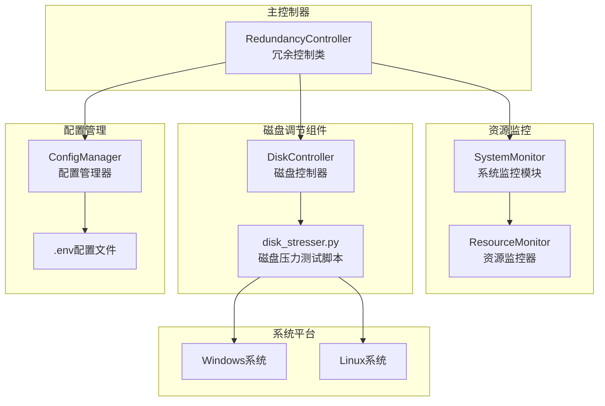
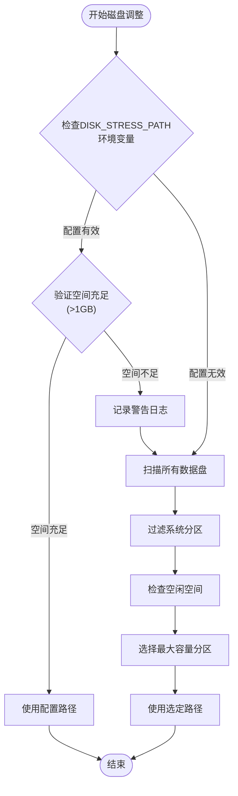
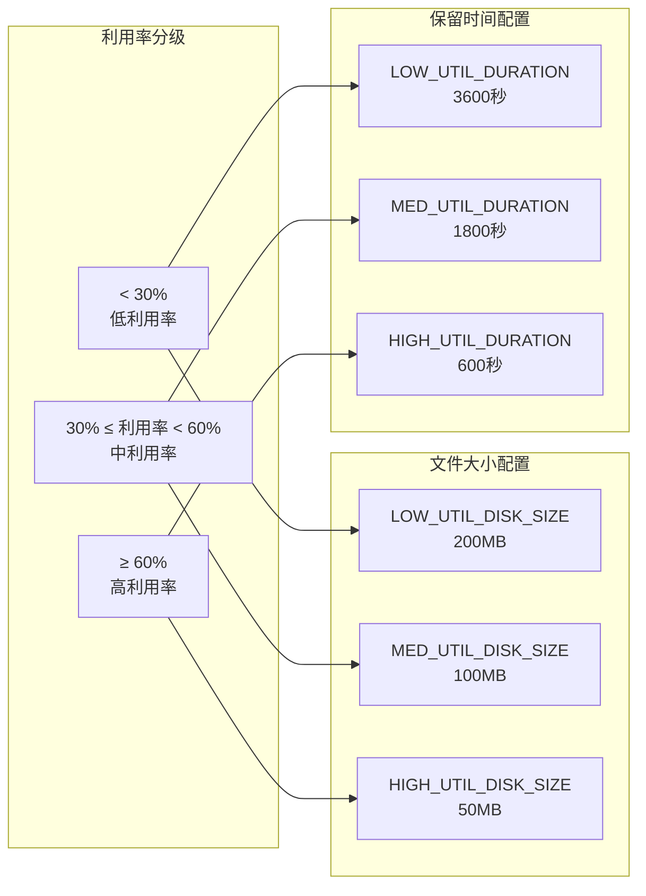
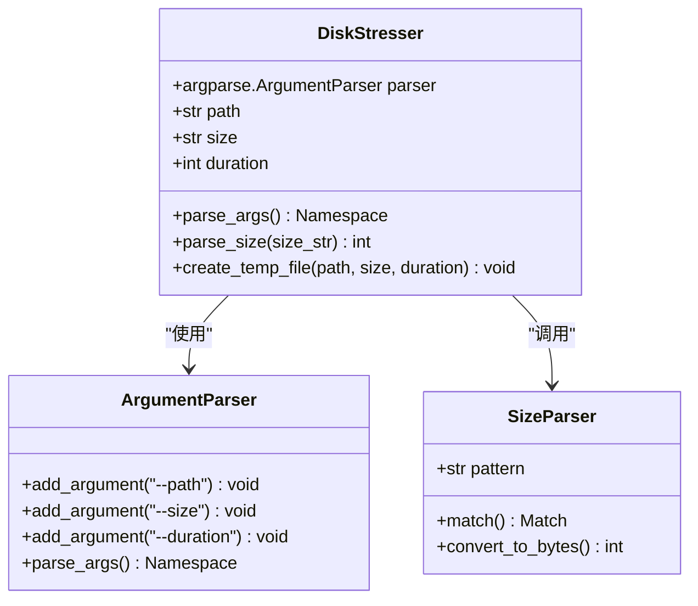
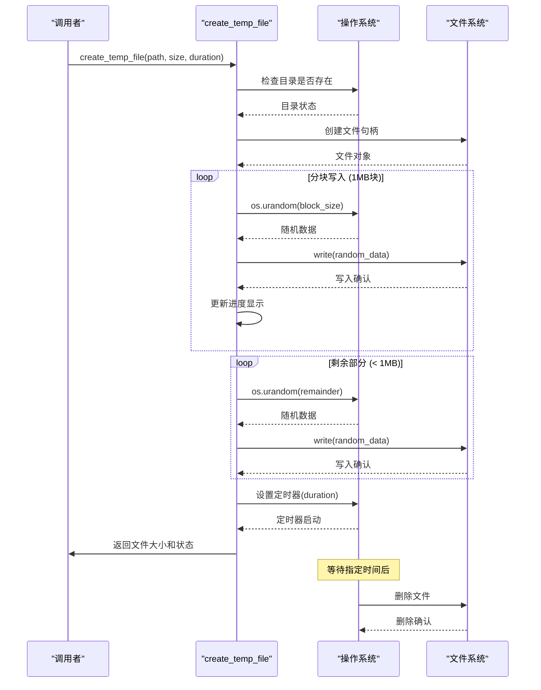
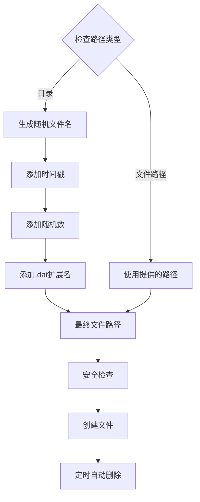
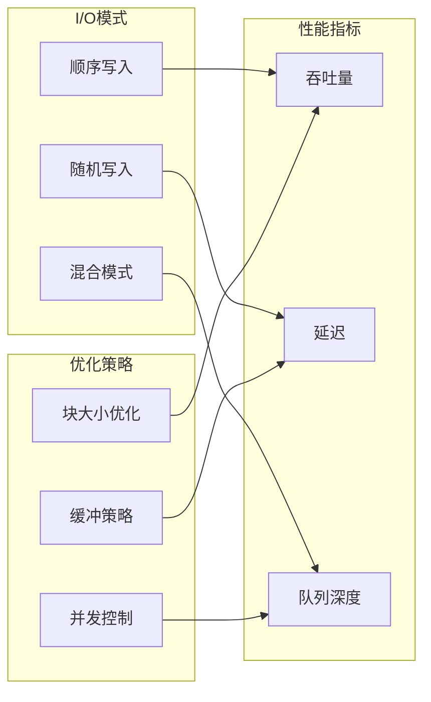
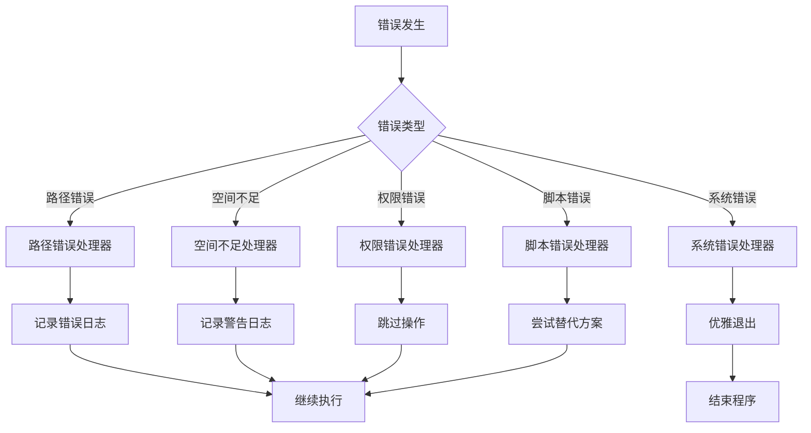

# 磁盘利用率调节功能技术文档

<cite>
**本文档引用的文件**
- [dynamic_redundancy.py](file://scripts/dynamic_redundancy.py)
- [disk_stresser.py](file://scripts/disk_stresser.py)
- [memory_stresser.py](file://scripts/memory_stresser.py)
- [cpu_stresser.py](file://scripts/cpu_stresser.py)
- [.env](file://config/.env)
- [README.md](file://README.md)
</cite>

## 目录
1. [项目概述](#项目概述)
2. [核心架构](#核心架构)
3. [RedundancyController智能路径选择策略](#redundancycontroller智能路径选择策略)
4. [自适应算法详解](#自适应算法详解)
5. [disk_stresser.py命令行接口设计](#disk_stresserpy命令行接口设计)
6. [parse_size函数正则匹配逻辑](#parse_size函数正则匹配逻辑)
7. [create_temp_file函数实现原理](#create_temp_file函数实现原理)
8. [临时文件命名机制与安全保障](#临时文件命名机制与安全保障)
9. [跨平台命令生成差异](#跨平台命令生成差异)
10. [磁盘I/O性能影响评估](#磁盘io性能影响评估)
11. [错误处理方案](#错误处理方案)
12. [总结](#总结)

## 项目概述

CloudResourceOptimizer是一个用于云主机资源利用率管理和优化的脚本工具，能够根据云主机的规格（特别是内存大小）自动调整系统资源（CPU、内存、磁盘）的利用率，使其达到监管云要求的目标值。本项目的核心功能包括：

- **智能资源调度**：根据云主机内存规格自动区分小规格（≤8GB）和大规格（≥16GB），动态调整CPU、内存、磁盘利用率
- **自适应控制**：支持30天平均利用率统计和监控，实现资源使用的平滑调节
- **完整日志记录**：提供详细的系统运行日志，便于问题排查和性能分析
- **灵活配置管理**：通过.env文件实现各种参数的灵活配置

## 核心架构



**图表来源**
- [dynamic_redundancy.py](file://scripts/dynamic_redundancy.py#L245-L273)
- [disk_stresser.py](file://scripts/disk_stresser.py#L1-L50)

## RedundancyController智能路径选择策略

RedundancyController类中的`adjust_disk_usage`方法实现了智能路径选择策略，该策略具有以下特点：

### 优先级决策流程



**图表来源**
- [dynamic_redundancy.py](file://scripts/dynamic_redundancy.py#L375-L420)

### 路径选择算法实现

智能路径选择遵循以下优先级原则：

1. **配置优先**：首先检查`DISK_STRESS_PATH`环境变量是否配置
2. **空间验证**：验证配置路径是否有至少1GB的空闲空间
3. **自动扫描**：若配置无效或空间不足，自动扫描所有数据盘
4. **容量选择**：在可用分区中选择总容量最大的可用分区
5. **系统分区过滤**：Windows系统跳过C盘，Linux系统跳过根目录和常见系统挂载点

**章节来源**
- [dynamic_redundancy.py](file://scripts/dynamic_redundancy.py#L375-L420)

## 自适应算法详解

自适应算法根据当前平均利用率分级动态选择文件大小及保留时间，实现精细化的资源控制。

### 利用率分级策略



**图表来源**
- [dynamic_redundancy.py](file://scripts/dynamic_redundancy.py#L425-L440)
- [.env](file://config/.env#L35-L45)

### 自适应算法实现

算法根据当前平均利用率执行以下逻辑：

```python
# 根据当前利用率选择文件大小和保留时间
if current_avg_usage < 30:
    # 低利用率场景
    file_size = self.config.get('LOW_UTIL_DISK_SIZE', '200MB')
    duration_seconds = self.config.get('LOW_UTIL_DURATION', 3600)
elif current_avg_usage < 60:
    # 中利用率场景  
    file_size = self.config.get('MED_UTIL_DISK_SIZE', '100MB')
    duration_seconds = self.config.get('MED_UTIL_DURATION', 1800)
else:
    # 高利用率场景
    file_size = self.config.get('HIGH_UTIL_DISK_SIZE', '50MB')
    duration_seconds = self.config.get('HIGH_UTIL_DURATION', 600)
```

这种分级策略的优势：
- **渐进式调节**：不同利用率区间采用不同的文件大小和保留时间
- **资源优化**：低利用率时创建较大文件，提高调节效率；高利用率时减少资源占用
- **灵活性**：支持通过配置文件动态调整各等级的参数

**章节来源**
- [dynamic_redundancy.py](file://scripts/dynamic_redundancy.py#L425-L440)

## disk_stresser.py命令行接口设计

disk_stresser.py脚本提供了简洁而强大的命令行接口，支持通过参数精确控制临时文件的创建。

### 参数解析架构



**图表来源**
- [disk_stresser.py](file://scripts/disk_stresser.py#L85-L95)
- [disk_stresser.py](file://scripts/disk_stresser.py#L25-L35)

### 命令行参数设计

disk_stresser.py支持以下命令行参数：

- `--path`：必需参数，指定临时文件的存储路径
- `--size`：必需参数，指定文件大小，支持MB和GB格式
- `--duration`：可选参数，默认3600秒，指定文件保留时间

### 使用示例

```bash
# Windows平台
python disk_stresser.py --path D:\data --size 100MB --duration 3600

# Linux平台  
python disk_stresser.py --path /data --size 1GB

# 简化用法（仅指定路径和大小）
python disk_stresser.py --path /tmp --size 500MB
```

**章节来源**
- [disk_stresser.py](file://scripts/disk_stresser.py#L85-L95)

## parse_size函数正则匹配逻辑

parse_size函数实现了对文件大小字符串的精确解析，支持多种格式的大小描述。

### 正则表达式设计

```mermaid
flowchart TD
Input[输入大小字符串<br/>如："100MB", "2GB"] --> Pattern["正则模式：<br/>^(\\d+)([M|G]B)$"]
Pattern --> Match{"匹配成功？"}
Match --> |是| ExtractNum[提取数字部分<br/>group(1)]
Match --> |否| ThrowError[抛出ValueError异常]
ExtractNum --> ExtractUnit[提取单位部分<br/>group(2)]
ExtractUnit --> CheckUnit{"检查单位"}
CheckUnit --> |MB| ConvertMB[转换为字节<br/>num * 1024 * 1024]
CheckUnit --> |GB| ConvertGB[转换为字节<br/>num * 1024 * 1024 * 1024]
CheckUnit --> |其他| ThrowError
ConvertMB --> Output[返回字节数]
ConvertGB --> Output
ThrowError --> Exit[程序退出]
```

**图表来源**
- [disk_stresser.py](file://scripts/disk_stresser.py#L25-L35)

### 正则匹配实现

```python
def parse_size(size_str):
    """解析大小字符串为字节数"""
    try:
        # 匹配数字和单位
        pattern = '^(\\d+)([M|G]B)$'
        import re
        match = re.match(pattern, size_str.upper())
        if match:
            num = int(match.group(1))
            unit = match.group(2)
            if unit == 'MB':
                return num * 1024 * 1024  # MB转字节
            elif unit == 'GB':
                return num * 1024 * 1024 * 1024  # GB转字节
        # 如果格式不正确，抛出异常
        raise ValueError(f"无效的大小格式: {size_str}")
    except Exception as e:
        print(f"解析大小失败: {e}")
        sys.exit(1)
```

### 支持的格式规范

- **MB格式**：`100MB`, `2GB`, `512MB`等
- **GB格式**：`1GB`, `2GB`, `10GB`等
- **大小写不敏感**：`100mb`和`100MB`等效
- **错误处理**：支持多种错误格式的优雅处理

**章节来源**
- [disk_stresser.py](file://scripts/disk_stresser.py#L25-L35)

## create_temp_file函数实现原理

create_temp_file函数实现了高效的临时文件创建机制，采用分块写入和随机数据填充的优化策略。

### 文件创建流程



**图表来源**
- [disk_stresser.py](file://scripts/disk_stresser.py#L37-L75)

### 分块写入优化策略

```python
def create_temp_file(file_path, file_size_bytes, duration_seconds):
    """创建临时大文件"""
    # 分块写入文件
    block_size = 1024 * 1024  # 1MB块
    blocks = file_size_bytes // block_size
    remainder = file_size_bytes % block_size
    
    with open(file_path, 'wb') as f:
        for i in range(blocks):
            # 写入随机数据
            f.write(os.urandom(block_size))
        
        # 写入剩余部分
        if remainder > 0:
            f.write(os.urandom(remainder))
```

### 零填充优化原理

该实现采用了重要的零填充优化：

1. **随机数据写入**：使用`os.urandom()`生成真正的随机数据
2. **避免零填充**：现代文件系统通常会对连续的零字节进行特殊处理（零填充优化）
3. **真实数据占用**：确保文件真正占用磁盘空间，而非通过元数据压缩
4. **性能平衡**：1MB块大小在性能和内存使用之间取得平衡

**章节来源**
- [disk_stresser.py](file://scripts/disk_stresser.py#L37-L75)

## 临时文件命名机制与安全保障

临时文件命名机制确保了文件的唯一性和安全性，同时提供了自动清理功能。

### 命名策略设计



**图表来源**
- [disk_stresser.py](file://scripts/disk_stresser.py#L95-L105)

### 命名机制实现

```python
# 生成随机文件名（如果路径是目录）
if os.path.isdir(args.path):
    file_name = f"temp_{int(time.time())}_{random.randint(1000, 9999)}.dat"
    file_path = os.path.join(args.path, file_name)
else:
    file_path = args.path
```

### 安全保障机制

1. **时间戳防冲突**：使用Unix时间戳确保文件名的时间唯一性
2. **随机数增强安全性**：添加4位随机数进一步降低冲突概率
3. **标准化扩展名**：统一使用.dat扩展名便于识别
4. **自动清理机制**：支持定时自动删除，避免长期占用磁盘空间

### 错误处理与清理

```python
try:
    # 创建临时文件
    create_temp_file(file_path, file_size_bytes, args.duration)
except Exception as e:
    print(f"创建临时文件失败: {e}")
    # 清理已创建的文件
    if 'file_path' in locals() and os.path.exists(file_path):
        try:
            os.remove(file_path)
            print(f"已清理临时文件: {file_path}")
        except:
            pass
    sys.exit(1)
```

**章节来源**
- [disk_stresser.py](file://scripts/disk_stresser.py#L95-L117)

## 跨平台命令生成差异

系统根据不同平台自动调整命令格式，确保在Windows和Linux环境下都能正常运行。

### 平台检测与命令适配

```mermaid
graph TB
subgraph "平台检测"
Detect[detect_platform()<br/>检测当前操作系统]
Win[Windows系统]
Linux[Linux系统]
Auto[自动检测]
end
subgraph "命令生成"
WinCmd[Windows命令:<br/>sys.executable<br/>disk_stresser.py<br/>--path PATH<br/>--size SIZE<br/>--duration DURATION]
LinuxCmd[Linux命令:<br/>python3<br/>disk_stresser.py<br/>--path PATH<br/>--size SIZE<br/>--duration DURATION]
end
Detect --> Win
Detect --> Linux
Detect --> Auto
Win --> WinCmd
Linux --> LinuxCmd
```

**图表来源**
- [dynamic_redundancy.py](file://scripts/dynamic_redundancy.py#L445-L470)

### 跨平台实现细节

```python
# 根据平台调整命令格式
if current_platform == 'windows':
    # Windows平台
    cmd = [
        sys.executable,  # 使用Python解释器
        disk_script,
        '--path', disk_path,
        '--size', file_size,
        '--duration', str(duration_seconds)
    ]
else:
    # Linux平台
    cmd = [
        'python3',  # 显式指定python3
        disk_script,
        '--path', disk_path,
        '--size', file_size,
        '--duration', str(duration_seconds)
    ]
```

### 平台差异分析

| 特征 | Windows | Linux |
|------|---------|-------|
| Python解释器 | sys.executable | python3 |
| 路径分隔符 | \ | / |
| 权限模型 | UAC | sudo/root |
| 文件系统 | NTFS/FAT32 | ext4/xfs |

### 自动化平台检测

系统具备自动检测平台的能力：

```python
def detect_platform(self):
    """检测操作系统平台"""
    # 从配置中获取平台设置
    platform_config = self.config.get('PLATFORM', 'auto').lower()
    
    if platform_config != 'auto':
        self.logger.info(f"使用配置的平台: {platform_config}")
        return platform_config
    
    # 自动检测平台
    system = platform.system().lower()
    if system == 'windows':
        return 'windows'
    elif system == 'linux':
        # 尝试检测Linux发行版
        try:
            with open('/etc/os-release', 'r') as f:
                content = f.read().lower()
                if 'centos' in content:
                    return 'centos'
                elif 'ubuntu' in content:
                    return 'ubuntu'
                # ... 其他发行版检测
        except Exception as e:
            self.logger.error(f"检测Linux发行版失败: {e}")
            return 'linux_generic'
    else:
        self.logger.warning(f"未知操作系统: {system}")
        return 'unknown'
```

**章节来源**
- [dynamic_redundancy.py](file://scripts/dynamic_redundancy.py#L445-L470)
- [dynamic_redundancy.py](file://scripts/dynamic_redundancy.py#L350-L370)

## 磁盘I/O性能影响评估

磁盘利用率调节功能对系统性能的影响经过精心设计，确保在满足监管要求的同时最小化对系统性能的干扰。

### 性能影响分析维度



### 写入性能优化策略

1. **块大小优化**：采用1MB块大小平衡性能和内存使用
2. **并发控制**：单线程顺序写入避免过多的I/O竞争
3. **缓冲策略**：利用操作系统的文件系统缓存
4. **随机数据写入**：避免零填充优化导致的空间浪费

### 性能监控指标

系统通过以下指标监控磁盘I/O性能：

- **吞吐量**：每秒写入的数据量（MB/s）
- **IOPS**：每秒的I/O操作次数
- **响应时间**：单次I/O操作的平均响应时间
- **队列长度**：等待处理的I/O请求数量

### 资源占用评估

```python
# 磁盘占用计算
file_size_bytes = parse_size(file_size)  # 解析后的字节数
duration_seconds = duration_seconds      # 保留时间

# 内存使用估算
block_size = 1024 * 1024                 # 1MB块
blocks = file_size_bytes // block_size   # 总块数
remainder = file_size_bytes % block_size # 剩余字节数

# 磁盘空间占用
total_space = file_size_bytes            # 实际占用空间
```

## 错误处理方案

系统实现了完善的错误处理机制，确保在各种异常情况下都能安全运行。

### 错误分类与处理策略



### 具体错误处理实现

#### 1. 磁盘空间不足处理

```python
# 检查配置路径是否有足够空间
try:
    usage = psutil.disk_usage(disk_stress_path)
    if usage.free > 1024 * 1024 * 1024:  # 至少1GB空闲空间
        disk_path = disk_stress_path
    else:
        self.logger.warning(f"配置的磁盘路径 {disk_stress_path} 空间不足")
except Exception as e:
    self.logger.error(f"检查配置路径失败: {e}")
```

#### 2. 脚本不存在处理

```python
# 使用disk_stresser.py脚本
disk_script = os.path.join(self.config.get('SCRIPT_DIR'), 'disk_stresser.py')
if os.path.exists(disk_script):
    # 启动脚本
    subprocess.Popen(cmd)
else:
    self.logger.error(f"磁盘占用脚本不存在: {disk_script}")
```

#### 3. 文件创建失败处理

```python
try:
    # 创建临时文件
    create_temp_file(file_path, file_size_bytes, args.duration)
except Exception as e:
    print(f"创建临时文件失败: {e}")
    # 清理已创建的文件
    if 'file_path' in locals() and os.path.exists(file_path):
        try:
            os.remove(file_path)
            print(f"已清理临时文件: {file_path}")
        except:
            pass
    sys.exit(1)
```

### 错误恢复机制

1. **自动重试**：对于临时性错误提供自动重试机制
2. **降级处理**：在主要功能不可用时提供备用方案
3. **状态保存**：保存当前操作状态以便恢复
4. **用户通知**：及时向用户报告错误状态

**章节来源**
- [dynamic_redundancy.py](file://scripts/dynamic_redundancy.py#L375-L420)
- [disk_stresser.py](file://scripts/disk_stresser.py#L75-L117)

## 总结

CloudResourceOptimizer的磁盘利用率调节功能展现了高度的智能化和自适应能力：

### 核心优势

1. **智能路径选择**：优先使用配置路径，空间不足时自动扫描并选择最大容量分区
2. **自适应算法**：根据当前利用率分级动态调整文件大小和保留时间
3. **跨平台兼容**：支持Windows和Linux平台的无缝运行
4. **性能优化**：采用分块写入和随机数据填充的优化策略
5. **安全保障**：完善的错误处理和自动清理机制

### 技术创新点

- **分级调节策略**：通过三个利用率级别实现精细化的资源控制
- **零填充优化**：使用os.urandom()避免文件系统零填充优化
- **智能命名机制**：结合时间戳和随机数确保文件唯一性
- **平台感知**：自动检测操作系统并调整命令格式

### 应用价值

该功能为云主机资源管理提供了有效的解决方案，能够在满足监管要求的同时最小化对系统性能的影响，是资源优化领域的优秀实践案例。