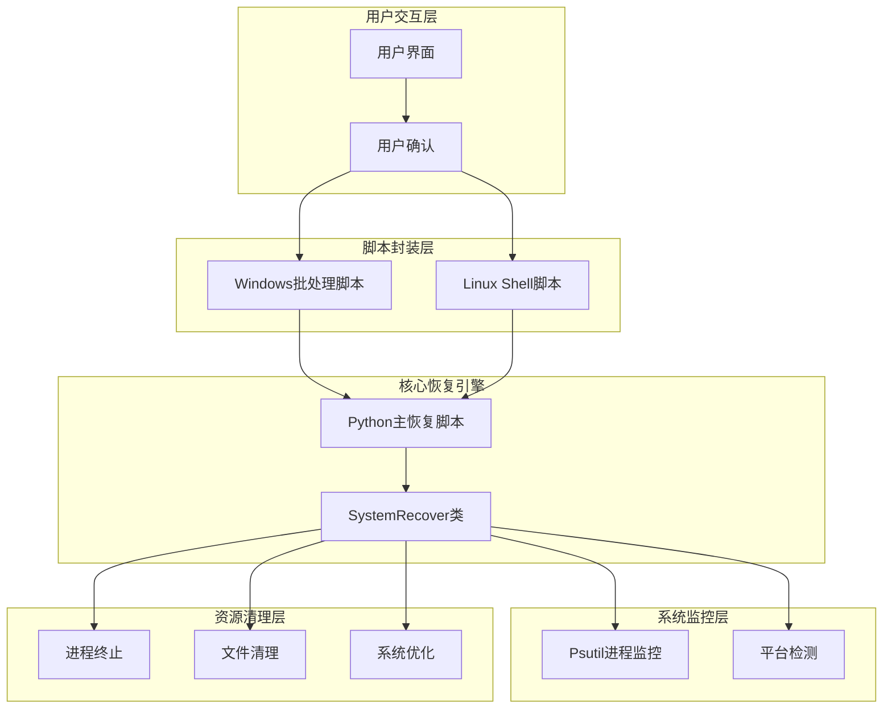
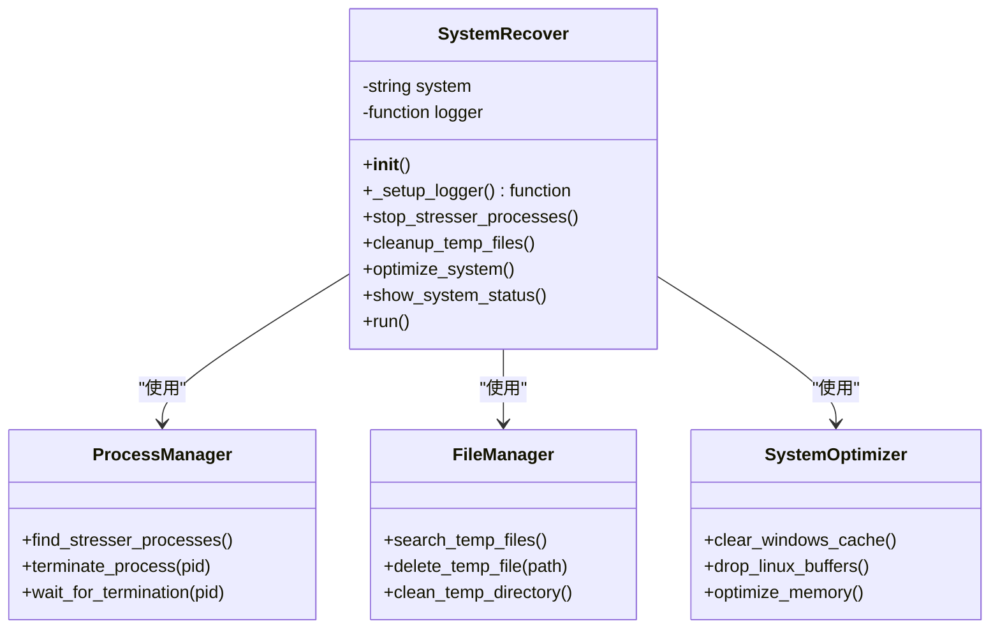
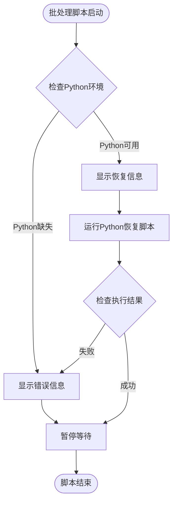
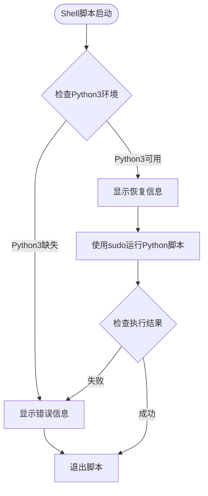
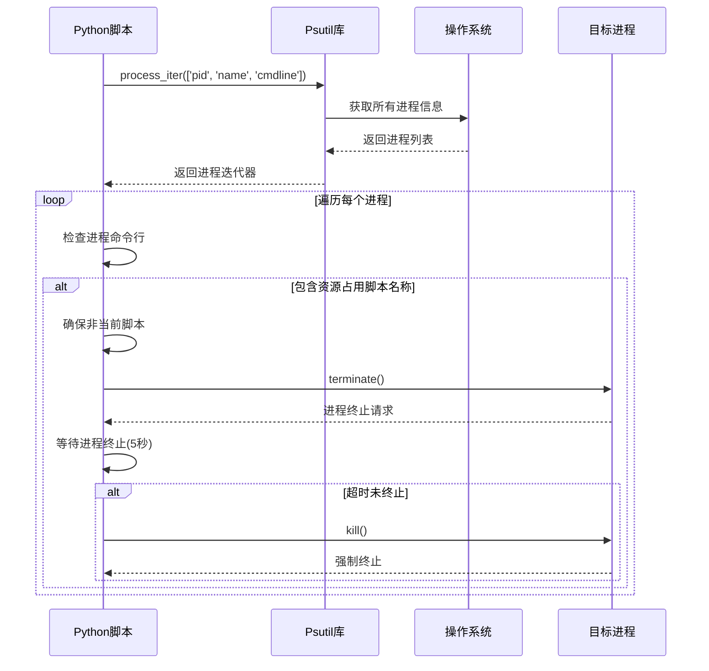
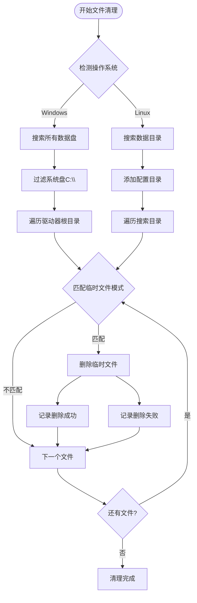
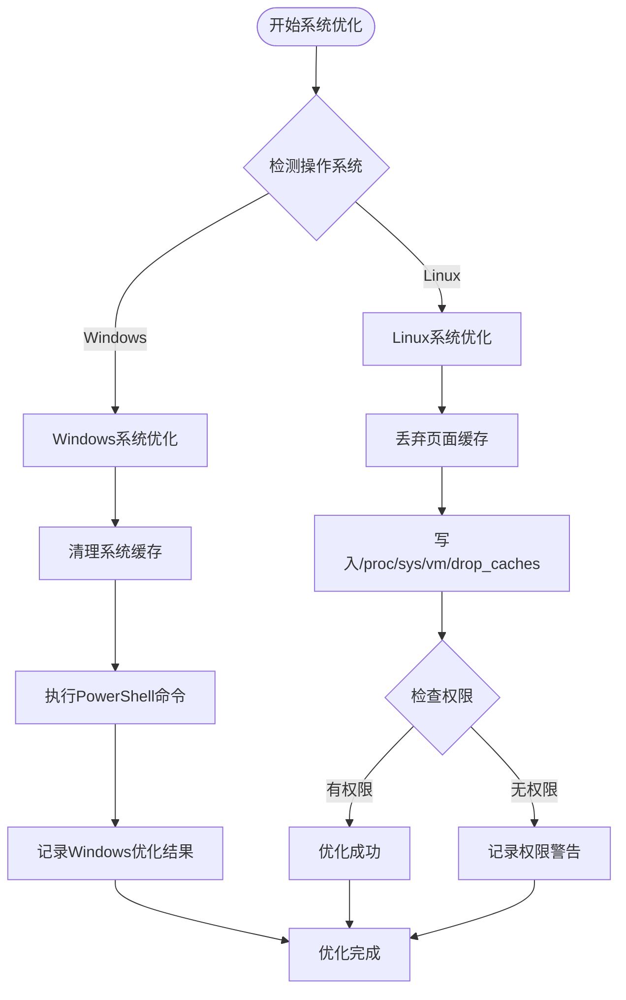
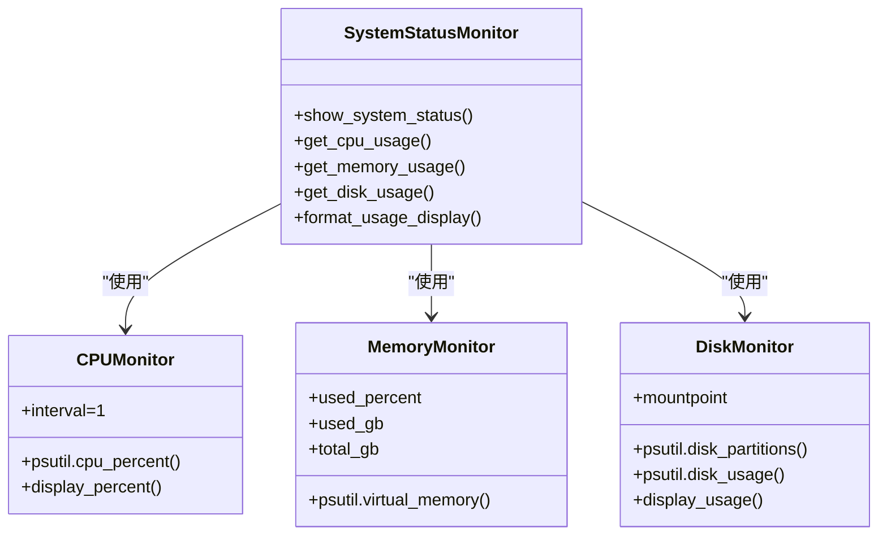
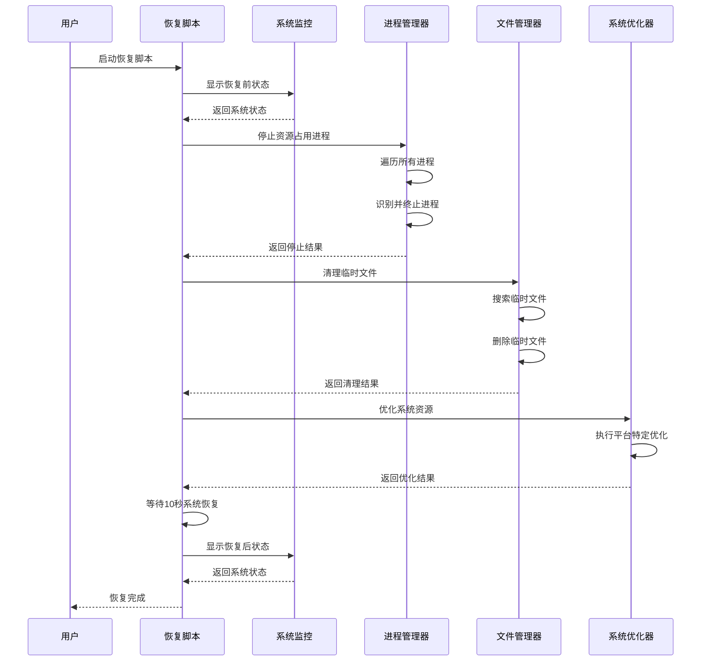
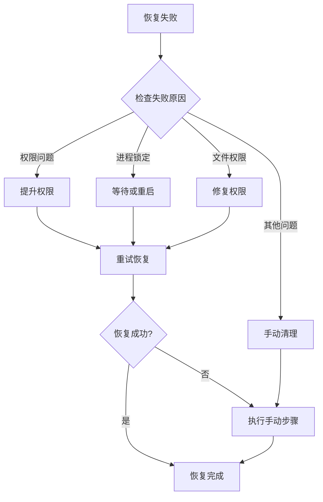

# 系统恢复功能

<cite>
**本文档引用的文件**
- [recover_system.py](file://Recover/recover_system.py)
- [recover_system.bat](file://Recover/recover_system.bat)
- [recover_system.sh](file://Recover/recover_system.sh)
- [disk_stresser.py](file://scripts/disk_stresser.py)
- [dynamic_redundancy.py](file://scripts/dynamic_redundancy.py)
- [README.md](file://README.md)
- [requirements.txt](file://requirements.txt)
</cite>

## 目录
1. [项目概述](#项目概述)
2. [系统恢复架构](#系统恢复架构)
3. [核心恢复组件分析](#核心恢复组件分析)
4. [跨平台脚本封装](#跨平台脚本封装)
5. [进程监控与终止机制](#进程监控与终止机制)
6. [文件清理机制](#文件清理机制)
7. [系统优化操作](#系统优化操作)
8. [系统状态监控](#系统状态监控)
9. [恢复流程详解](#恢复流程详解)
10. [故障排除指南](#故障排除指南)
11. [最佳实践建议](#最佳实践建议)

## 项目概述

CloudResourceOptimizer系统恢复功能是一个专门设计的资源清理和系统优化工具，旨在解决云主机资源利用率管理过程中产生的资源占用问题。该功能通过智能检测和终止由主程序启动的各种资源占用进程，并清理相关的临时文件，确保系统能够快速恢复到正常运行状态。

系统恢复功能的核心价值在于：
- **紧急响应能力**：在系统资源过度占用导致性能下降时，提供快速恢复手段
- **自动化清理**：无需人工干预即可完成复杂的资源清理工作
- **跨平台兼容**：支持Windows和Linux两种主流操作系统
- **安全可靠**：通过用户确认机制和日志记录确保操作的安全性

## 系统恢复架构

系统恢复功能采用分层架构设计，确保在不同操作系统环境下都能稳定运行：



**图表来源**
- [recover_system.py](file://Recover/recover_system.py#L1-L50)
- [recover_system.bat](file://Recover/recover_system.bat#L1-L45)
- [recover_system.sh](file://Recover/recover_system.sh#L1-L43)

## 核心恢复组件分析

### SystemRecover类设计

SystemRecover类是整个恢复系统的核心组件，采用面向对象的设计模式，提供了完整的资源清理和系统优化功能：



**图表来源**
- [recover_system.py](file://Recover/recover_system.py#L15-L229)

### 关键恢复方法分析

**进程停止机制**：
- 使用psutil库遍历所有正在运行的进程
- 识别包含特定脚本名称的进程（cpu_stresser.py、memory_stresser.py、disk_stresser.py、dynamic_redundancy.py）
- 实现优雅终止和强制终止双重策略
- 防止误杀当前恢复脚本进程

**文件清理策略**：
- 针对disk_stresser.py创建的临时大文件进行精准定位
- 支持跨平台的目录搜索策略
- 实现安全的文件删除机制
- 提供详细的清理进度报告

**系统优化操作**：
- Windows平台：调用PowerShell命令清理系统缓存
- Linux平台：直接写入/proc/sys/vm/drop_caches文件
- 实现平台无关的优化接口

**章节来源**
- [recover_system.py](file://Recover/recover_system.py#L40-L180)

## 跨平台脚本封装

### Windows批处理脚本设计

Windows版本的recover_system.bat脚本提供了简洁直观的操作界面：



**图表来源**
- [recover_system.bat](file://Recover/recover_system.bat#L1-L45)

### Linux Shell脚本设计

Linux版本的recover_system.sh脚本针对Unix-like系统的特性进行了优化：



**图表来源**
- [recover_system.sh](file://Recover/recover_system.sh#L1-L43)

### 跨平台兼容性处理

两个脚本都实现了以下跨平台兼容性功能：

1. **目录结构统一**：
   - 自动计算脚本所在目录的绝对路径
   - 统一的工作区目录结构
   - 日志目录的自动创建

2. **Python环境检测**：
   - Windows：检查python命令是否存在
   - Linux：检查python3命令是否存在

3. **权限处理**：
   - Windows：直接运行Python脚本
   - Linux：使用sudo提升权限

**章节来源**
- [recover_system.bat](file://Recover/recover_system.bat#L1-L45)
- [recover_system.sh](file://Recover/recover_system.sh#L1-L43)

## 进程监控与终止机制

### 进程识别策略

SystemRecover类使用psutil库实现精确的进程识别：



**图表来源**
- [recover_system.py](file://Recover/recover_system.py#L40-L75)

### 进程终止策略

系统实现了多层次的进程终止策略：

1. **优雅终止阶段**：
   - 发送SIGTERM信号
   - 等待最多5秒让进程正常退出
   - 记录终止成功的进程

2. **强制终止阶段**：
   - 发送SIGKILL信号
   - 立即终止进程
   - 记录强制终止的进程

3. **异常处理机制**：
   - 忽略NoSuchProcess异常（进程已不存在）
   - 忽略AccessDenied异常（权限不足）
   - 忽略ZombieProcess异常（僵尸进程）

### 资源占用脚本识别

支持识别以下类型的资源占用脚本：

- **CPU占用脚本**：cpu_stresser.py
- **内存占用脚本**：memory_stresser.py  
- **磁盘占用脚本**：disk_stresser.py
- **主控制脚本**：dynamic_redundancy.py

每种脚本都有其特定的用途和参数配置，系统能够准确识别并处理这些进程。

**章节来源**
- [recover_system.py](file://Recover/recover_system.py#L40-L75)

## 文件清理机制

### 临时文件识别策略

SystemRecover类针对disk_stresser.py创建的临时文件实现了智能识别：



**图表来源**
- [recover_system.py](file://Recover/recover_system.py#L80-L120)

### 跨平台目录搜索策略

**Windows平台策略**：
- 搜索所有字母盘符（D-Z）
- 排除系统盘C:\\
- 遍历每个驱动器的根目录

**Linux平台策略**：
- 搜索常见数据目录：/data、/var/data、/home、/opt
- 添加配置目录到搜索范围
- 使用os.walk递归遍历目录结构

### 文件删除安全机制

1. **权限检查**：在删除前检查文件访问权限
2. **异常捕获**：捕获并记录删除失败的情况
3. **日志记录**：详细记录每个文件的删除操作
4. **批量处理**：支持一次性清理多个临时文件

### 临时文件模式匹配

系统使用fnmatch模块进行通配符匹配：

- **模式**：'temp_*.dat'
- **匹配规则**：所有以temp_开头，以.dat结尾的文件
- **适用场景**：disk_stresser.py创建的临时大文件

**章节来源**
- [recover_system.py](file://Recover/recover_system.py#L80-L120)
- [disk_stresser.py](file://scripts/disk_stresser.py#L90-L118)

## 系统优化操作

### 平台差异化优化策略

SystemRecover类实现了针对不同操作系统的优化策略：



**图表来源**
- [recover_system.py](file://Recover/recover_system.py#L125-L155)

### Windows系统优化

Windows平台使用PowerShell命令进行系统缓存清理：

```python
subprocess.run(['powershell.exe', 'Clear-SystemMemoryCache -Immediately'], 
               capture_output=True, text=True)
```

这种优化方式的优势：
- 利用系统原生命令，性能更优
- 不需要额外的权限提升
- 操作简单，效果显著

### Linux系统优化

Linux平台通过直接写入内核接口进行内存优化：

```python
with open('/proc/sys/vm/drop_caches', 'w') as f:
    f.write('3')
```

这里的'3'代表：
- 1：清除页缓存
- 2：清除dentries和inodes
- 3：清除所有缓存

**权限注意事项**：
- 需要root权限才能成功写入
- 权限不足时会记录警告信息而非抛出异常
- 系统会继续执行后续恢复步骤

**章节来源**
- [recover_system.py](file://Recover/recover_system.py#L125-L155)

## 系统状态监控

### 实时资源监控

SystemRecover类提供了全面的系统状态监控功能：



**图表来源**
- [recover_system.py](file://Recover/recover_system.py#L160-L190)

### 监控指标详情

**CPU使用率监控**：
- 使用psutil.cpu_percent(interval=1)获取1秒采样率
- 显示当前CPU使用百分比
- 数据采集简单高效

**内存使用情况监控**：
- 获取虚拟内存使用情况
- 计算使用百分比和具体数值
- 显示已用/总内存容量（GB）
- 支持浮点精度显示

**磁盘使用情况监控**：
- 遍历所有磁盘分区
- 跳过系统特殊分区（sysfs、proc等）
- 显示每个挂载点的使用情况
- 支持多磁盘环境监控

### 状态显示格式

系统状态以表格形式清晰展示：

```
==== 当前系统状态 ====
CPU使用率: 15.3%
内存使用: 45.2% (8.50GB/18.60GB)
磁盘使用情况:
  /: 25.1% (50.2GB/200.0GB)
  /data: 12.5% (15.6GB/125.0GB)
====================
```

**章节来源**
- [recover_system.py](file://Recover/recover_system.py#L160-L190)

## 恢复流程详解

### 完整恢复流程

SystemRecover类的run()方法实现了完整的恢复流程：



**图表来源**
- [recover_system.py](file://Recover/recover_system.py#L195-L229)

### 恢复前状态评估

在开始恢复过程之前，系统会显示详细的恢复前状态：

1. **CPU使用率**：显示当前CPU占用百分比
2. **内存使用情况**：显示内存使用率和具体数值
3. **磁盘使用情况**：显示各个挂载点的使用情况

### 恢复后状态验证

恢复完成后，系统会再次显示系统状态，让用户直观了解恢复效果：

- **CPU使用率下降**：资源占用进程被终止后CPU使用率显著降低
- **内存使用减少**：内存占用脚本被清理后内存使用量减少
- **磁盘空间增加**：临时文件被删除后磁盘可用空间增加

### 恢复时间控制

系统在关键步骤之间设置了适当的等待时间：

- **进程终止后等待**：确保所有进程完全退出
- **系统优化后等待**：给系统时间应用优化效果
- **最终验证等待**：10秒等待时间确保系统稳定

**章节来源**
- [recover_system.py](file://Recover/recover_system.py#L195-L229)

## 故障排除指南

### 常见恢复失败原因

#### 权限不足问题

**问题现象**：
- 进程终止失败
- 文件删除失败
- 系统优化命令执行失败

**解决方案**：
1. **Windows系统**：以管理员身份运行批处理脚本
2. **Linux系统**：使用sudo权限运行Shell脚本
3. **检查Python权限**：确保Python脚本有足够的系统访问权限

#### 进程锁定问题

**问题现象**：
- 进程无法终止
- 强制终止后进程仍然存在

**解决方案**：
1. **等待进程自然结束**：给进程足够的时间完成当前操作
2. **重启系统**：作为最后手段，重启系统强制清理所有进程
3. **检查系统负载**：高负载情况下进程可能难以终止

#### 文件系统权限问题

**问题现象**：
- 临时文件无法删除
- 日志文件写入失败

**解决方案**：
1. **检查文件权限**：确保脚本对目标文件夹有读写权限
2. **检查磁盘空间**：确保有足够的磁盘空间进行操作
3. **检查文件锁定**：某些文件可能被其他进程锁定

### 恢复失败的应对措施



### 日志分析指导

系统恢复过程会产生详细的日志文件，位于logs目录下：

1. **日志文件命名**：recover_YYYYMMDD_HHMMSS.log
2. **日志内容**：包含所有操作步骤和错误信息
3. **分析要点**：
   - 查看错误级别日志（ERROR）
   - 检查警告级别日志（WARNING）
   - 确认操作步骤的完整性

### 自动化运维集成

系统恢复功能可以轻松集成到自动化运维流程中：

1. **监控告警触发**：当系统资源使用率超过阈值时自动触发恢复
2. **定时检查**：定期检查系统状态，预防资源占用问题
3. **批量部署**：在多台服务器上统一部署恢复脚本
4. **状态报告**：集成到运维监控平台，提供恢复状态报告

**章节来源**
- [recover_system.py](file://Recover/recover_system.py#L20-L40)

## 最佳实践建议

### 恢复脚本部署建议

#### 生产环境部署

1. **权限配置**：
   - Windows：确保服务账户具有管理员权限
   - Linux：配置sudo规则，允许特定用户执行恢复脚本

2. **备份策略**：
   - 在执行恢复前创建系统快照
   - 保留重要的临时文件副本（如果需要）

3. **测试验证**：
   - 在测试环境中充分验证恢复功能
   - 模拟各种故障场景进行测试

#### 监控集成

1. **资源监控**：
   - 集成到现有的系统监控平台
   - 设置合理的资源使用率阈值告警

2. **恢复监控**：
   - 监控恢复脚本的执行状态
   - 记录每次恢复的详细信息

### 安全操作规范

#### 用户确认机制

系统恢复脚本实现了两层确认机制：

1. **脚本启动确认**：用户必须输入'y'确认才能继续
2. **操作过程确认**：在关键步骤前再次确认

#### 安全防护措施

1. **进程过滤**：严格过滤只终止由主程序启动的进程
2. **文件保护**：避免误删系统关键文件
3. **权限控制**：最小权限原则执行恢复操作

### 性能优化建议

#### 恢复效率优化

1. **并行处理**：对于大量文件的清理，考虑并行处理
2. **增量扫描**：只扫描最近修改的文件，减少扫描时间
3. **缓存机制**：缓存进程信息，减少重复查询

#### 资源使用优化

1. **内存管理**：在恢复过程中合理控制内存使用
2. **磁盘I/O优化**：避免在恢复过程中进行大量磁盘操作
3. **CPU使用控制**：平衡恢复速度和系统负载

### 维护和升级

#### 版本管理

1. **版本控制**：为恢复脚本建立版本控制系统
2. **变更管理**：记录每次功能变更和修复
3. **向后兼容**：确保新版本与旧版本的日志格式兼容

#### 功能扩展

1. **自定义脚本**：支持用户自定义的资源占用脚本识别
2. **配置化**：通过配置文件控制恢复行为
3. **插件机制**：支持第三方扩展模块

### 应急响应流程

#### 故障分级

1. **一级故障**：系统完全不可用，需要立即恢复
2. **二级故障**：性能严重下降，影响业务运行
3. **三级故障**：资源占用过高，但系统仍可运行

#### 响应时间要求

1. **自动响应**：一级故障应在5分钟内自动恢复
2. **人工响应**：二级故障应在30分钟内人工介入
3. **分析响应**：三级故障应在2小时内完成根本原因分析

通过遵循这些最佳实践建议，可以确保系统恢复功能在各种场景下都能稳定、高效地运行，为企业级应用提供可靠的资源管理保障。