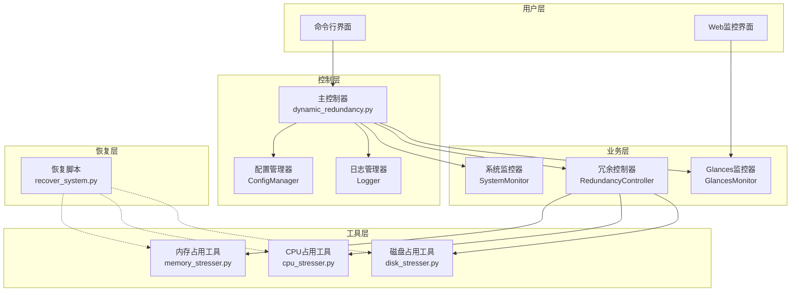
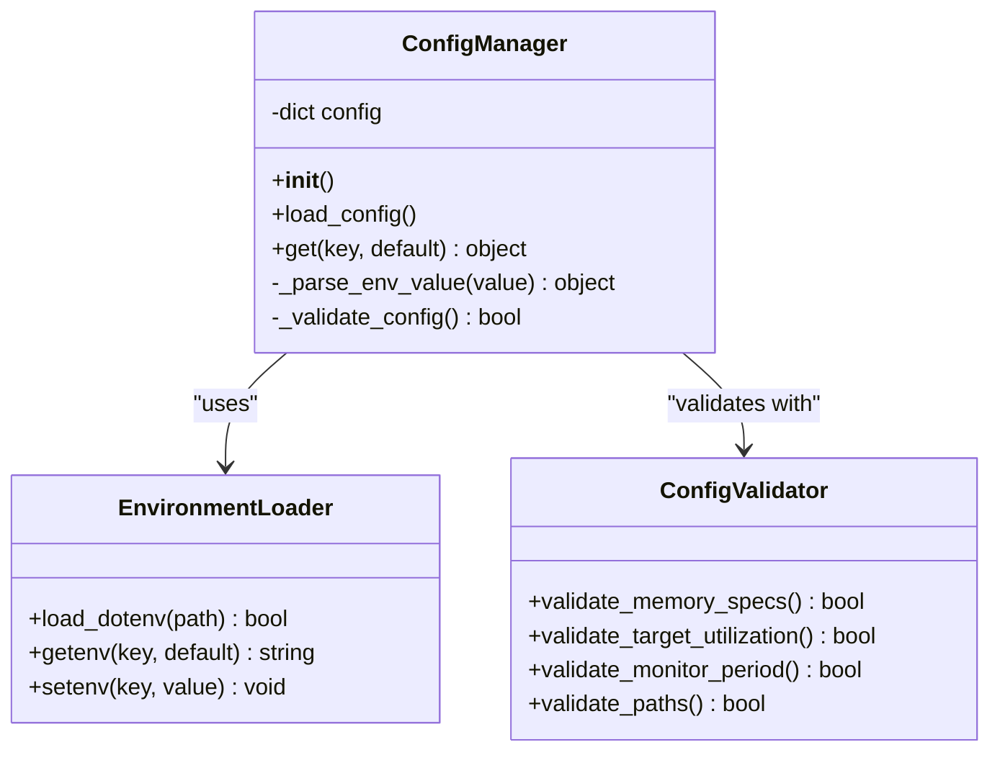
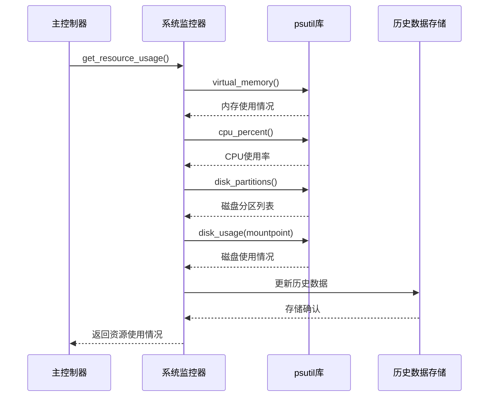
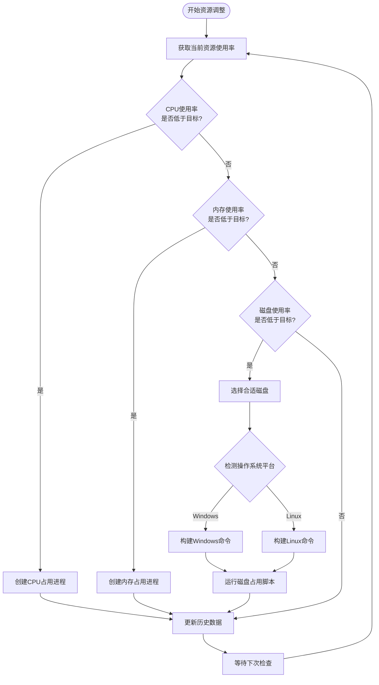
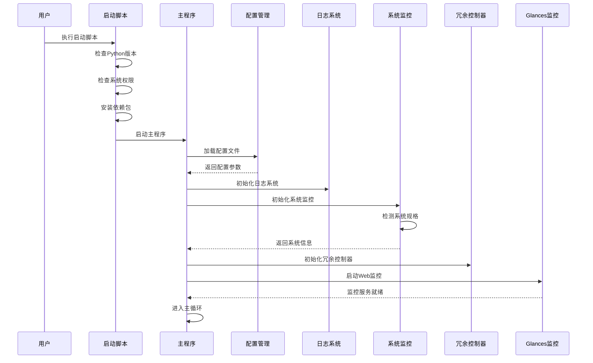
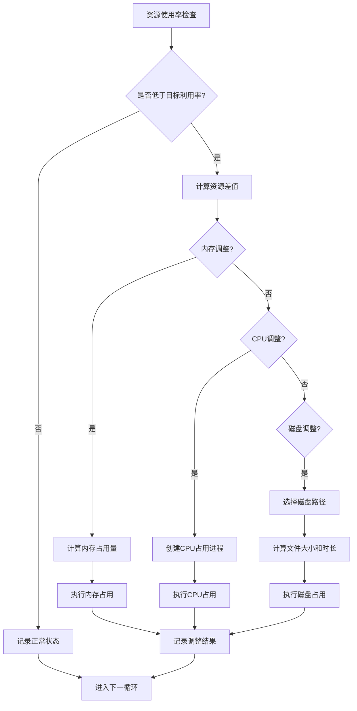
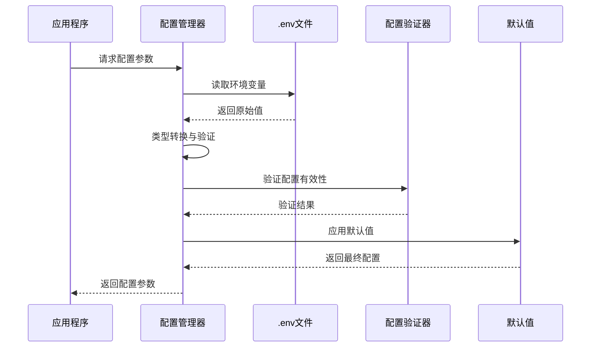
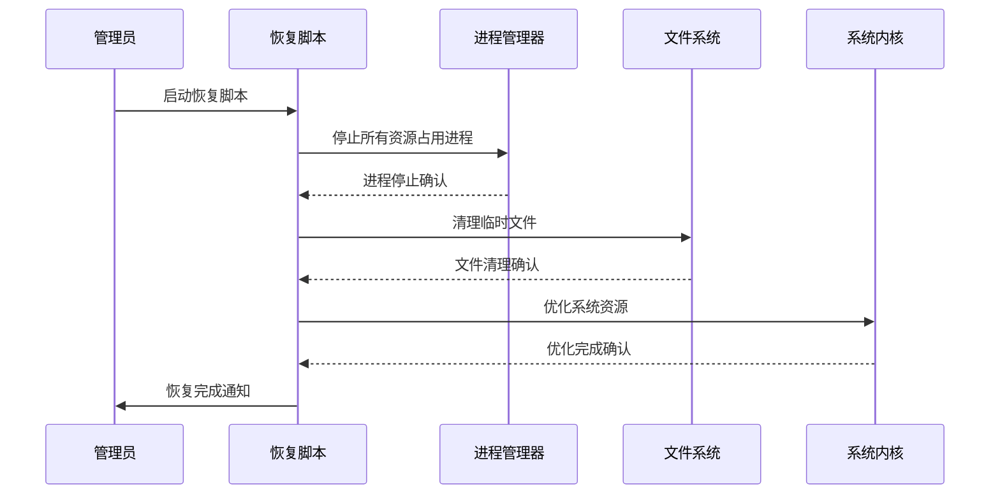

# CloudResourceOptimizer项目概述

<cite>
**本文档引用的文件**
- [README.md](file://README.md)
- [requirements.txt](file://requirements.txt)
- [scripts/dynamic_redundancy.py](file://scripts/dynamic_redundancy.py)
- [scripts/memory_stresser.py](file://scripts/memory_stresser.py)
- [scripts/cpu_stresser.py](file://scripts/cpu_stresser.py)
- [scripts/disk_stresser.py](file://scripts/disk_stresser.py)
- [start_dynamic_redundancy.sh](file://start_dynamic_redundancy.sh)
- [start_dynamic_redundancy.bat](file://start_dynamic_redundancy.bat)
- [Recover/recover_system.py](file://Recover/recover_system.py)
</cite>

## 目录
1. [项目简介](#项目简介)
2. [核心功能特性](#核心功能特性)
3. [系统架构设计](#系统架构设计)
4. [技术选型分析](#技术选型分析)
5. [模块化设计详解](#模块化设计详解)
6. [工作流程分析](#工作流程分析)
7. [配置管理机制](#配置管理机制)
8. [跨平台兼容性](#跨平台兼容性)
9. [实际应用场景](#实际应用场景)
10. [故障排除指南](#故障排除指南)
11. [总结与展望](#总结与展望)

## 项目简介

CloudResourceOptimizer是一个专为云主机环境设计的资源利用率优化工具，旨在通过智能调控系统资源占用，实现云主机资源的高效利用和优化管理。该工具能够根据云主机的内存规格（特别是内存大小）自动调整系统资源（CPU、内存、磁盘）的利用率，使其达到监管云要求的目标值。

### 核心价值定位

该项目的核心价值在于解决云主机资源利用率不达标的问题，通过动态调整资源使用率来满足监管合规要求。系统采用智能化的资源调控机制，能够根据不同规格的云主机自动设定相应的利用率目标，确保资源使用既符合监管要求又不会过度消耗系统资源。

## 核心功能特性

### 智能规格识别与目标设定

系统具备自动识别云主机规格的能力，根据内存容量将主机分为两类：

- **小规格主机**（≤8GB内存）：目标利用率为25%以上
- **大规格主机**（≥16GB内存）：目标利用率为40%左右

这种差异化的目标设定机制确保了不同规模的云主机都能获得适合的资源利用率，避免了"一刀切"的资源配置方式。

### 多维度资源调控

系统对三种核心资源进行精细化调控：

1. **CPU资源调控**：通过创建CPU密集型任务来提升CPU利用率
2. **内存资源调控**：通过内存占用进程来增加内存使用率
3. **磁盘资源调控**：在数据盘创建临时大文件来提高磁盘利用率

### 实时监控与历史数据分析

系统提供完整的30天监控周期，包括：
- 实时资源使用率监控
- 平均资源使用率统计
- 资源使用历史数据维护
- 自动清理过期监控数据

### Web可视化监控

集成glances性能监控工具，提供Web界面的实时性能监控，支持：
- 实时资源使用情况展示
- 自定义刷新频率设置
- 多平台兼容的Web监控界面

**章节来源**
- [README.md](file://README.md#L1-L50)
- [scripts/dynamic_redundancy.py](file://scripts/dynamic_redundancy.py#L1-L100)

## 系统架构设计

### 整体架构概览



**图表来源**
- [scripts/dynamic_redundancy.py](file://scripts/dynamic_redundancy.py#L1-L730)
- [scripts/memory_stresser.py](file://scripts/memory_stresser.py#L1-L46)
- [scripts/cpu_stresser.py](file://scripts/cpu_stresser.py#L1-L59)
- [scripts/disk_stresser.py](file://scripts/disk_stresser.py#L1-L118)

### 核心组件职责划分

#### 配置管理模块（ConfigManager）
负责统一管理所有配置参数，包括：
- 环境变量解析与验证
- 默认值设置与覆盖
- 配置参数的动态访问
- 配置变更的实时应用

#### 系统监控模块（SystemMonitor）
承担系统资源监控的核心职责：
- 实时采集CPU、内存、磁盘使用率
- 系统规格自动检测与分类
- 资源使用历史数据维护
- 监控数据的标准化输出

#### 冗余控制模块（RedundancyController）
实现资源利用率的智能调控：
- 根据目标利用率制定调整策略
- 动态创建资源占用进程
- 平台适配与兼容性处理
- 资源调整的精细化控制

#### 日志管理模块（Logger）
提供完整的日志记录体系：
- 多级别日志记录（INFO、WARNING、ERROR）
- 文件与控制台双重输出
- 按日期轮转的日志文件
- 结构化的日志格式

**章节来源**
- [scripts/dynamic_redundancy.py](file://scripts/dynamic_redundancy.py#L25-L200)
- [scripts/dynamic_redundancy.py](file://scripts/dynamic_redundancy.py#L201-L400)
- [scripts/dynamic_redundancy.py](file://scripts/dynamic_redundancy.py#L401-L600)

## 技术选型分析

### 核心依赖库选择

#### psutil - 系统监控利器
```python
# psutil在系统监控中的应用示例
# 获取内存使用情况
memory = psutil.virtual_memory()
memory_usage = memory.percent

# 获取CPU使用率
cpu_usage = psutil.cpu_percent(interval=1)

# 获取磁盘使用率
for partition in psutil.disk_partitions():
    usage = psutil.disk_usage(partition.mountpoint)
    disk_usage = usage.percent
```

psutil的选择基于以下优势：
- 跨平台兼容性强（Windows/Linux/Unix）
- 提供丰富的系统信息接口
- 性能优异，资源占用低
- 支持实时监控与历史数据获取

#### python-dotenv - 灵活配置管理
```python
# .env文件配置示例
# 内存规格定义
SMALL_MEMORY_MAX=8
LARGE_MEMORY_MIN=16

# 目标利用率设置
TARGET_UTILIZATION_SMALL=25
TARGET_UTILIZATION_LARGE=40

# 监控周期设置
MONITOR_PERIOD_DAYS=30
CHECK_INTERVAL_SECONDS=60
```

python-dotenv的优势：
- 简单易用的环境变量管理
- 支持默认值设置
- 便于配置的集中化管理
- 与Python生态系统无缝集成

#### glances - Web监控解决方案
```python
# glances监控启动配置
subprocess.Popen([
    'glances', 
    '--webserver', 
    '--port', '61208',
    '--refresh', str(refresh_interval)
])
```

glances的选择理由：
- 提供直观的Web监控界面
- 支持多种指标的实时展示
- 轻量级部署，资源占用少
- 支持自定义刷新频率

### 工具脚本的技术考量

#### 内存占用脚本（memory_stresser.py）
采用简单而有效的内存占用策略：
- 使用字符串占位符模拟内存占用
- 支持MB/GB级别的精确控制
- 防止垃圾回收机制的内存释放
- 提供友好的命令行参数解析

#### CPU占用脚本（cpu_stresser.py）
实现多线程CPU占用机制：
- 利用multiprocessing获取CPU核心数
- 支持自定义线程数量配置
- 使用daemon线程避免阻塞主进程
- 提供CPU密集型计算任务

#### 磁盘占用脚本（disk_stresser.py）
设计分块写入的磁盘占用方案：
- 支持大文件的分块创建
- 提供随机数据填充避免压缩优化
- 支持定时自动清理机制
- 跨平台兼容的文件操作

**章节来源**
- [requirements.txt](file://requirements.txt#L1-L5)
- [scripts/memory_stresser.py](file://scripts/memory_stresser.py#L1-L46)
- [scripts/cpu_stresser.py](file://scripts/cpu_stresser.py#L1-L59)
- [scripts/disk_stresser.py](file://scripts/disk_stresser.py#L1-L118)

## 模块化设计详解

### 配置管理模块深度解析



**图表来源**
- [scripts/dynamic_redundancy.py](file://scripts/dynamic_redundancy.py#L25-L100)

ConfigManager采用工厂模式和单例模式的混合设计：
- **延迟初始化**：配置仅在首次访问时加载
- **默认值保护**：所有配置项都有合理的默认值
- **类型安全**：自动转换配置值为适当的数据类型
- **错误恢复**：配置加载失败时使用硬编码默认值

### 系统监控模块架构



**图表来源**
- [scripts/dynamic_redundancy.py](file://scripts/dynamic_redundancy.py#L201-L350)

系统监控模块实现了观察者模式：
- **实时监控**：持续采集系统资源使用情况
- **历史追踪**：维护30天的资源使用历史
- **数据聚合**：计算平均利用率等统计指标
- **异常处理**：监控失败时提供默认值

### 冗余控制模块策略引擎



**图表来源**
- [scripts/dynamic_redundancy.py](file://scripts/dynamic_redundancy.py#L401-L600)

冗余控制模块采用策略模式：
- **差异化策略**：针对不同资源类型采用不同的调整策略
- **条件触发**：仅在资源使用率低于目标时才进行调整
- **渐进式调整**：避免一次性大幅调整导致系统不稳定
- **平台适配**：根据不同操作系统采用相应的实现方式

**章节来源**
- [scripts/dynamic_redundancy.py](file://scripts/dynamic_redundancy.py#L25-L200)
- [scripts/dynamic_redundancy.py](file://scripts/dynamic_redundancy.py#L201-L400)
- [scripts/dynamic_redundancy.py](file://scripts/dynamic_redundancy.py#L401-L600)

## 工作流程分析

### 启动流程详解



**图表来源**
- [start_dynamic_redundancy.sh](file://start_dynamic_redundancy.sh#L1-L104)
- [start_dynamic_redundancy.bat](file://start_dynamic_redundancy.bat#L1-L24)
- [scripts/dynamic_redundancy.py](file://scripts/dynamic_redundancy.py#L650-L730)

### 主循环执行流程

系统采用事件驱动的主循环架构：

1. **资源使用率采集**：每60秒采集一次系统资源使用情况
2. **目标对比分析**：将当前使用率与目标值进行对比
3. **差异化调整**：根据资源类型和使用率差异制定调整策略
4. **进程启动执行**：启动相应的资源占用进程
5. **历史数据更新**：更新30天监控周期的历史数据
6. **状态日志记录**：记录每次调整的详细信息

### 资源调整算法



**图表来源**
- [scripts/dynamic_redundancy.py](file://scripts/dynamic_redundancy.py#L401-L600)

**章节来源**
- [scripts/dynamic_redundancy.py](file://scripts/dynamic_redundancy.py#L650-L730)
- [scripts/dynamic_redundancy.py](file://scripts/dynamic_redundancy.py#L401-L600)

## 配置管理机制

### 配置文件结构分析

配置文件采用.env格式，具有以下特点：

#### 基础配置参数
```ini
# 内存规格定义
SMALL_MEMORY_MAX=8          # 小规格内存上限(GB)
LARGE_MEMORY_MIN=16         # 大规格内存下限(GB)

# 目标利用率设置
TARGET_UTILIZATION_SMALL=25 # 小规格平均利用率目标(%)
TARGET_UTILIZATION_LARGE=40 # 大规格平均利用率目标(%)

# 监控周期设置
MONITOR_PERIOD_DAYS=30      # 监控周期(天)
CHECK_INTERVAL_SECONDS=60   # 检查间隔(秒)
```

#### 工作区配置
```ini
# 工作区配置
WORKSPACE_DIR=              # 工作区目录（留空则使用脚本父目录）
SCRIPT_DIR=${WORKSPACE_DIR}/scripts
LOG_DIR=${WORKSPACE_DIR}/logs
CONFIG_DIR=${WORKSPACE_DIR}/config
```

#### 平台适配配置
```ini
# 平台配置
PLATFORM=auto               # 支持的平台：auto, centos, ubuntu, kylin, openEuler

# glances监控配置
GLANCES_ENABLED=true        # 是否启用glances监控
GLANCES_REFRESH_INTERVAL=2  # glances刷新间隔(秒)
```

### 动态配置加载机制



**图表来源**
- [scripts/dynamic_redundancy.py](file://scripts/dynamic_redundancy.py#L25-L100)

### 配置参数优先级

配置参数遵循以下优先级顺序：
1. **环境变量**：最高优先级，直接覆盖所有其他配置
2. **配置文件**：.env文件中的设置
3. **默认值**：硬编码的默认配置
4. **运行时参数**：程序启动时的命令行参数

**章节来源**
- [README.md](file://README.md#L51-L120)
- [scripts/dynamic_redundancy.py](file://scripts/dynamic_redundancy.py#L25-L100)

## 跨平台兼容性

### 平台检测与适配

系统支持多种操作系统平台，通过智能检测机制实现兼容性：

```python
def detect_platform(self):
    """检测操作系统平台"""
    # 从配置中获取平台设置
    platform_config = self.config.get('PLATFORM', 'auto').lower()
    
    if platform_config != 'auto':
        return platform_config
    
    # 自动检测平台
    system = platform.system().lower()
    if system == 'windows':
        return 'windows'
    elif system == 'linux':
        # 尝试检测Linux发行版
        try:
            with open('/etc/os-release', 'r') as f:
                content = f.read().lower()
                if 'centos' in content:
                    return 'centos'
                elif 'ubuntu' in content:
                    return 'ubuntu'
                elif 'kylin' in content:
                    return 'kylin'
                elif 'openEuler' in content or 'openeuler' in content:
                    return 'openEuler'
        except Exception:
            return 'linux_generic'
    else:
        return 'unknown'
```

### 平台特定实现

#### Windows平台适配
- 使用PowerShell命令进行系统优化
- 支持Windows特有的文件路径格式
- 利用Windows任务管理器停止进程
- 支持Windows服务注册表操作

#### Linux平台适配
- 支持多种Linux发行版（CentOS、Ubuntu、Kylin、OpenEuler）
- 使用系统调用清理页面缓存
- 支持Linux特有的文件系统类型
- 利用进程树结构进行进程管理

#### 跨平台工具脚本
所有工具脚本都采用统一的接口设计：
- 支持命令行参数解析
- 提供标准的帮助信息
- 实现跨平台的文件操作
- 支持异常处理和错误报告

**章节来源**
- [scripts/dynamic_redundancy.py](file://scripts/dynamic_redundancy.py#L450-L500)
- [start_dynamic_redundancy.sh](file://start_dynamic_redundancy.sh#L1-L104)

## 实际应用场景

### 云主机资源优化场景

#### 场景一：小型云主机优化
**配置参数**：
```ini
SMALL_MEMORY_MAX=8
LARGE_MEMORY_MIN=16
TARGET_UTILIZATION_SMALL=25
TARGET_UTILIZATION_LARGE=40
```

**适用对象**：内存≤8GB的小型云主机
**优化效果**：将资源利用率稳定维持在25%以上
**典型用途**：开发测试环境、小型Web应用服务器

#### 场景二：大型云主机优化
**配置参数**：
```ini
SMALL_MEMORY_MAX=8
LARGE_MEMORY_MIN=16
TARGET_UTILIZATION_SMALL=25
TARGET_UTILIZATION_LARGE=40
```

**适用对象**：内存≥16GB的大型云主机
**优化效果**：将资源利用率稳定维持在40%左右
**典型用途**：数据库服务器、大数据处理节点、AI训练集群

### 监控与运维场景

#### 实时监控界面
通过glances提供的Web界面，运维人员可以：
- 实时查看系统资源使用情况
- 监控多个指标的实时趋势
- 设置自定义的告警阈值
- 远程访问和管理

#### 历史数据分析
系统维护30天的监控历史，支持：
- 资源使用趋势分析
- 异常情况回溯调查
- 性能基线建立
- 合规性审计支持

### 恢复与应急场景

#### 系统恢复流程


**图表来源**
- [Recover/recover_system.py](file://Recover/recover_system.py#L1-L229)

#### 恢复功能特点
- **一键式恢复**：简化复杂的系统恢复操作
- **进程清理**：彻底停止所有资源占用进程
- **文件清理**：自动清理临时文件和缓存
- **状态监控**：提供恢复前后的系统状态对比

**章节来源**
- [README.md](file://README.md#L121-L182)
- [Recover/recover_system.py](file://Recover/recover_system.py#L1-L100)

## 故障排除指南

### 常见问题诊断

#### 启动失败问题
**问题症状**：脚本无法正常启动
**可能原因**：
1. Python版本不兼容（需要3.6+）
2. 缺少必要的依赖包
3. 权限不足无法访问系统资源
4. 配置文件格式错误

**解决方案**：
```bash
# 检查Python版本
python --version

# 安装依赖包
pip install -r requirements.txt

# 以管理员权限运行
sudo python scripts/dynamic_redundancy.py
```

#### glances监控问题
**问题症状**：Web监控界面无法访问
**可能原因**：
1. glances未正确安装
2. 端口61208被占用
3. 防火墙阻止访问

**解决方案**：
```bash
# 检查glances安装状态
glances --version

# 更换端口
GLANCES_PORT=61209 python scripts/dynamic_redundancy.py

# 检查防火墙设置
sudo ufw status
```

#### 资源调整失效问题
**问题症状**：资源利用率未达到目标值
**可能原因**：
1. 目标利用率设置过高
2. 系统资源已接近满载
3. 平台检测错误
4. 进程启动失败

**解决方案**：
- 调整目标利用率参数
- 检查系统可用资源
- 验证平台配置设置
- 查看详细日志信息

### 性能优化建议

#### 监控频率优化
```ini
# 降低监控频率以减少系统开销
CHECK_INTERVAL_SECONDS=120
MONITOR_PERIOD_DAYS=15
```

#### 内存使用优化
```python
# 限制内存占用脚本的最大内存使用
memory_to_use_mb = min(memory_to_use_mb, 1024)  # 最多使用1GB
```

#### 磁盘I/O优化
```python
# 减少磁盘写入频率
disk_write_interval = 30  # 每30秒写入一次
```

### 日志分析技巧

#### 关键日志模式
- **INFO级别**：正常操作记录，显示资源调整过程
- **WARNING级别**：潜在问题警告，如资源不足
- **ERROR级别**：严重错误，需要人工干预

#### 日志分析要点
1. **资源使用趋势**：观察资源使用率的变化规律
2. **调整频率**：评估资源调整的频繁程度
3. **异常模式**：识别重复出现的错误模式
4. **性能瓶颈**：定位系统资源的瓶颈点

**章节来源**
- [scripts/dynamic_redundancy.py](file://scripts/dynamic_redundancy.py#L650-L730)
- [Recover/recover_system.py](file://Recover/recover_system.py#L1-L100)

## 总结与展望

### 项目价值总结

CloudResourceOptimizer作为一个专业的云主机资源利用率优化工具，具有以下核心价值：

1. **合规性保障**：通过自动化的资源调控机制，确保云主机资源利用率符合监管要求
2. **智能化管理**：基于主机规格的差异化目标设定，实现精准的资源优化
3. **自动化运维**：减少人工干预，提高运维效率和系统稳定性
4. **跨平台兼容**：支持Windows和Linux平台，适应多样化的云环境
5. **可观测性增强**：通过Web监控界面和详细日志记录，提供完整的系统可见性

### 技术创新点

#### 智能化资源调控算法
- 基于历史数据的预测性调整
- 动态目标值的自适应设定
- 渐进式调整策略避免系统波动
- 多维度资源协同优化

#### 模块化架构设计
- 清晰的职责分离和接口定义
- 高度可扩展的功能模块
- 灵活的配置管理系统
- 完善的错误处理机制

#### 跨平台兼容性实现
- 自动平台检测与适配
- 统一的API接口设计
- 平台特定的优化实现
- 一致的用户体验

### 发展方向与改进建议

#### 功能扩展建议
1. **网络资源优化**：添加基于网络流量的资源调控功能
2. **存储性能优化**：实现基于IOPS和吞吐量的存储资源优化
3. **容器化支持**：适配Docker和Kubernetes环境
4. **云端集成**：与主流云服务商的API深度集成

#### 性能优化方向
1. **算法优化**：改进资源调整算法的计算效率
2. **内存优化**：减少系统监控的内存占用
3. **并发处理**：增强多线程处理能力
4. **缓存机制**：引入智能缓存策略

#### 可视化增强
1. **仪表板定制**：提供可定制的监控仪表板
2. **告警系统**：集成邮件和短信告警功能
3. **历史对比**：支持多时间段的历史数据对比
4. **趋势预测**：基于机器学习的资源使用趋势预测

### 最佳实践建议

#### 部署最佳实践
1. **环境准备**：确保Python 3.6+环境和必要权限
2. **配置优化**：根据实际需求调整监控参数
3. **定期维护**：定期检查日志文件和系统状态
4. **备份策略**：重要配置文件的版本控制和备份

#### 运维最佳实践
1. **监控告警**：设置适当的监控阈值和告警机制
2. **性能调优**：根据系统负载调整监控频率
3. **故障处理**：建立完善的故障处理流程
4. **文档维护**：保持配置文档和操作手册的及时更新

CloudResourceOptimizer项目通过其智能化的资源调控机制和完善的系统架构，为云主机资源优化提供了可靠的技术解决方案。随着云计算技术的不断发展，该工具将继续演进，为用户提供更加智能、高效的资源管理体验。